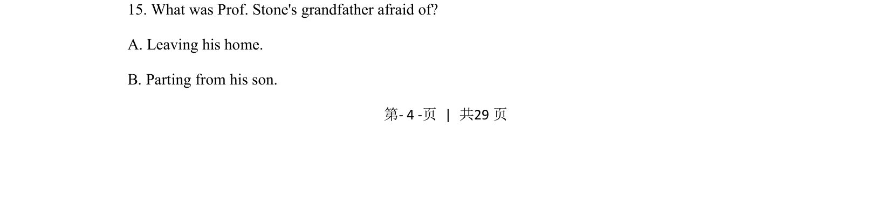
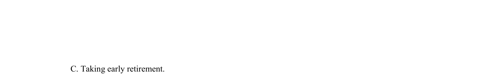

## 题面

## 摘要

本题询问Prof. Stone的祖父害怕什么，考查细节理解。

## 关联考点

- [[690-Specific Information|细节理解]]
- [[681-Listening|Listening]]

## 答案与解析

> 📄 原 PDF 第 4 页：`素材/真题/吉林/2008-2024·（吉林）英语高考真题/2021年高考英语试卷（全国乙卷）（新课标Ⅰ）（解析卷）.pdf`
