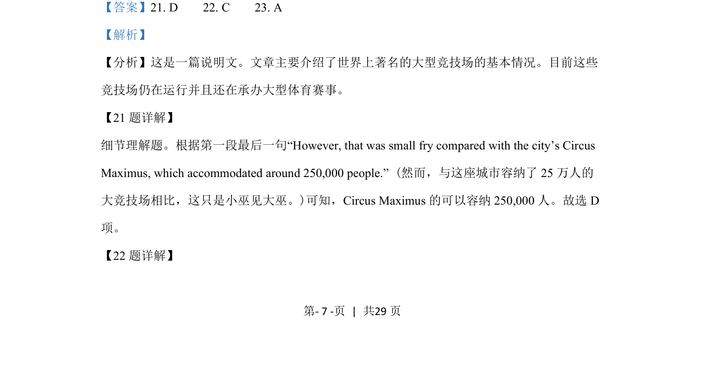
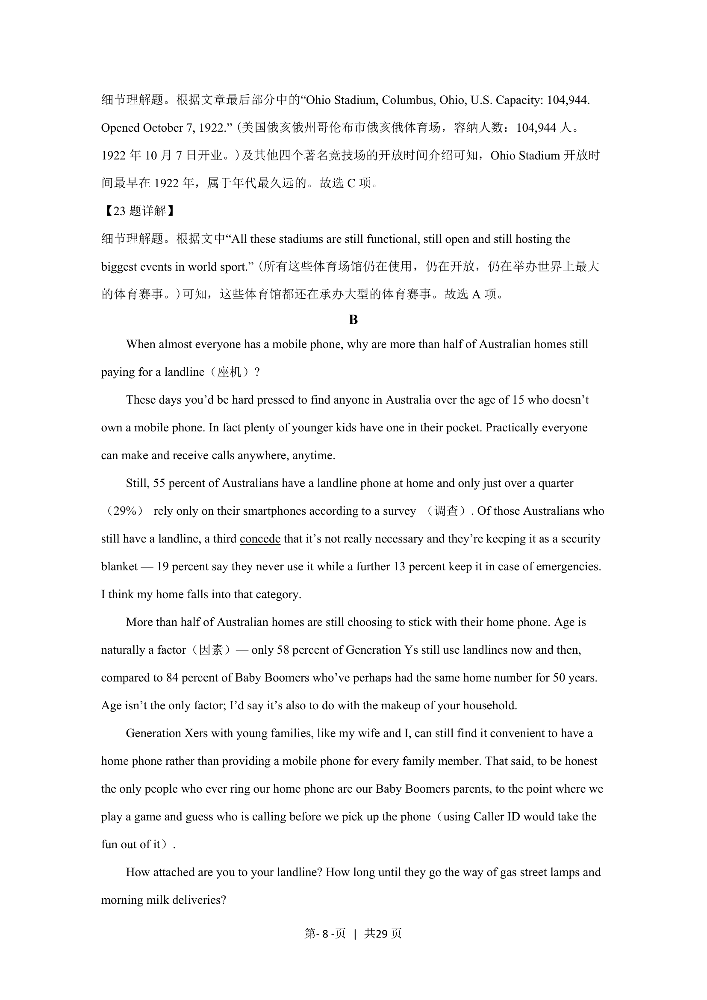

## 题面

## 摘要

考查根据第一段最后一句获取Circus Maximus具体容纳人数的细节信息

## 关联考点

- [[Detail Comprehension]]
- [[Locating Specific Information]]
- [[Number Identification]]

## 答案与解析

> 📄 原 PDF 第 7 页：`素材/真题/吉林/2008-2024·（吉林）英语高考真题/2021年高考英语试卷（全国乙卷）（新课标Ⅰ）（解析卷）.pdf`
