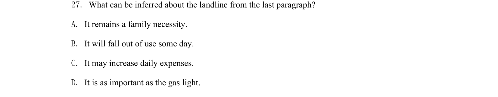
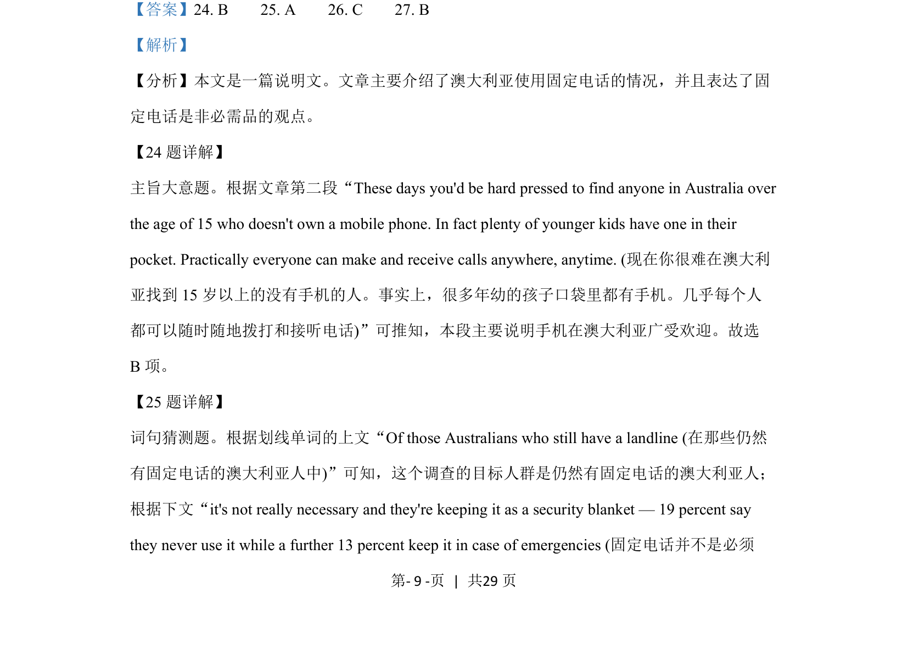
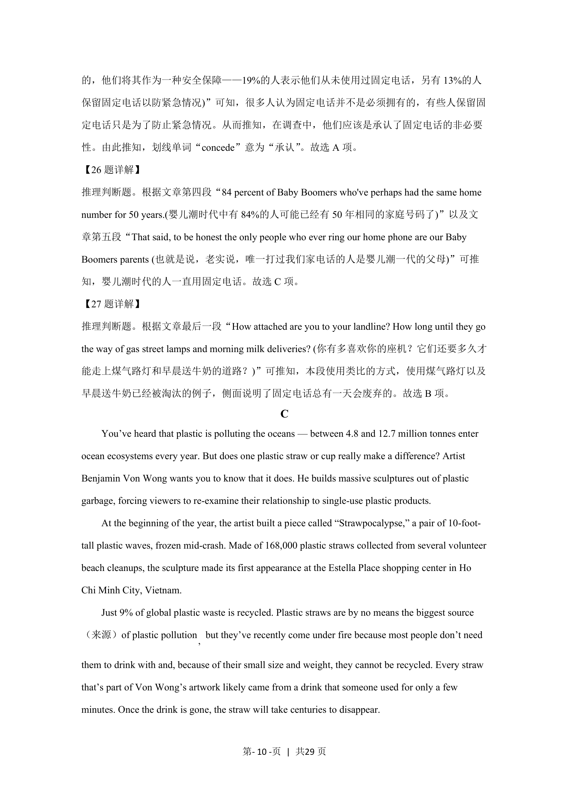
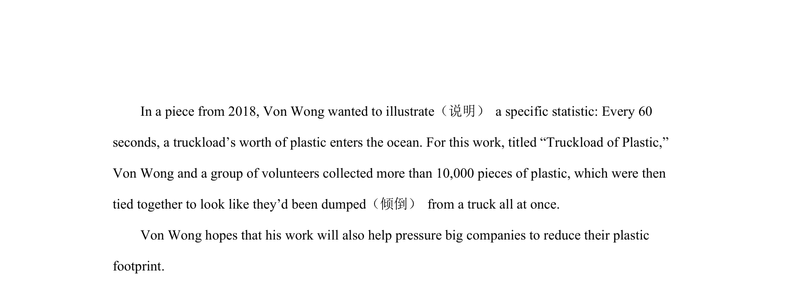

## 题面

## 摘要

该题考查阅读理解中段落主旨的概括能力，要求归纳第二段手机在澳大利亚普及的核心内容。

## 关联考点

- [[681-Main Idea|Main Idea]]
- [[954-Paragraph Summary|Paragraph Summary]]

## 答案与解析

> 📄 原 PDF 第 9 页：`素材/真题/吉林/2008-2024·（吉林）英语高考真题/2021年高考英语试卷（全国乙卷）（新课标Ⅰ）（解析卷）.pdf`
