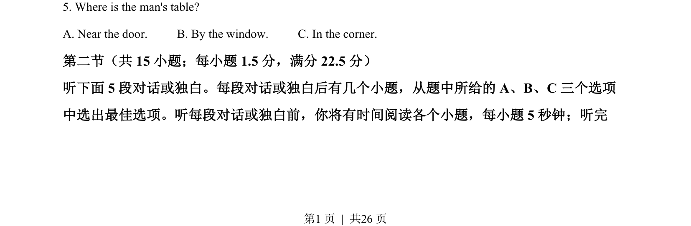

## 题面

## 摘要

简短对话听力理解，询问男士餐桌位置。

## 关联考点

- [[644-听力说明|听力理解]]
- [[938-Location identification|Location identification]]

## 答案与解析

> 📄 原 PDF 第 1 页：`素材/真题/吉林/2008-2024·（吉林）英语高考真题/2022年高考英语试卷（全国乙卷）（解析卷）.pdf`
