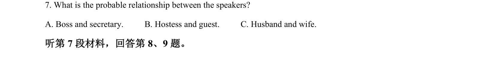

## 题面

## 摘要

该题为一篇书评阅读理解，考查学生细节查找及推理判断能力。

## 关联考点

- [[706-detail comprehension|detail comprehension]]
- [[627-inference|inference]]
- [[700-book review|book review]]
- [[710-genre identification|genre identification]]

## 答案与解析

> 📄 原 PDF 第 2 页：`素材/真题/吉林/2008-2024·（吉林）英语高考真题/2022年高考英语试卷（全国乙卷）（解析卷）.pdf`
