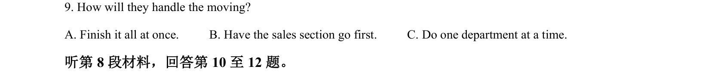

## 题面

## 摘要

听力细节理解题，考查对不同搬家方案的理解和辨别。

## 关联考点

- [[716-listening comprehension|listening comprehension]]
- [[707-detail understanding|detail understanding]]
- [[726-sequence of actions|sequence of actions]]

## 答案与解析

> 📄 原 PDF 第 2 页：`素材/真题/吉林/2008-2024·（吉林）英语高考真题/2022年高考英语试卷（全国乙卷）（解析卷）.pdf`
