## 题面

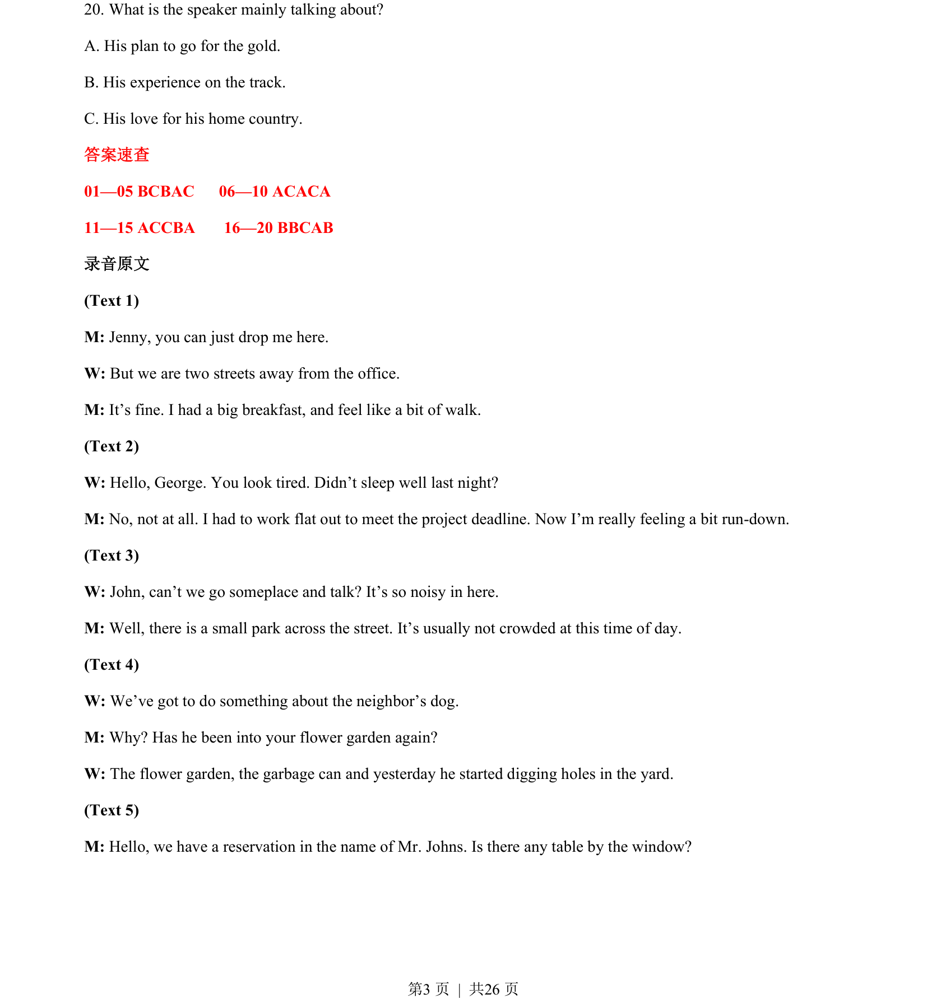
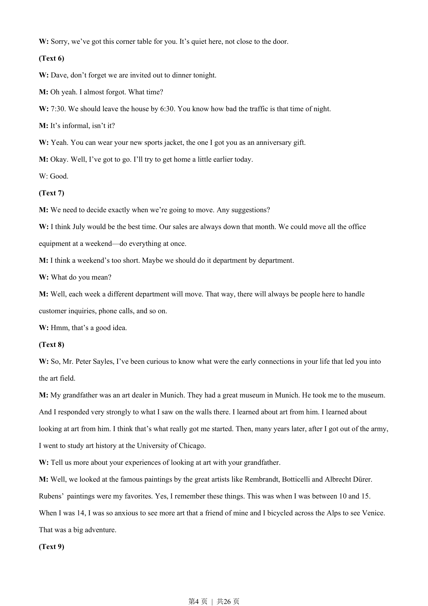
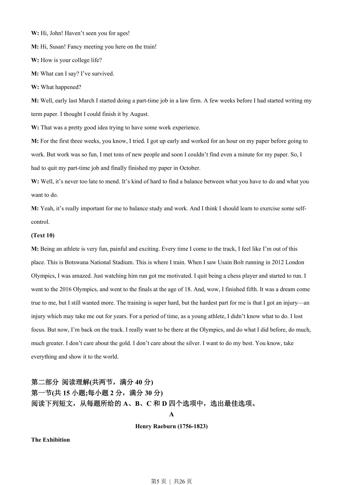
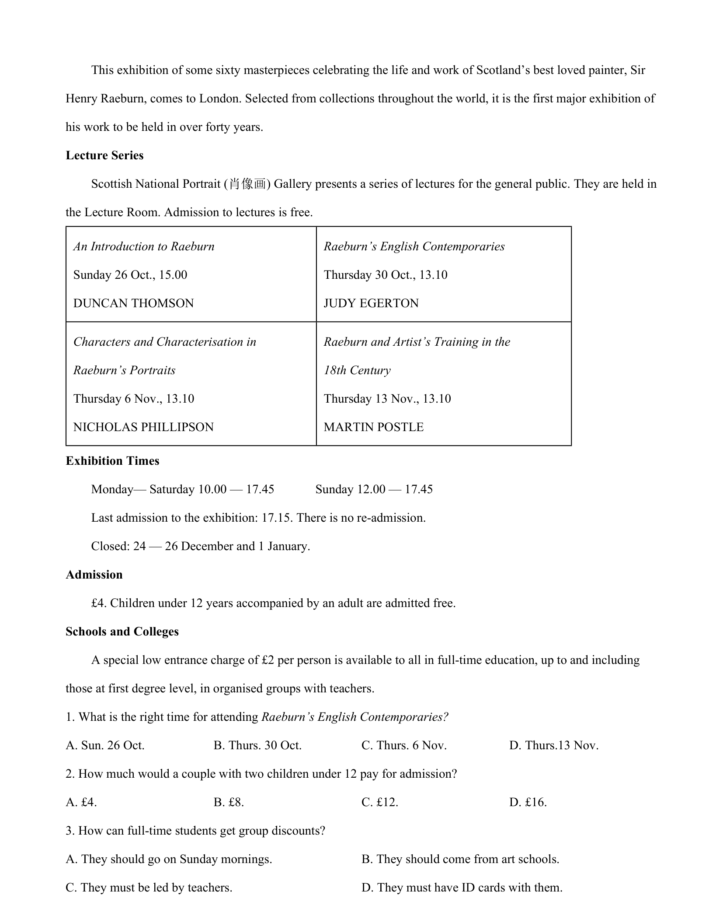

## 摘要

听力主旨大意题，要求归纳独白核心内容。

## 关联考点

- [[Listening for main idea]]
- [[Gist comprehension]]

## 答案与解析

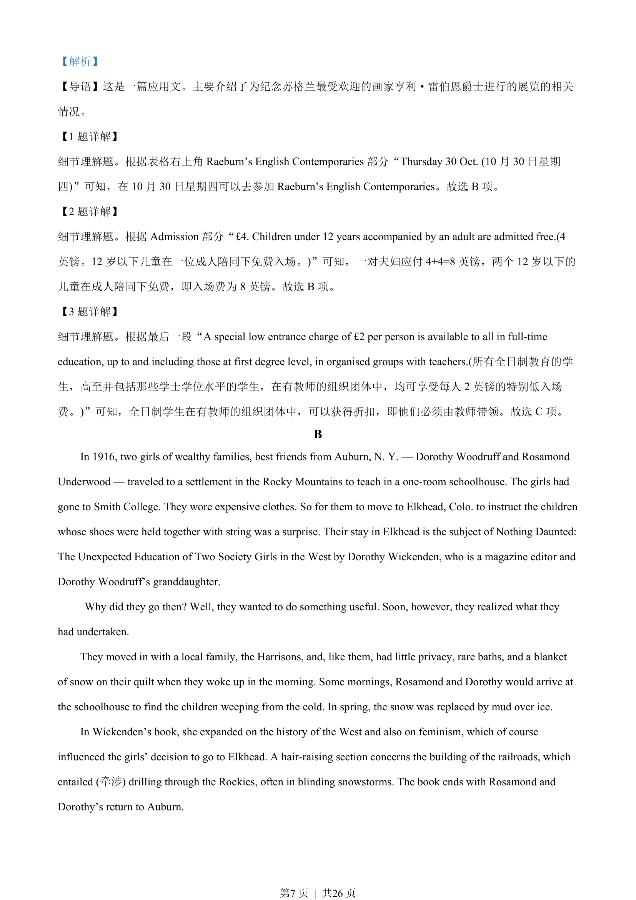
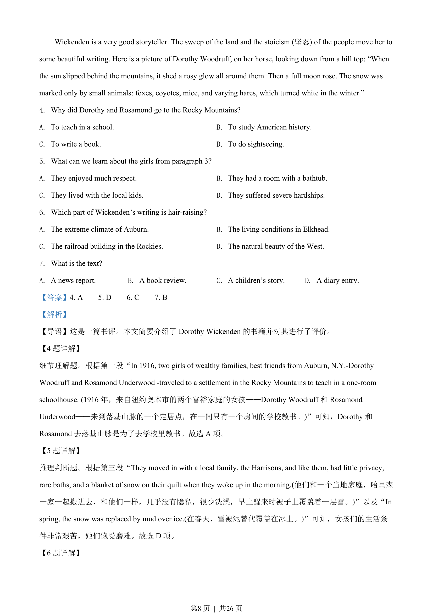
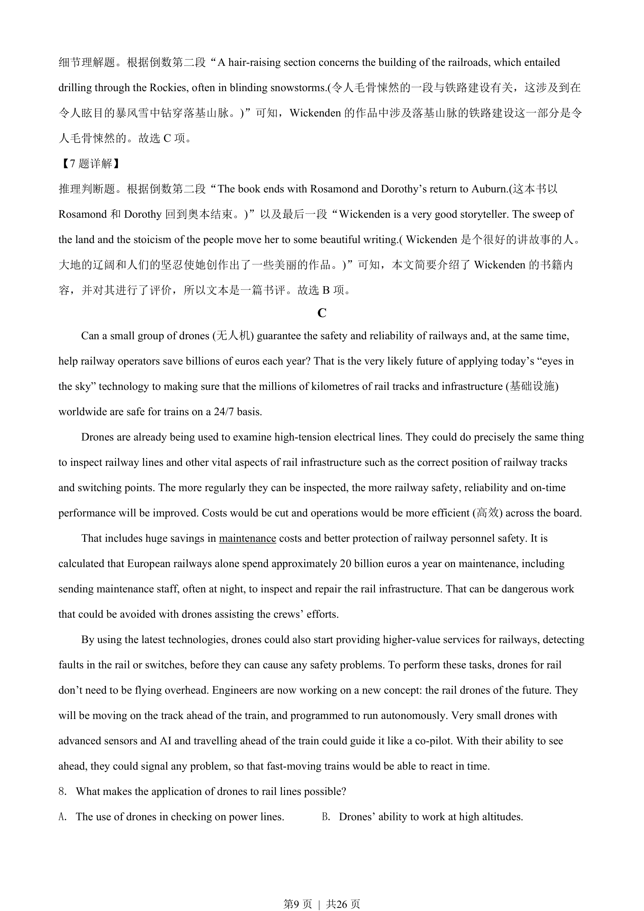
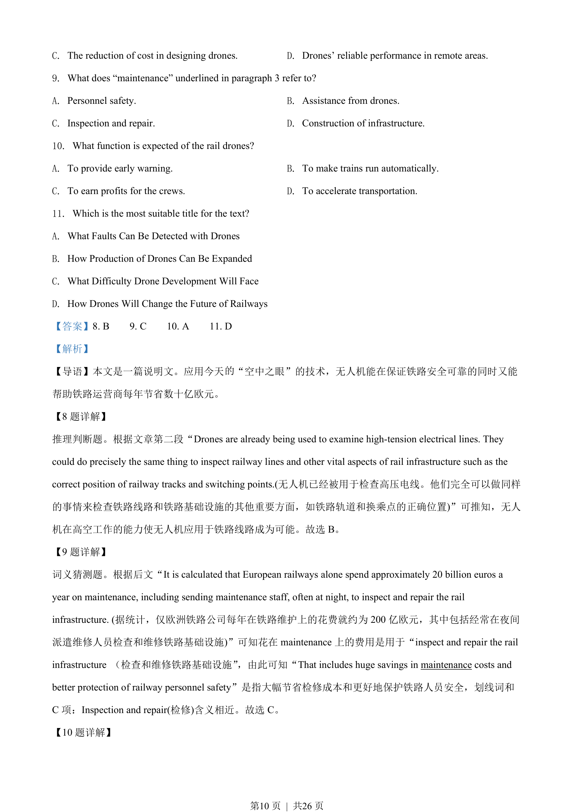
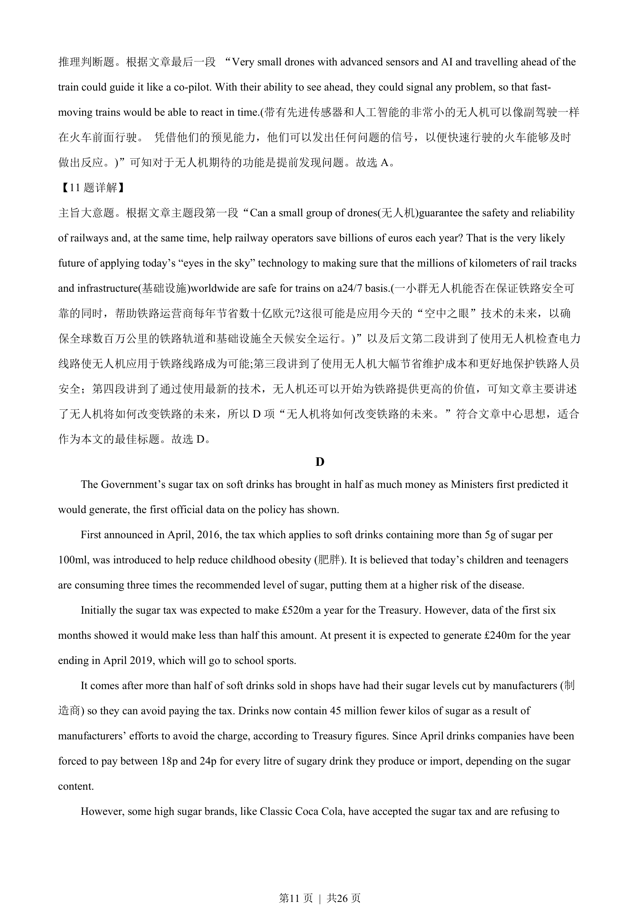
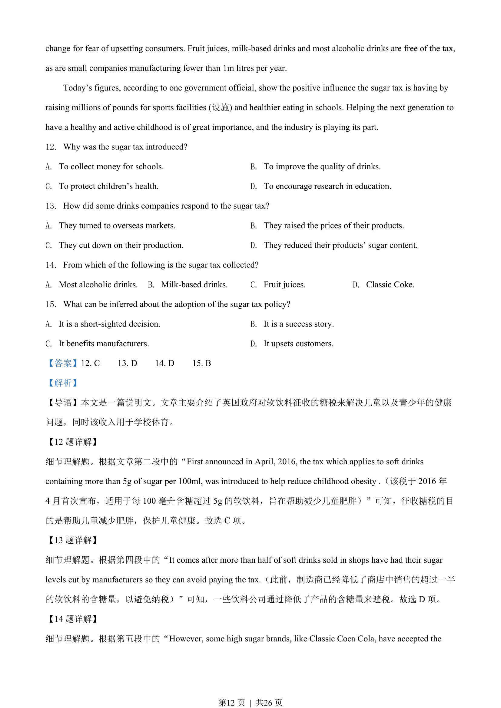
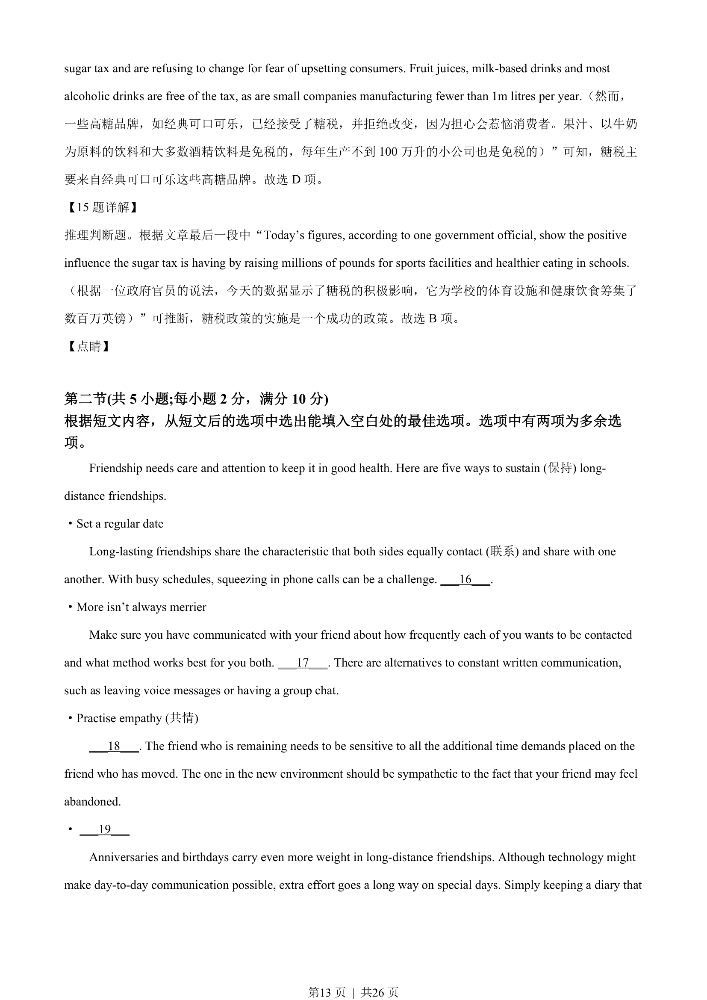
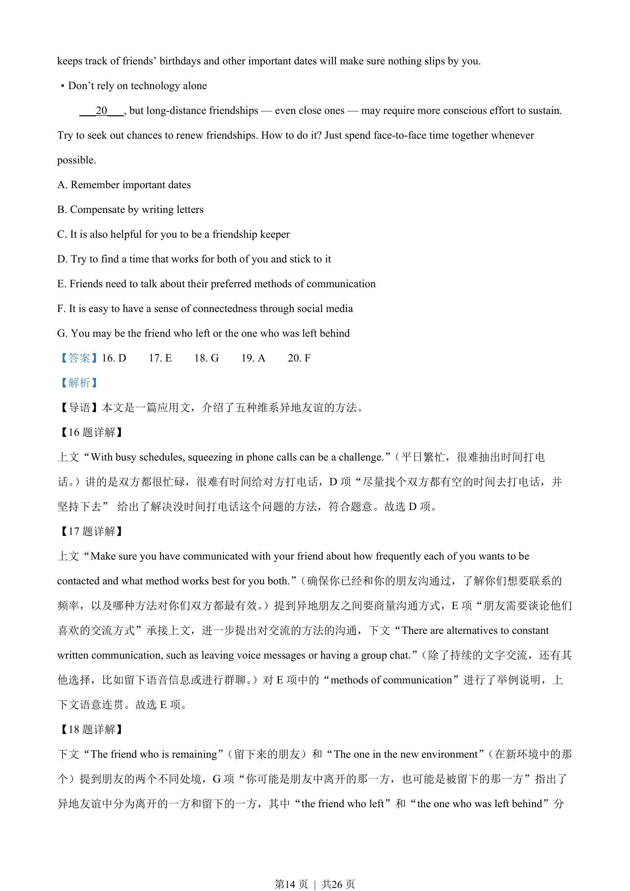
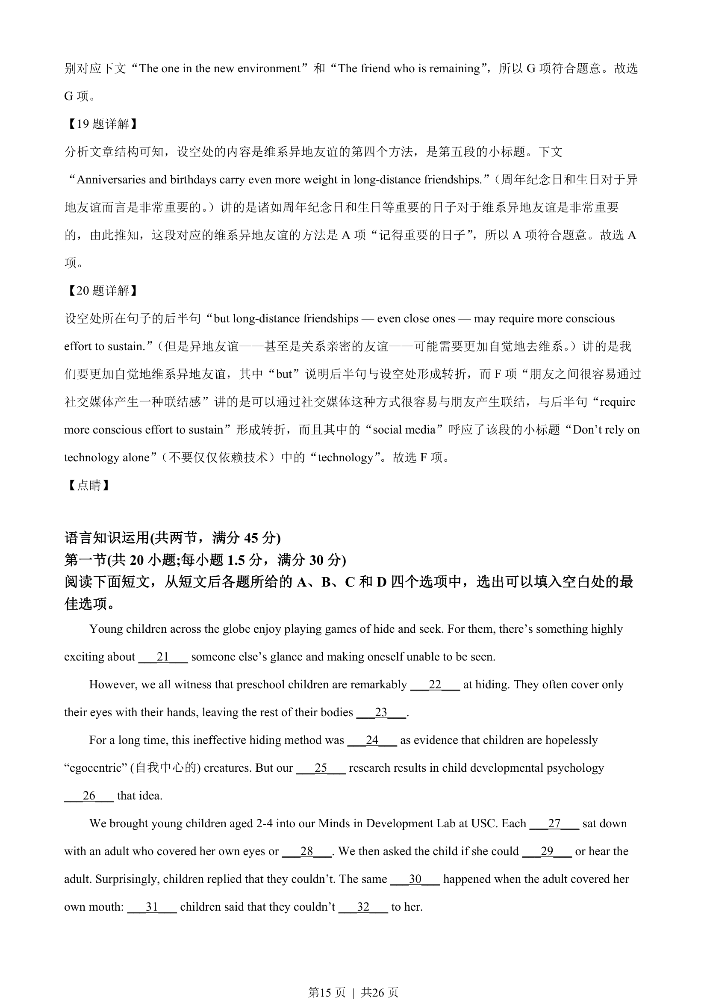
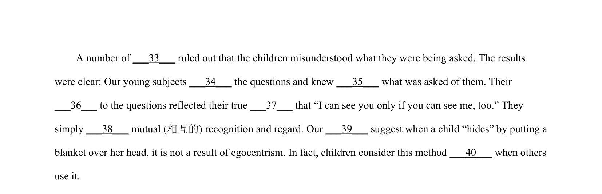

> 📄 原 PDF 第 3 页：`素材/真题/吉林/2008-2024·（吉林）英语高考真题/2022年高考英语试卷（全国乙卷）（解析卷）.pdf`
