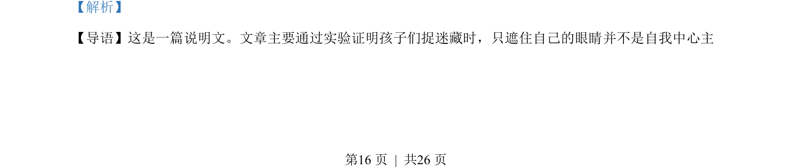
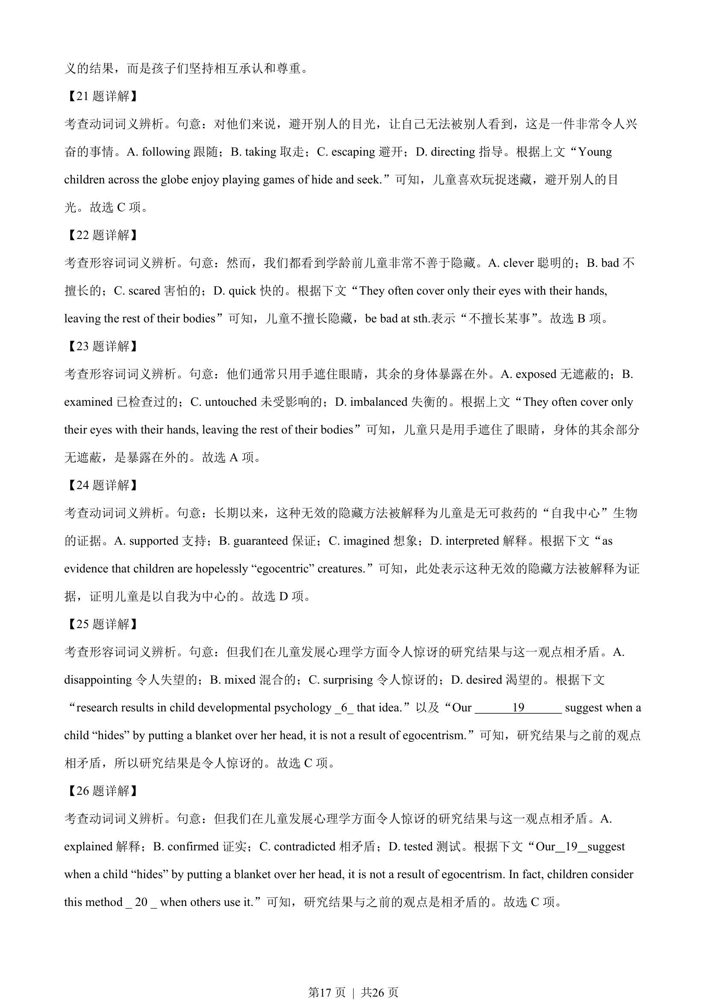
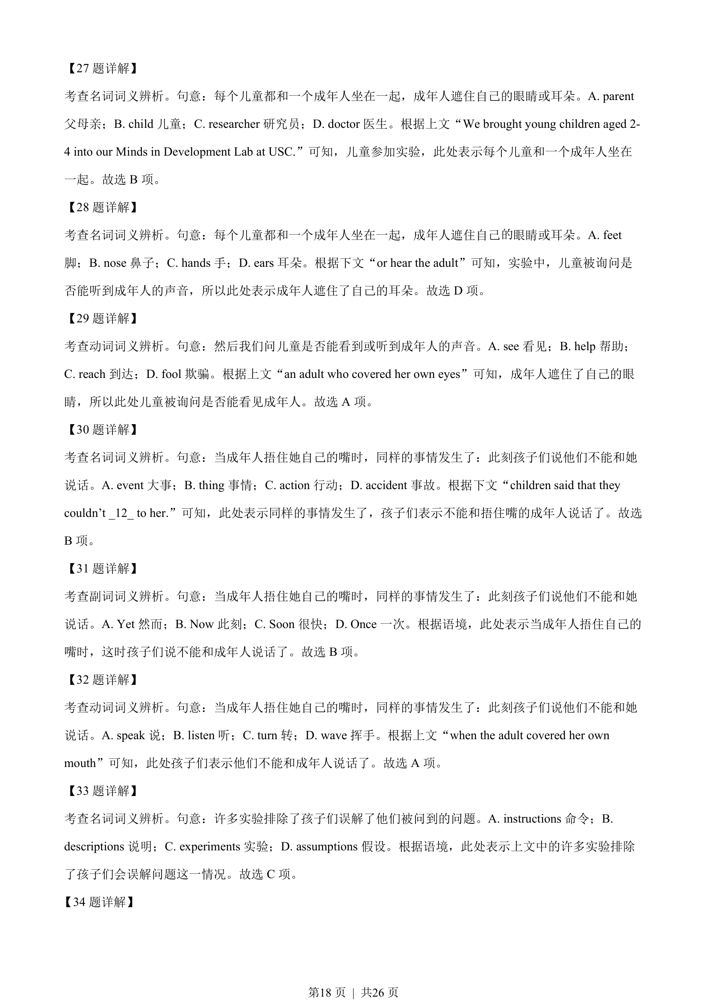
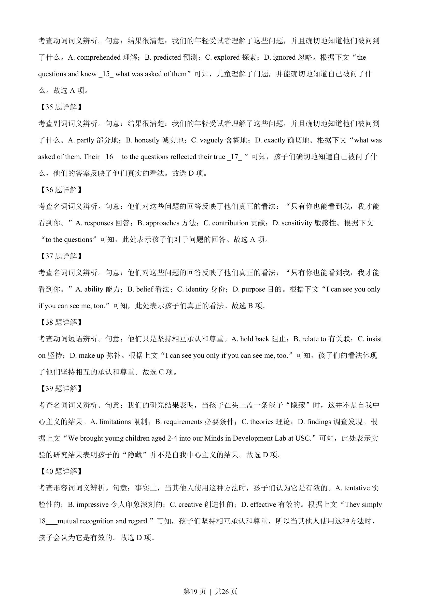
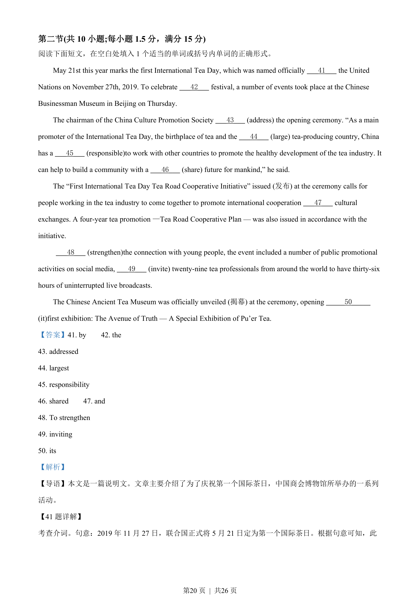
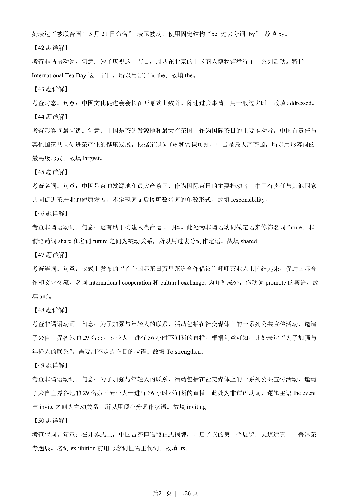
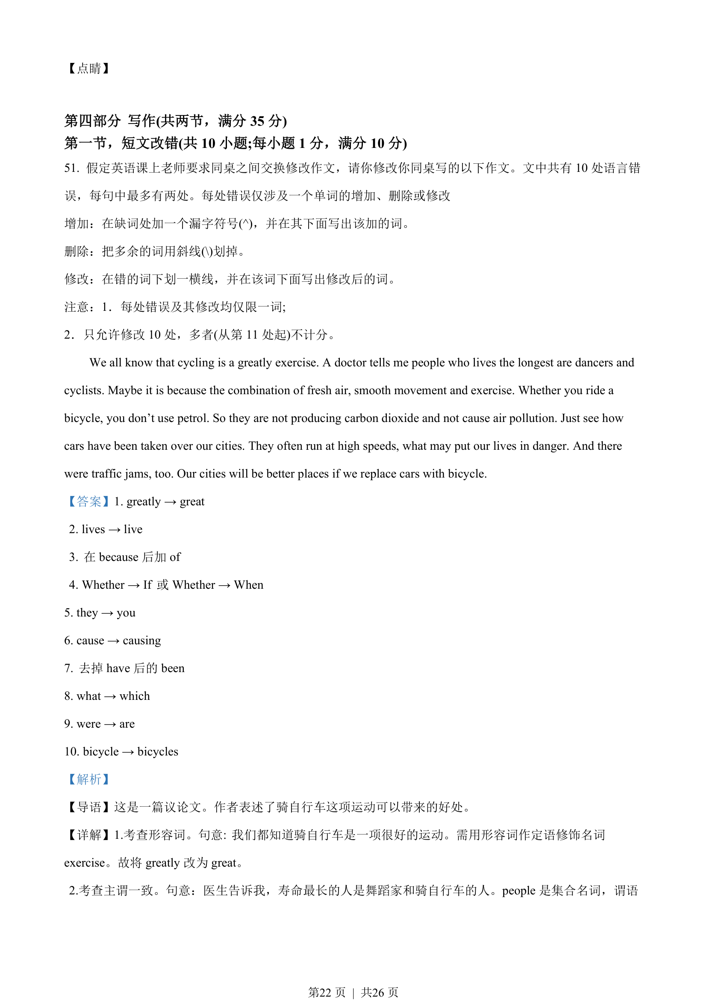
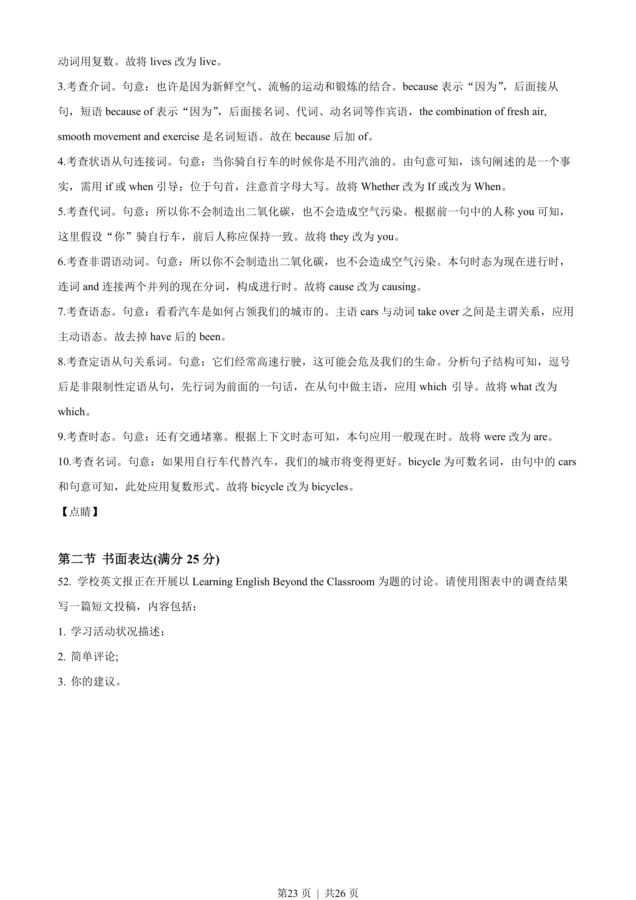
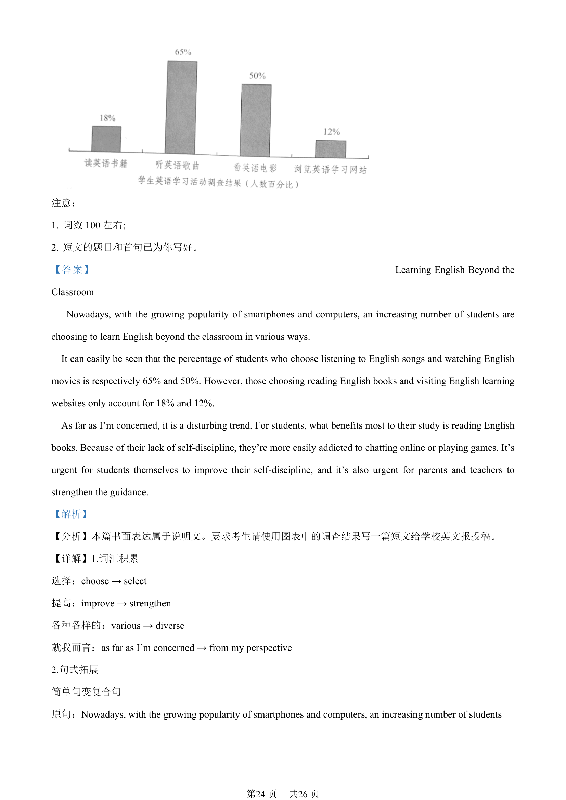
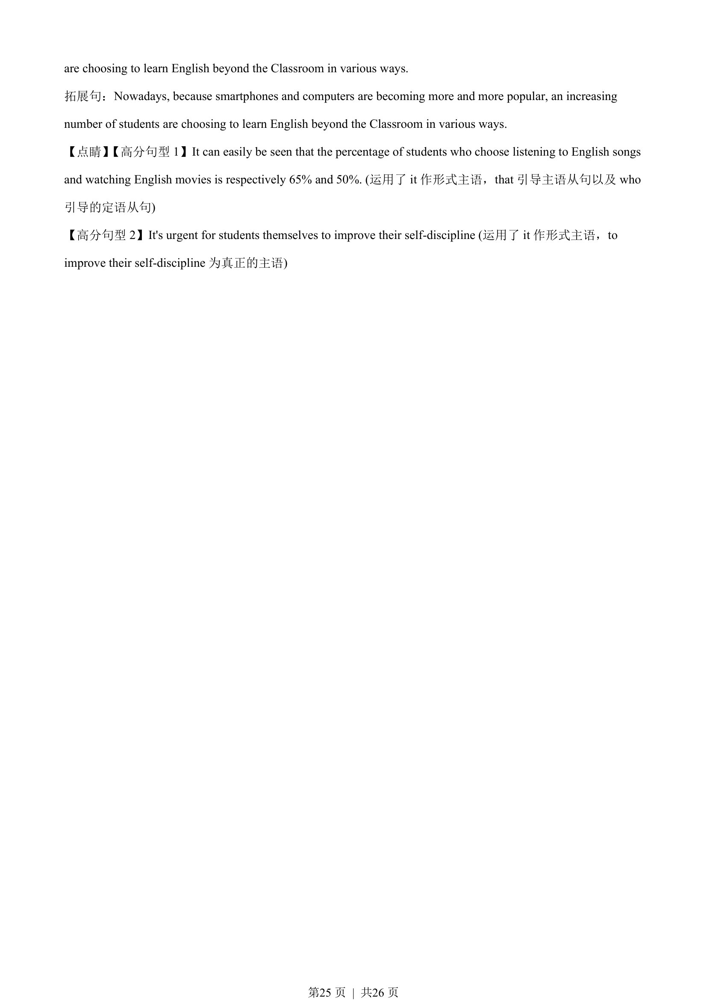

## 题面

## 摘要

完形填空答案列表，截图为21-40题的答案（21.C 22.B...），题目为完形填空部分的集中答案页。

## 关联考点

- [[810-完形填空|完形填空]]
- [[934-答案列表|答案列表]]

## 答案与解析

> 📄 原 PDF 第 16 页：`素材/真题/吉林/2008-2024·（吉林）英语高考真题/2022年高考英语试卷（全国乙卷）（解析卷）.pdf`
