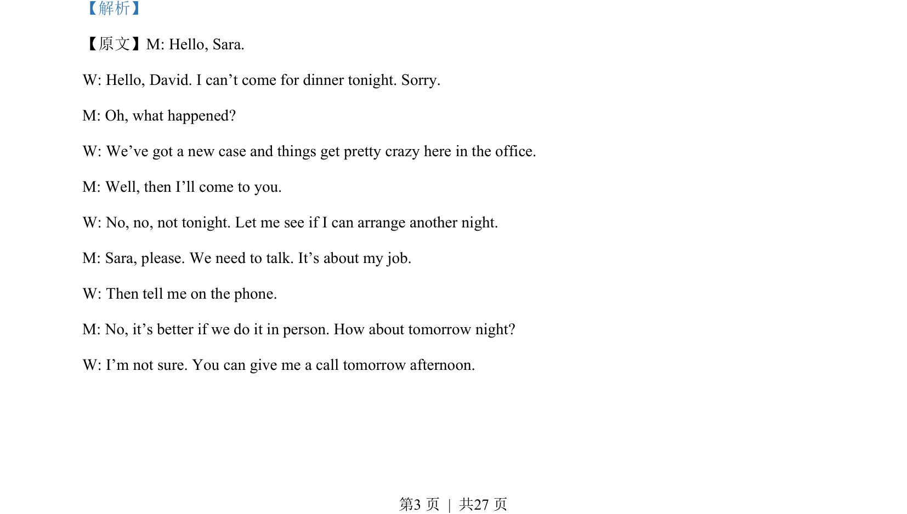
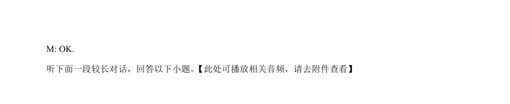

## 题面

## 摘要

该题是一段英语听力对话理解，考查对人物行为原因和对话意图的推理判断。

## 关联考点

- [[644-听力说明|听力理解]]
- [[966-细节捕捉|细节捕捉]]
- [[887-推理判断|推理判断]]

## 答案与解析

> 📄 原 PDF 第 3 页：`素材/真题/吉林/2008-2024·（吉林）英语高考真题/2023年高考英语试卷（新课标Ⅱ卷）（解析卷）.pdf`
