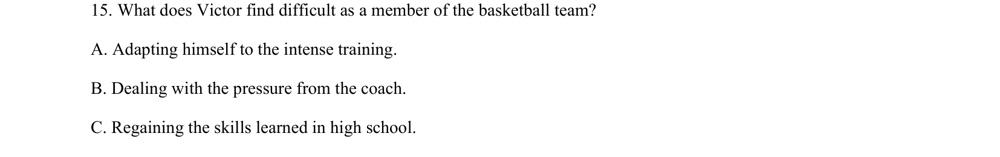

## 题面

## 摘要

考查识别Victor在篮球队面临的具体困难这一细节信息。

## 关联考点

- [[707-detail comprehension|detail comprehension]]
- [[644-听力说明|听力理解]]

## 答案与解析

> 📄 原 PDF 第 5 页：`素材/真题/吉林/2008-2024·（吉林）英语高考真题/2023年高考英语试卷（新课标Ⅱ卷）（解析卷）.pdf`
