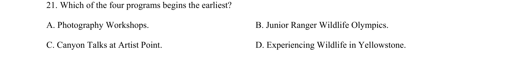

## 题面

## 摘要

细节理解题，考查从多个活动时间中找出最早开始的项目。

## 关联考点

- [[689-Specific Information|细节理解]]
- [[634-信息定位|信息定位]]
- [[860-比较分析|比较分析]]

## 答案与解析

> 📄 原 PDF 第 7 页：`素材/真题/吉林/2008-2024·（吉林）英语高考真题/2023年高考英语试卷（新课标Ⅱ卷）（解析卷）.pdf`
