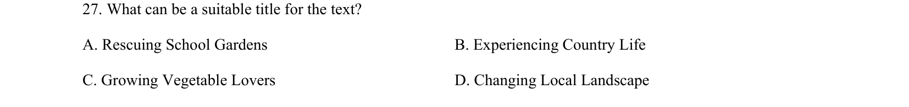
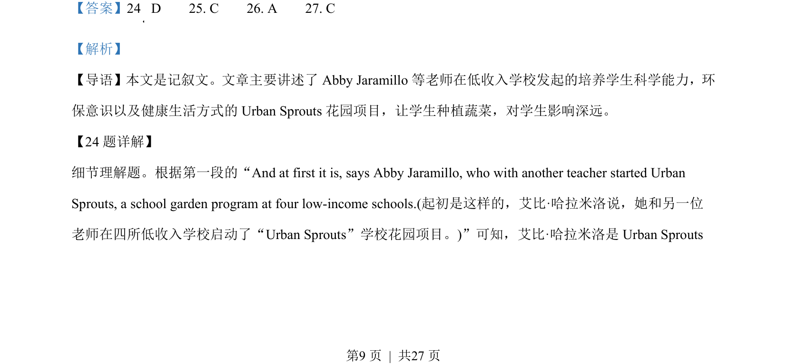
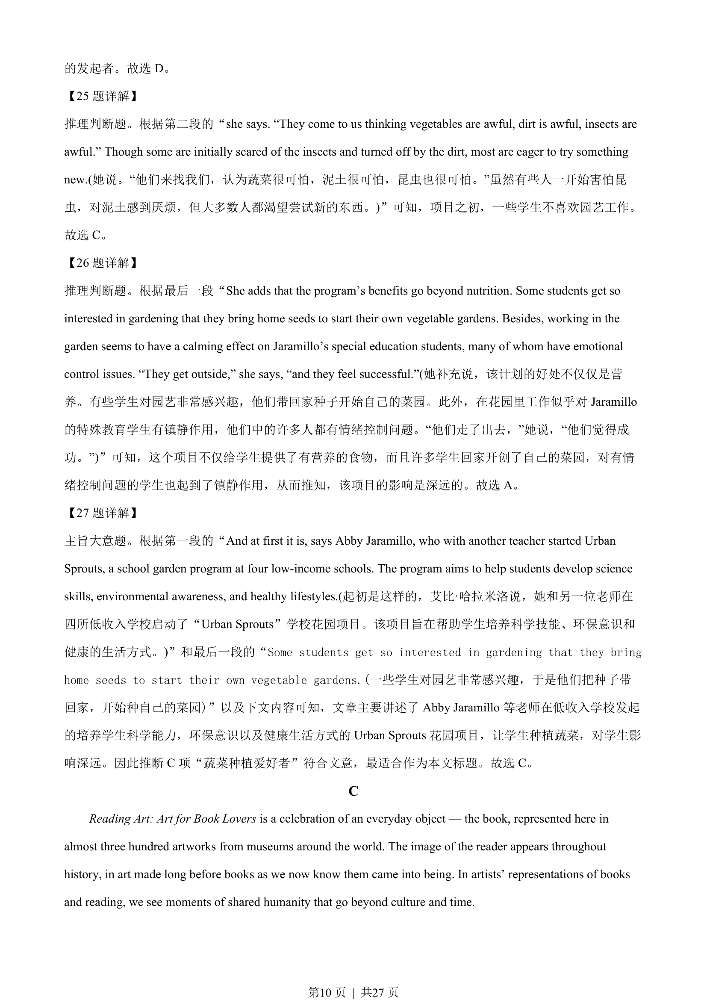
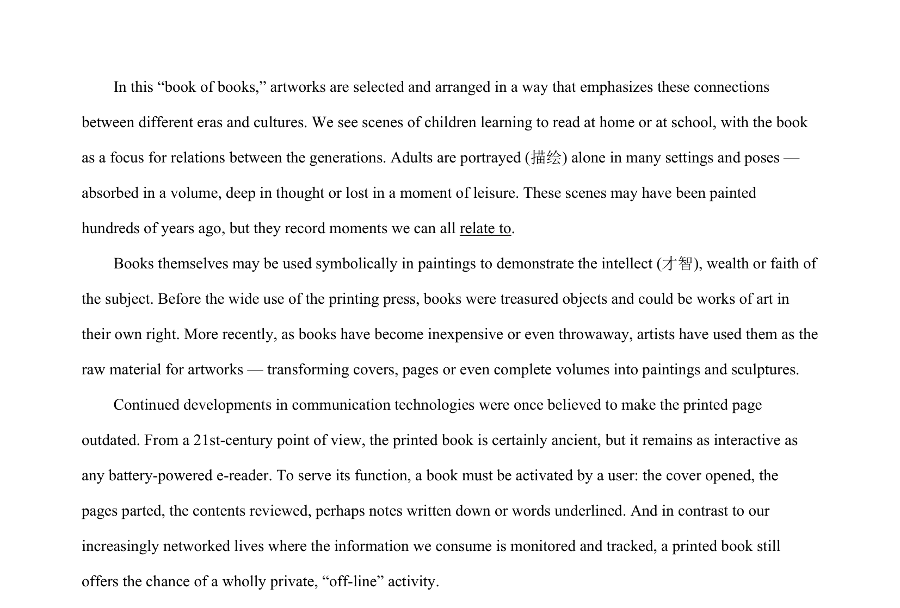

## 题面

## 摘要

考查对记叙文细节理解、推理判断及主旨大意的综合应用，涉及学校花园项目内容。

## 关联考点

- [[706-detail comprehension|detail comprehension]]
- [[627-inference|inference]]
- [[518-概括|main idea]]
- [[718-narrative reading|narrative reading]]

## 答案与解析

> 📄 原 PDF 第 9 页：`素材/真题/吉林/2008-2024·（吉林）英语高考真题/2023年高考英语试卷（新课标Ⅱ卷）（解析卷）.pdf`
