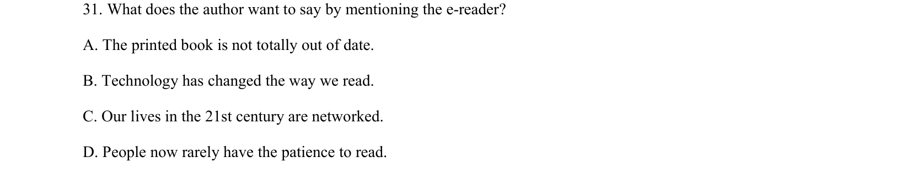
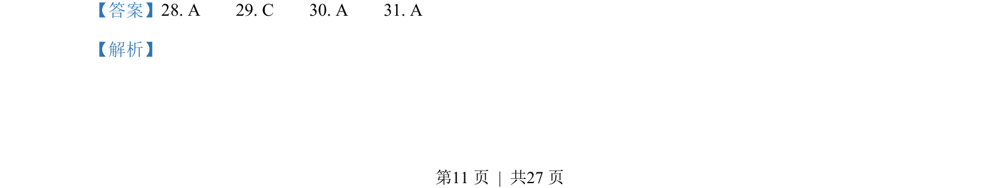
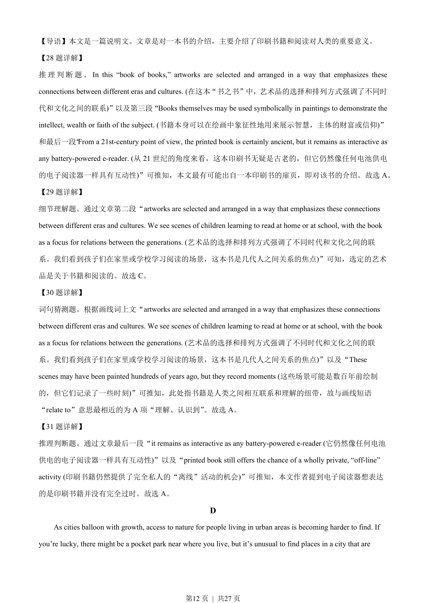
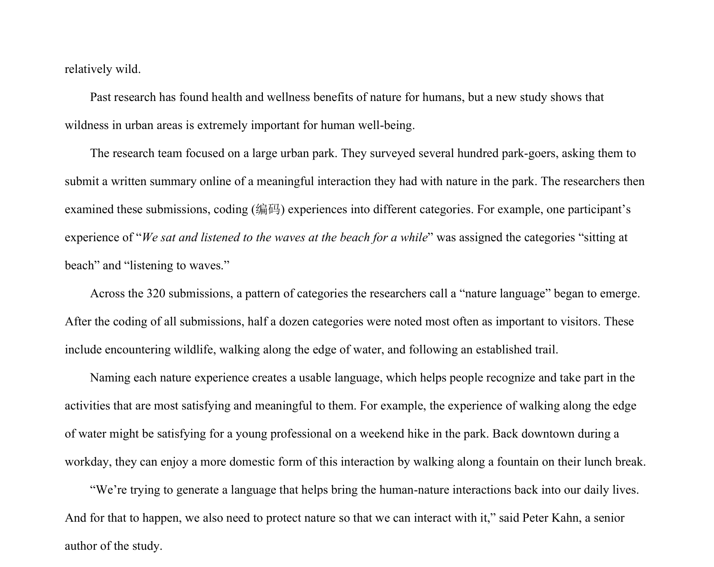

## 题面

## 摘要

本文通过介绍一本书阐述印刷书籍的意义，考查推理判断、细节理解和词义猜测。

## 关联考点

- [[718-logic inference|Inference]]
- [[690-Specific Information|细节理解]]
- [[697-Word Meaning Guessing|Word Meaning Guessing]]

## 答案与解析

> 📄 原 PDF 第 11 页：`素材/真题/吉林/2008-2024·（吉林）英语高考真题/2023年高考英语试卷（新课标Ⅱ卷）（解析卷）.pdf`
