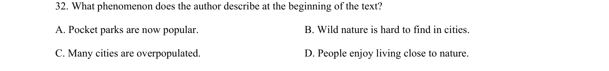

## 题面

## 摘要

该题考查函数与导数综合应用，涉及单调性、极值及不等式证明。

## 关联考点

- [[432-导数与函数单调性|函数单调性]]
- [[436-导数应用-几何最值|导数应用]]
- [[极值求解]]
- [[不等式证明]]

## 答案与解析

> 📄 原 PDF 第 13 页：`素材/真题/吉林/2008-2024·（吉林）英语高考真题/2023年高考英语试卷（新课标Ⅱ卷）（解析卷）.pdf`
