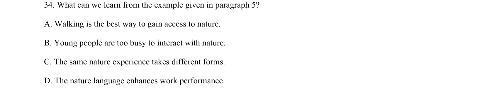

## 题面

## 摘要

阅读理解推理题，关于自然体验的多样性，考查从第五段举例中可以得出的结论（相同自然体验有不同表现形式等）。

## 关联考点

- [[725-reading comprehension|阅读理解]]
- [[888-推理判断|推理判断]]
- [[550-说明文|说明文]]

## 答案与解析

> 📄 原 PDF 第 13 页：`素材/真题/吉林/2008-2024·（吉林）英语高考真题/2023年高考英语试卷（新课标Ⅱ卷）（解析卷）.pdf`
