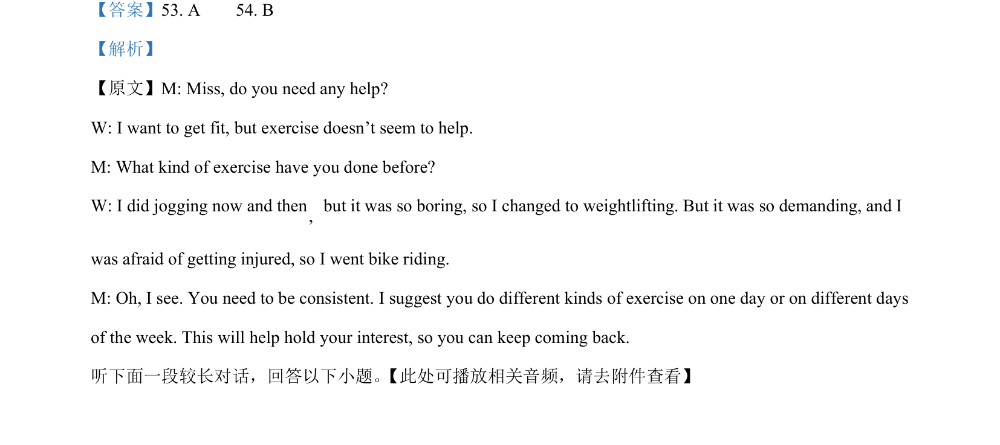

## 题面

## 摘要

考查对新闻报道中短篇故事服务细节和推理的理解。

## 关联考点

- [[Inference]]
- [[Detail Comprehension]]
- [[News Report Reading]]

## 答案与解析

> 📄 原 PDF 第 3 页：`素材/真题/吉林/2008-2024·（吉林）英语高考真题/2024年高考英语试卷（新课标Ⅱ卷）（解析卷）.pdf`
