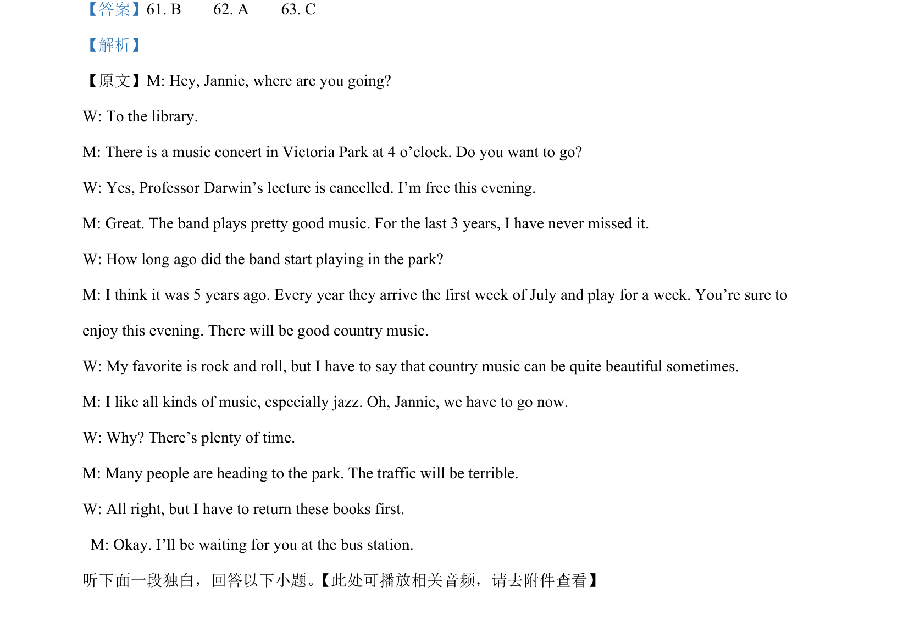

## 题面

## 摘要

该题通过简短对话考查学生捕捉后续行动细节的听力理解能力。

## 关联考点

- [[643-听力细节|Listening for Details]]
- [[676-Future Plans|Future Plans]]

## 答案与解析

> 📄 原 PDF 第 5 页：`素材/真题/吉林/2008-2024·（吉林）英语高考真题/2024年高考英语试卷（新课标Ⅱ卷）（解析卷）.pdf`
