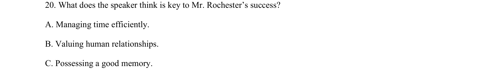
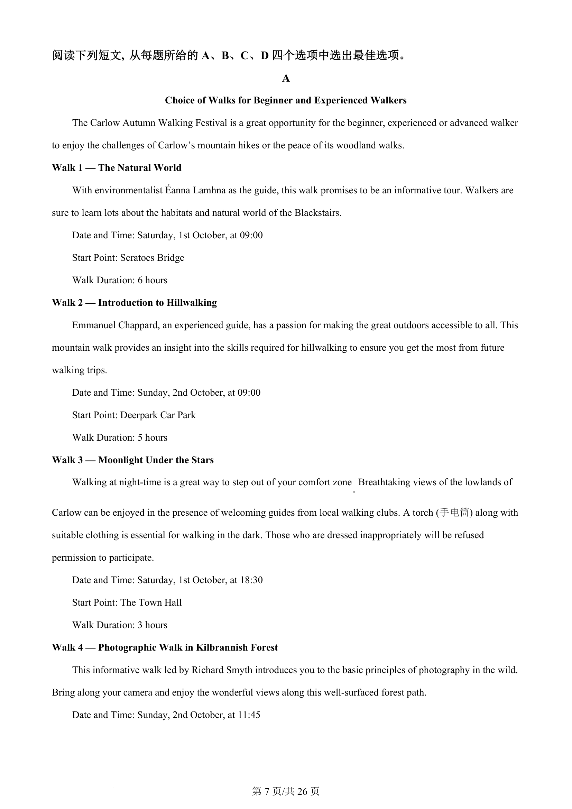
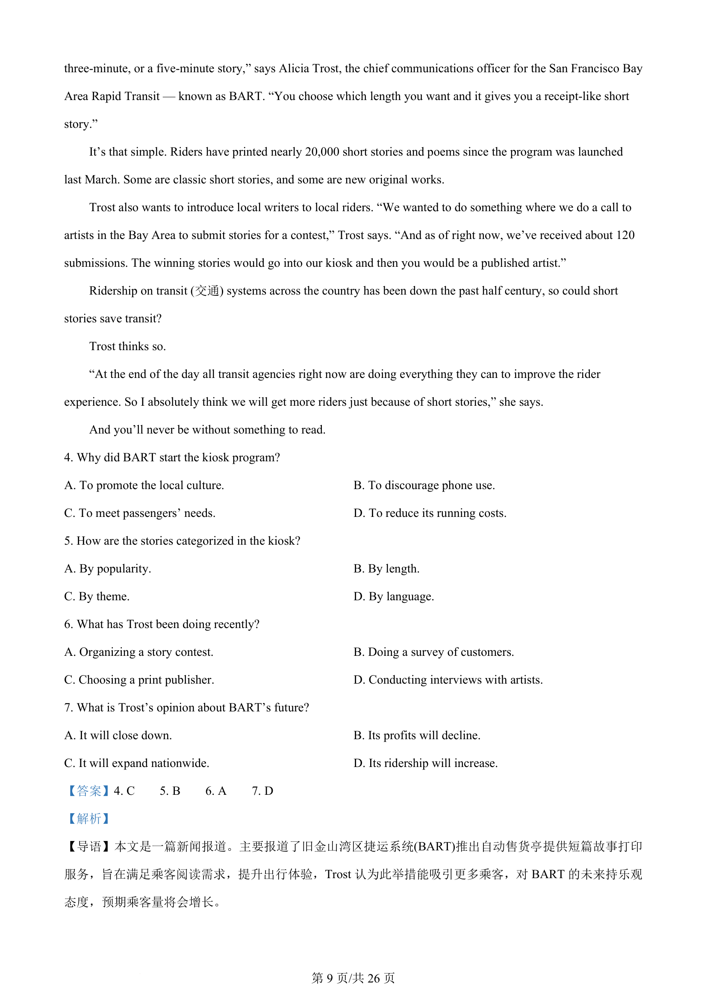
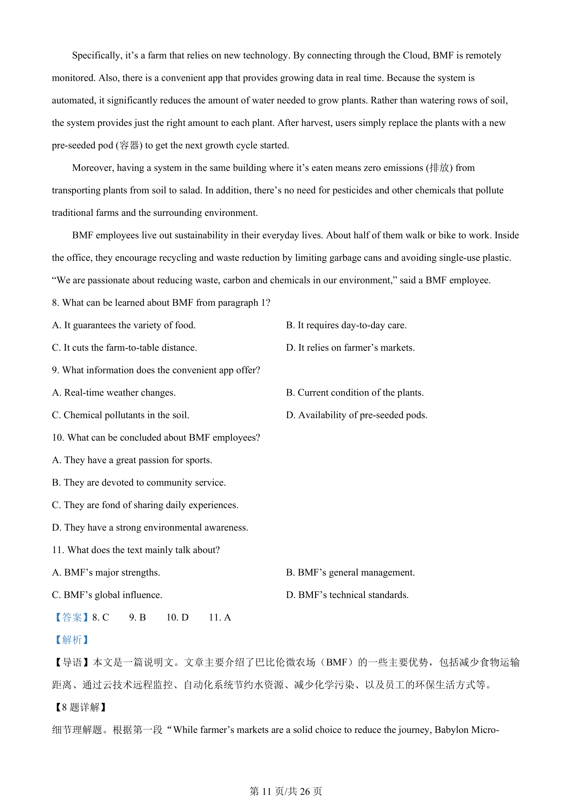
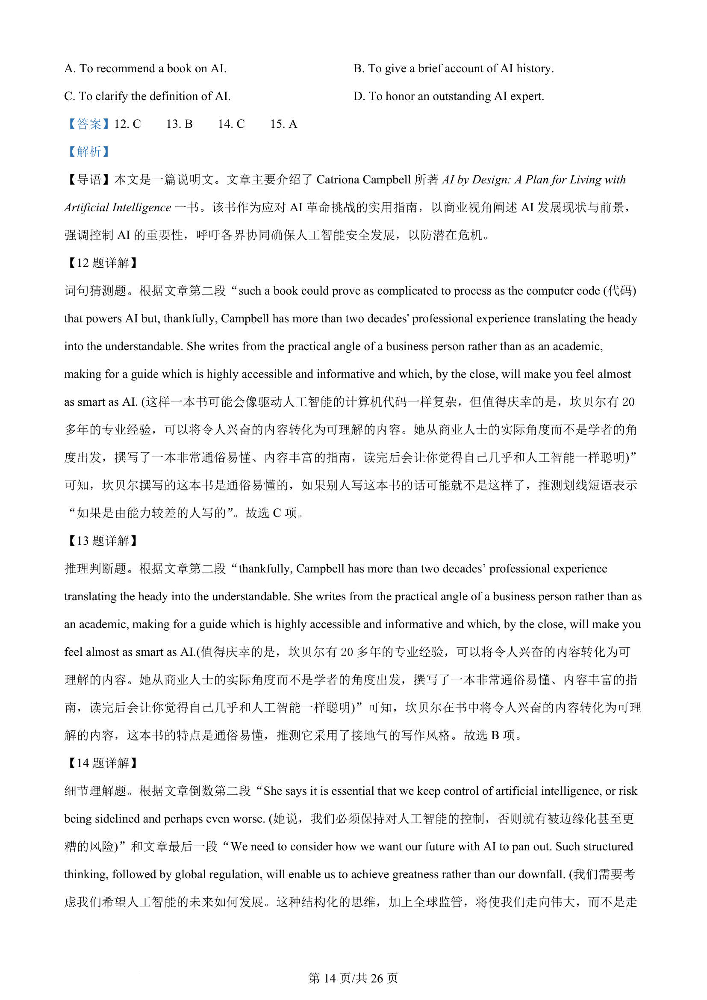
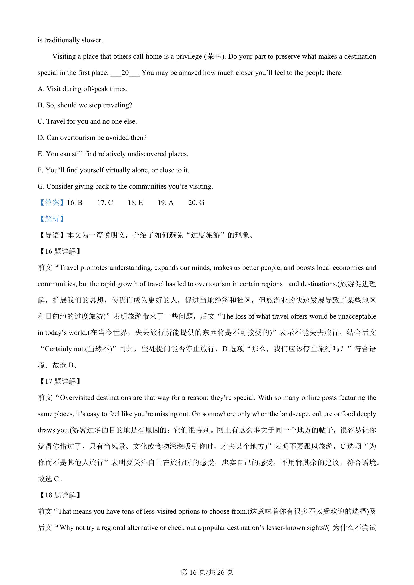
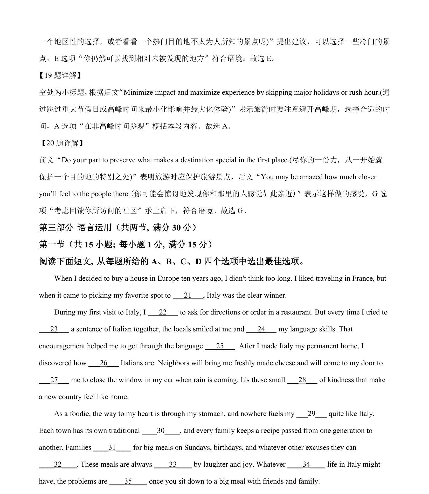

## 题面

## 摘要

该题通过一段成功商人的故事，考查对说话人观点及成功原因的理解。

## 关联考点

- [[644-听力说明|听力理解]]
- [[665-观点态度推理|观点态度推理]]
- [[759-人际交往主题|人际交往主题]]

## 答案与解析

> 📄 原 PDF 第 6 页：`素材/真题/吉林/2008-2024·（吉林）英语高考真题/2024年高考英语试卷（新课标Ⅱ卷）（解析卷）.pdf`
