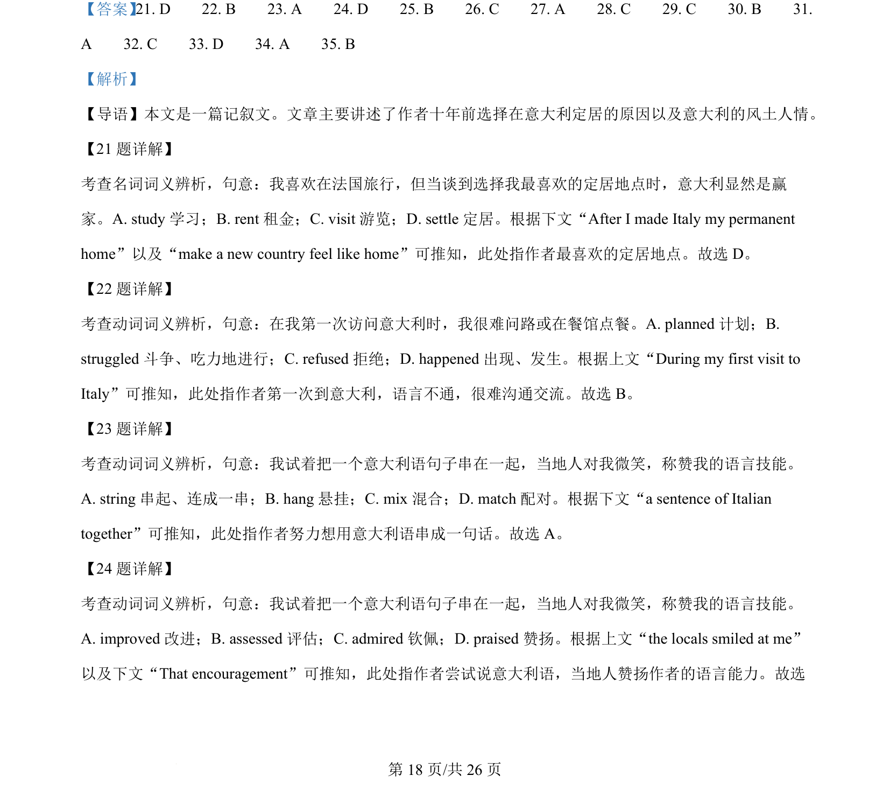
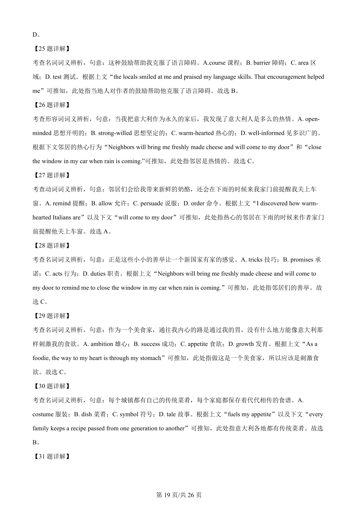
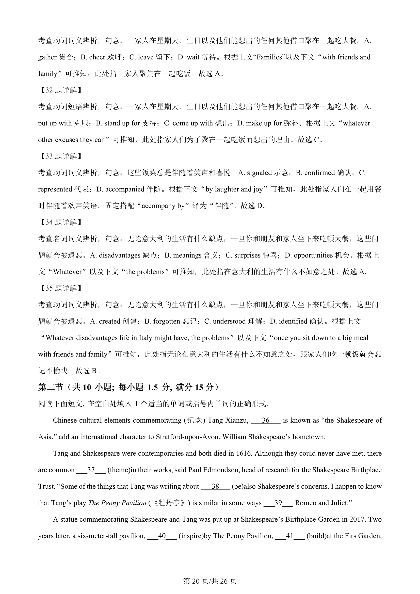
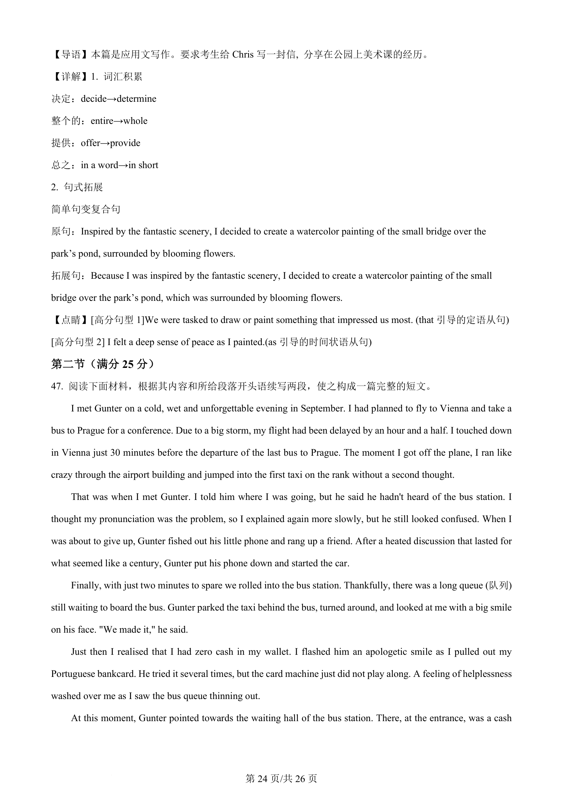

## 题面

## 摘要

这是一道完形填空题，考查根据上下文线索选择正确名词、动词、形容词等词汇。

## 关联考点

- [[471-名词|noun]]
- [[465-动词|verb]]
- [[494-形容词|adjective]]
- [[703-context clues|context clues]]
- [[730-vocabulary in context|vocabulary in context]]

## 答案与解析

> 📄 原 PDF 第 18 页：`素材/真题/吉林/2008-2024·（吉林）英语高考真题/2024年高考英语试卷（新课标Ⅱ卷）（解析卷）.pdf`
