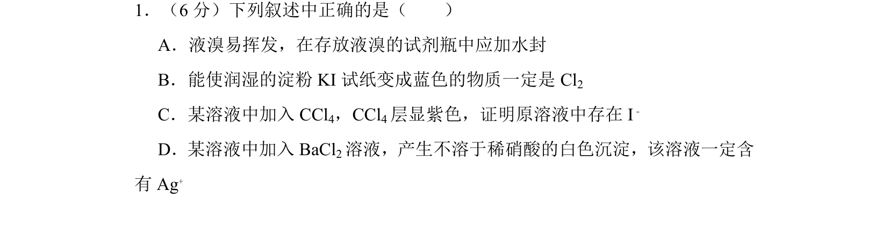
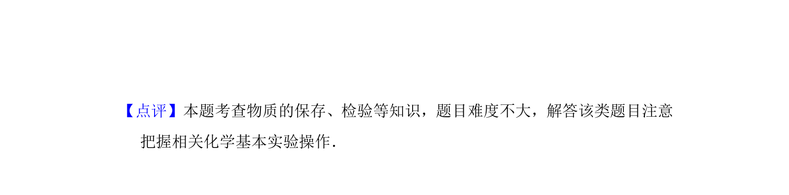

## 题面

## 摘要

考查液溴保存、淀粉KI试纸检验、碘的萃取及沉淀法检验离子的实验知识

## 关联考点

- [[物质的保存]]
- [[778-物质的检验与鉴别|物质的检验与鉴别]]
- [[162-氧化还原反应|氧化还原反应]]
- [[745-沉淀反应|沉淀反应]]

## 答案与解析

> 📄 原 PDF 第 1 页：`素材/真题/湖南/2008-2024·（湖南）化学高考真题/2012年高考化学试卷（新课标）（解析卷）.pdf`
