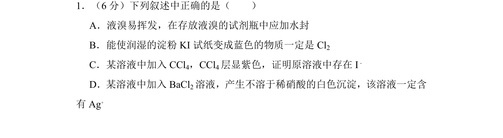
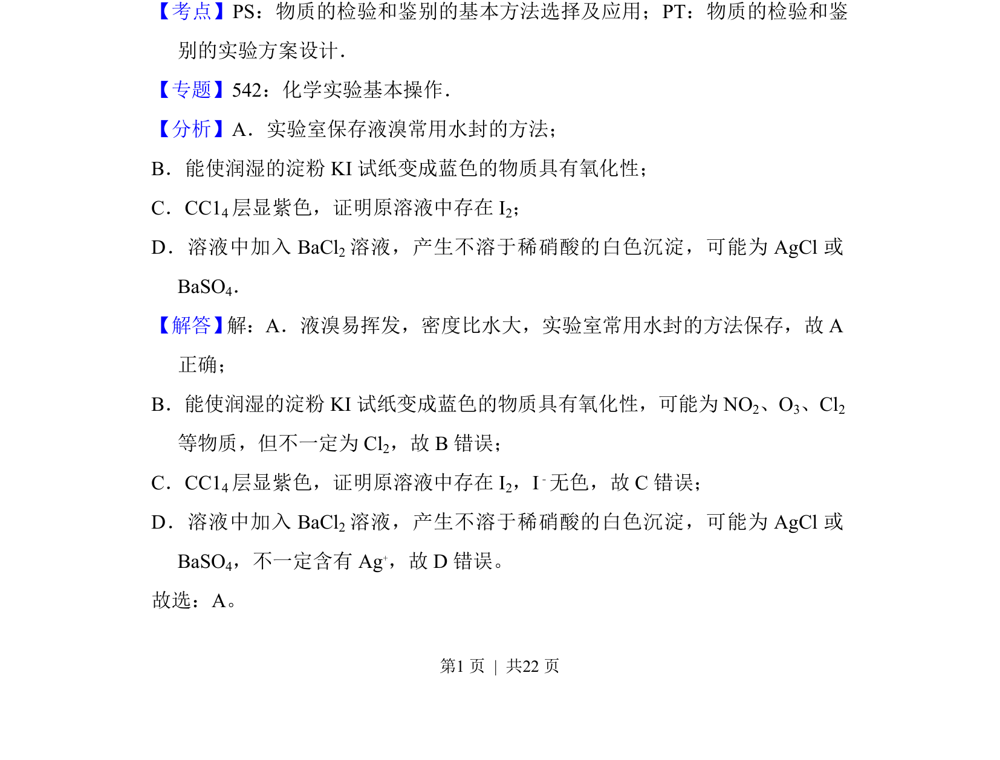
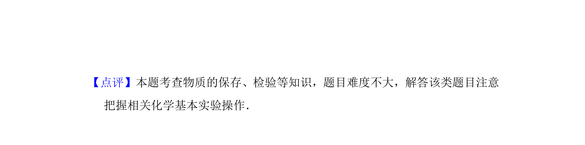

## 题面

## 摘要

考查液溴保存、淀粉KI试纸检验、碘的萃取及沉淀法检验离子的实验知识

## 关联考点

- [[物质的保存]]
- [[778-物质的检验与鉴别|物质的检验与鉴别]]
- [[162-氧化还原反应|氧化还原反应]]
- [[745-沉淀反应|沉淀反应]]

## 答案与解析

> 📄 原 PDF 第 1 页：`素材/真题/湖南/2008-2024·（湖南）化学高考真题/2012年高考化学试卷（新课标）（解析卷）.pdf`

<!-- 题干文本-start -->
## 题干文本
1．（6分）下列叙述中正确的是（　　）
A．液溴易挥发，在存放液溴的试剂瓶中应加水封
B．能使润湿的淀粉KI试纸变成蓝色的物质一定是Cl 2
C．某溶液中加入CCl 4，CCl4层显紫色，证明原溶液中存在I ﹣
D．某溶液中加入BaCl 2溶液，产生不溶于稀硝酸的白色沉淀，该溶液一定含
有Ag +
<!-- 题干文本-end -->

<!-- 解析文本-start -->
## 解析文本
【考点】PS：物质的检验和鉴别的基本方法选择及应用；PT：物质的检验和鉴
别的实验方案设计．菁优网版权所有
【专题】542：化学实验基本操作．
【分析】A．实验室保存液溴常用水封的方法；
B．能使润湿的淀粉KI试纸变成蓝色的物质具有氧化性；
C．CC14层显紫色，证明原溶液中存在I 2；
D．溶液中加入BaCl 2溶液，产生不溶于稀硝酸的白色沉淀，可能为AgCl或
BaSO4．
【解答】 解：A．液溴易挥发，密度比水大，实验室常用水封的方法保存，故A
正确；
B．能使润湿的淀粉KI试纸变成蓝色的物质具有氧化性，可能为NO 2、O3、Cl2
等物质，但不一定为Cl 2，故B错误；
C．CC14层显紫色，证明原溶液中存在I 2，I﹣无色，故C错误；
D．溶液中加入BaCl 2溶液，产生不溶于稀硝酸的白色沉淀，可能为AgCl或
BaSO4，不一定含有Ag +，故D错误。
故选：A。
<!-- 解析文本-end -->
