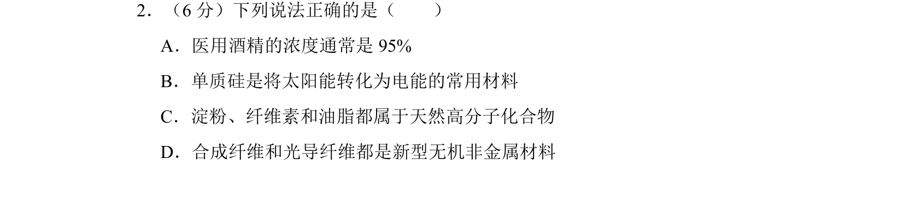

## 题面

## 摘要

本题考查常见物质组成、性质与应用的正误判断。

## 关联考点

- [[799-硅和二氧化硅|硅和二氧化硅]]
- [[生活中的有机化合物]]
- [[717-有机高分子化合物的结构和性质|有机高分子化合物的结构和性质]]

## 答案与解析

> 📄 原 PDF 第 2 页：`素材/真题/湖南/2008-2024·（湖南）化学高考真题/2012年高考化学试卷（新课标）（解析卷）.pdf`
