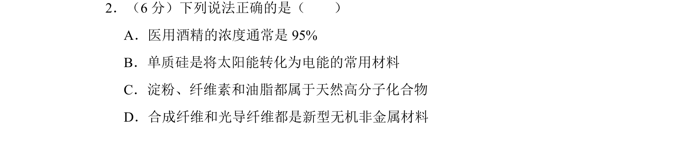
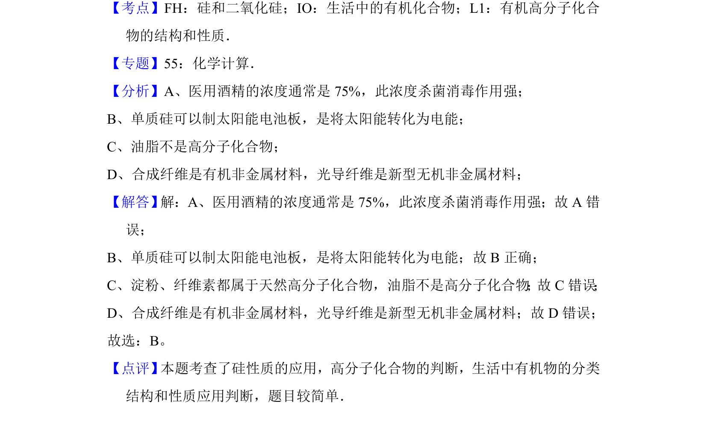

## 题面

## 摘要

本题考查常见物质组成、性质与应用的正误判断。

## 关联考点

- [[799-硅和二氧化硅|硅和二氧化硅]]
- [[生活中的有机化合物]]
- [[717-有机高分子化合物的结构和性质|有机高分子化合物的结构和性质]]

## 答案与解析

> 📄 原 PDF 第 2 页：`素材/真题/湖南/2008-2024·（湖南）化学高考真题/2012年高考化学试卷（新课标）（解析卷）.pdf`

<!-- 题干文本-start -->
## 题干文本
2．（6分）下列说法正确的是（　　）
A．医用酒精的浓度通常是95%
B．单质硅是将太阳能转化为电能的常用材料
C．淀粉、纤维素和油脂都属于天然高分子化合物
D．合成纤维和光导纤维都是新型无机非金属材料
<!-- 题干文本-end -->

<!-- 解析文本-start -->
## 解析文本
【考点】FH：硅和二氧化硅；IO：生活中的有机化合物；L1：有机高分子化合
物的结构和性质．菁优网版权所有
【专题】55：化学计算．
【分析】A、医用酒精的浓度通常是75%，此浓度杀菌消毒作用强；
B、单质硅可以制太阳能电池板，是将太阳能转化为电能；
C、油脂不是高分子化合物；
D、合成纤维是有机非金属材料，光导纤维是新型无机非金属材料；
【解答】 解：A、医用酒精的浓度通常是75%，此浓度杀菌消毒作用强；故A错
误；
B、单质硅可以制太阳能电池板，是将太阳能转化为电能；故B正确；
C、淀粉、纤维素都属于天然高分子化合物，油脂不是高分子化合物 ； 故C错误 ；
D、合成纤维是有机非金属材料，光导纤维是新型无机非金属材料；故D错误；
故选：B。
【点评】 本题考查了硅性质的应用，高分子化合物的判断，生活中有机物的分类
结构和性质应用判断，题目较简单．
<!-- 解析文本-end -->
