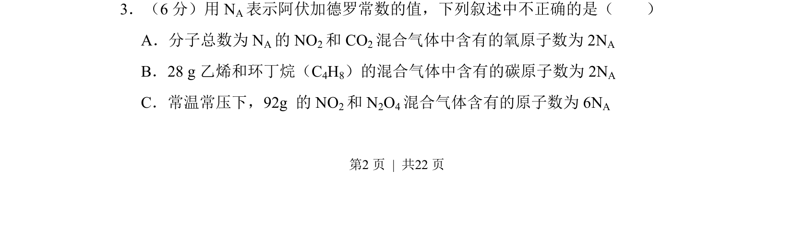
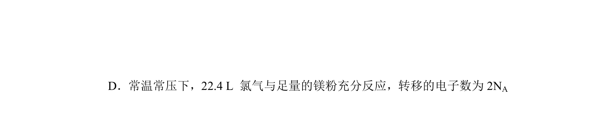
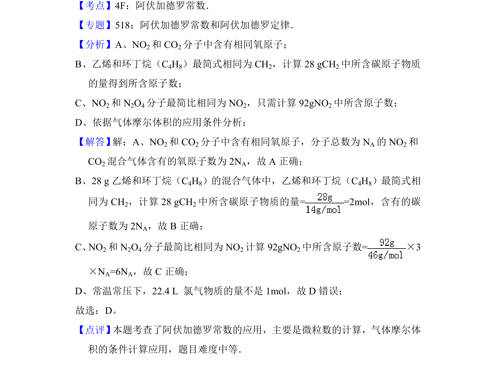

## 题面

## 摘要

阿伏加德罗常数应用，混合气体中原子数与碳原子数的计算

## 关联考点

- [[450-阿伏伽德罗常数|阿伏加德罗常数]]
- [[混合气体计算]]
- [[880-原子守恒|原子守恒]]

## 答案与解析

> 📄 原 PDF 第 2 页：`素材/真题/湖南/2008-2024·（湖南）化学高考真题/2012年高考化学试卷（新课标）（解析卷）.pdf`

<!-- 题干文本-start -->
## 题干文本
3．（6分）用N A表示阿伏加德罗常数的值，下列叙述中不正确的是（　　）
A．分子总数为N A的NO 2和CO 2混合气体中含有的氧原子数为2N A
B．28 g乙烯和环丁烷（C 4H8）的混合气体中含有的碳原子数为2N A
C．常温常压下，92g 的NO 2和N 2O4混合气体含有的原子数为6N A
<!-- 题干文本-end -->

<!-- 解析文本-start -->
## 解析文本

<!-- 解析文本-end -->
