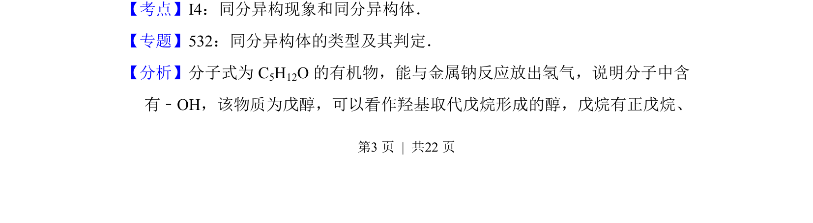
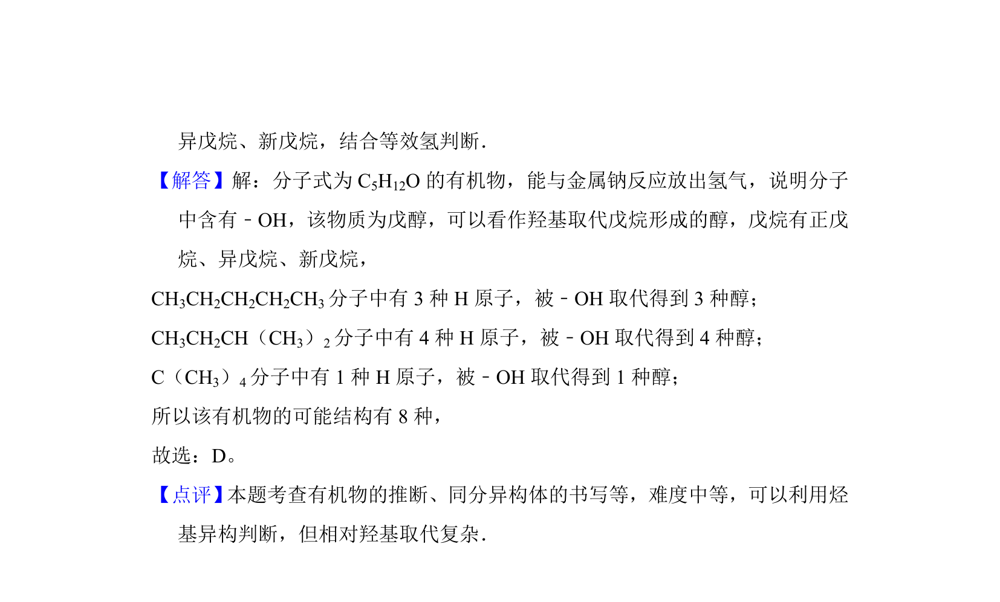

## 题面

## 摘要

分子式为C5H12O的醇的同分异构体数目判断。

## 关联考点

- [[447-同分异构现象|同分异构现象]]
- [[446-同分异构体|同分异构体]]
- [[475-醇|醇]]

## 答案与解析

> 📄 原 PDF 第 3 页：`素材/真题/湖南/2008-2024·（湖南）化学高考真题/2012年高考化学试卷（新课标）（解析卷）.pdf`

<!-- 题干文本-start -->
## 题干文本
4．（6分） 分子式为C5H12O且可与金属钠反应放出氢气的有机物有（不考虑立
体异构）（　　）
A．5种B．6种C．7种D．8种
<!-- 题干文本-end -->

<!-- 解析文本-start -->
## 解析文本
【考点】I4：同分异构现象和同分异构体．菁优网版权所有
【专题】532：同分异构体的类型及其判定．
【分析】分子式为C 5H12O的有机物，能与金属钠反应放出氢气，说明分子中含
有﹣OH，该物质为戊醇，可以看作羟基取代戊烷形成的醇，戊烷有正戊烷、
<!-- 解析文本-end -->
