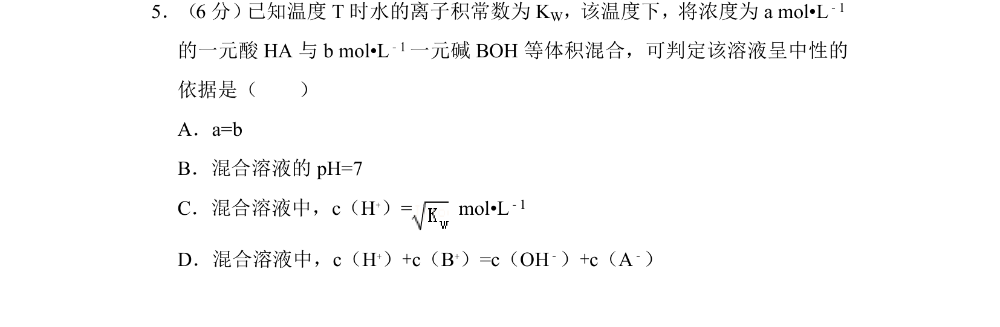
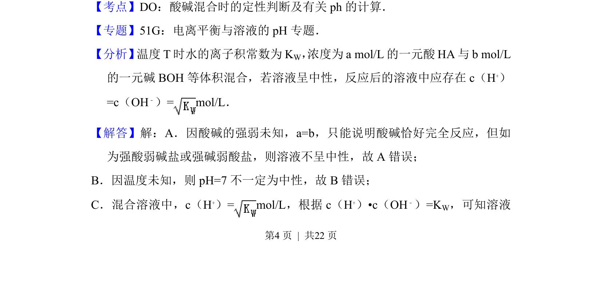

## 题面

## 摘要

该题考查温度T下水的离子积常数Kw，酸碱等体积混合后溶液呈中性的判断依据。

## 关联考点

- [[741-水的离子积常数|水的离子积常数]]
- [[酸碱混合]]
- [[溶液中性判断]]

## 答案与解析

> 📄 原 PDF 第 4 页：`素材/真题/湖南/2008-2024·（湖南）化学高考真题/2012年高考化学试卷（新课标）（解析卷）.pdf`
