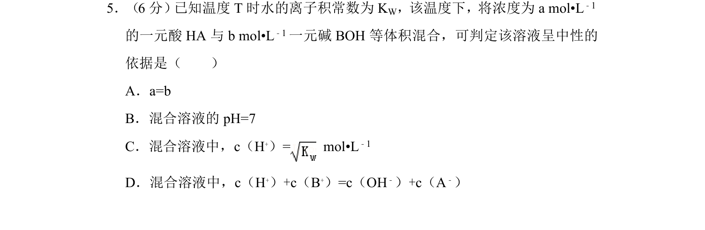
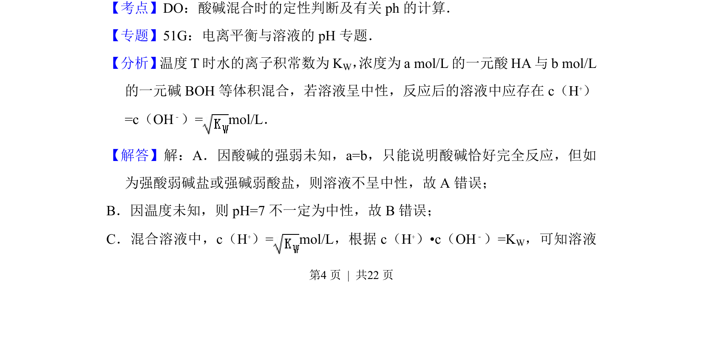
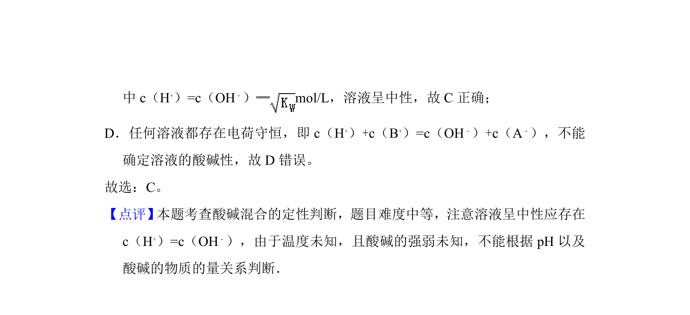

## 题面

## 摘要

该题考查温度T下水的离子积常数Kw，酸碱等体积混合后溶液呈中性的判断依据。

## 关联考点

- [[741-水的离子积常数|水的离子积常数]]
- [[酸碱混合]]
- [[溶液中性判断]]

## 答案与解析

> 📄 原 PDF 第 4 页：`素材/真题/湖南/2008-2024·（湖南）化学高考真题/2012年高考化学试卷（新课标）（解析卷）.pdf`

<!-- 题干文本-start -->
## 题干文本
5．（6分） 已知温度T时水的离子积常数为KW，该温度下，将浓度为a mol•L﹣1
的一元酸HA与b mol•L ﹣1一元碱BOH等体积混合，可判定该溶液呈中性的
依据是（　　）
A．a=b
B．混合溶液的pH=7
C．混合溶液中，c（H+）=  mol•L ﹣1
D．混合溶液中，c（H+）+c（B+）=c（OH﹣）+c（A﹣）
<!-- 题干文本-end -->

<!-- 解析文本-start -->
## 解析文本
【考点】DO：酸碱混合时的定性判断及有关ph的计算．菁优网版权所有
【专题】51G：电离平衡与溶液的pH专题．
【分析】 温度T时水的离子积常数为KW， 浓度为a mol/L的一元酸HA与b mol/L
的一元碱BOH等体积混合，若溶液呈中性，反应后的溶液中应存在c（H +）
=c（OH﹣）= mol/L．
【解答】解：A．因酸碱的强弱未知，a=b，只能说明酸碱恰好完全反应，但如
为强酸弱碱盐或强碱弱酸盐，则溶液不呈中性，故A错误；
B．因温度未知，则pH=7不一定为中性，故B错误；
C．混合溶液中，c（H +）= mol/L，根据c（H +）•c（OH﹣）=KW，可知溶液
<!-- 解析文本-end -->
