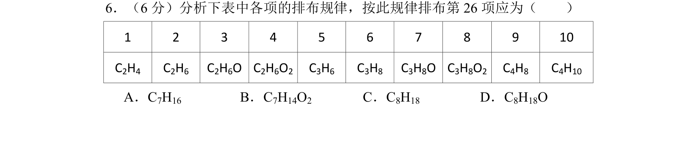
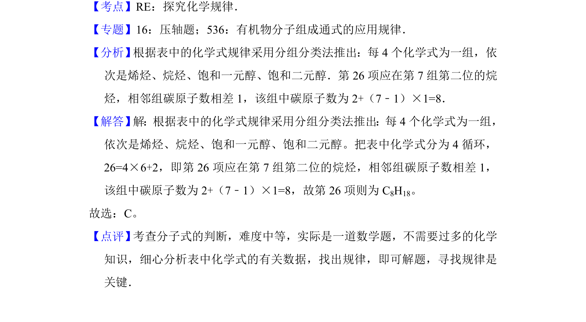

## 题面

## 摘要

根据有机物分子式排布规律，推断第26项对应的烷烃分子式。

## 关联考点

- [[712-有机物分子组成通式|有机物分子组成通式]]
- [[244-烷烃|烷烃]]
- [[探究规律]]

## 答案与解析

> 📄 原 PDF 第 5 页：`素材/真题/湖南/2008-2024·（湖南）化学高考真题/2012年高考化学试卷（新课标）（解析卷）.pdf`

<!-- 题干文本-start -->
## 题干文本
6．（6分）分析下表中各项的排布规律，按此规律排布第26项应为（　　）
1 2 3 4 5 6 7 8 9 10
C2H4 C2H6 C2H6O C2H6O2 C3H6 C3H8 C3H8O C3H8O2 C4H8 C4H10
A．C7H16 B．C7H14O2 C．C8H18 D．C8H18O
<!-- 题干文本-end -->

<!-- 解析文本-start -->
## 解析文本
【考点】RE：探究化学规律．菁优网版权所有
【专题】16：压轴题；536：有机物分子组成通式的应用规律．
【分析】 根据表中的化学式规律采用分组分类法推出：每4个化学式为一组，依
次是烯烃、烷烃、饱和一元醇、饱和二元醇．第26项应在第7组第二位的烷
烃，相邻组碳原子数相差1，该组中碳原子数为2+（7﹣1）×1=8．
【解答】 解：根据表中的化学式规律采用分组分类法推出：每4个化学式为一组，
依次是烯烃、烷烃、饱和一元醇、饱和二元醇。把表中化学式分为4循环，
26=4×6+2，即第26项应在第7组第二位的烷烃，相邻组碳原子数相差1，
该组中碳原子数为2+（7﹣1）×1=8，故第26项则为C 8H18。
故选：C。
【点评】 考查分子式的判断，难度中等，实际是一道数学题，不需要过多的化学
知识，细心分析表中化学式的有关数据，找出规律，即可解题，寻找规律是
关键．
<!-- 解析文本-end -->
