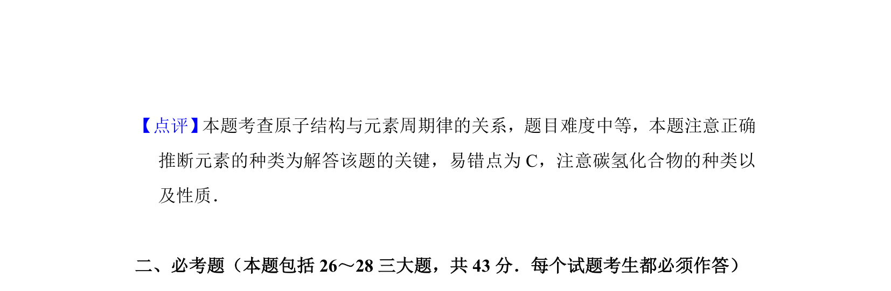

## 题面

## 摘要

通过短周期元素原子内层电子数与阴离子电子数关系，结合考古核素应用推断元素。

## 关联考点

- [[636-原子核外电子排布|原子核外电子排布]]
- [[262-周期表结构|元素周期表结构]]
- [[265-核素|核素]]
- [[597-元素推断|元素推断]]

## 答案与解析

> 📄 原 PDF 第 5 页：`素材/真题/湖南/2008-2024·（湖南）化学高考真题/2012年高考化学试卷（新课标）（解析卷）.pdf`
