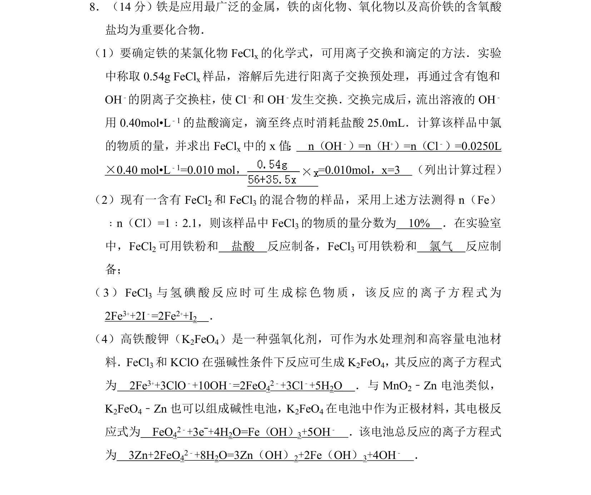
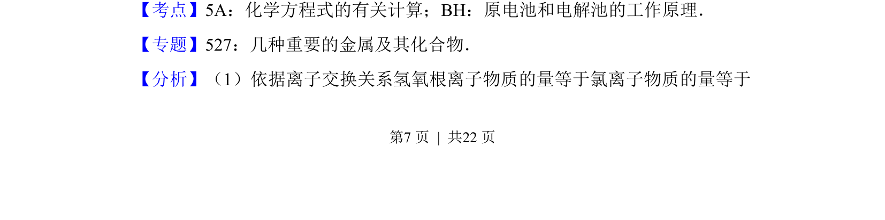
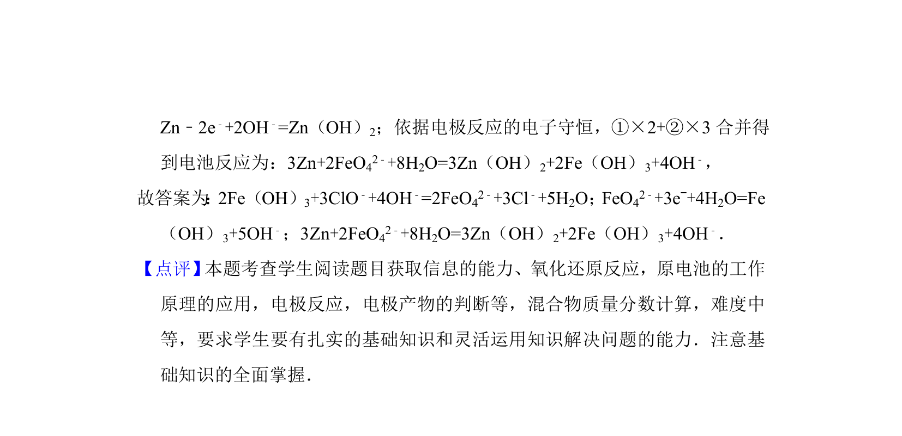

## 题面

## 摘要

该题以铁及其化合物为载体，考查了化学式计算、离子方程式的书写以及原电池电极反应与总反应的书写。

## 关联考点

- [[化学式计算]]
- [[806-离子方程式书写|离子方程式书写]]
- [[641-原电池原理|原电池原理]]
- [[162-氧化还原反应|氧化还原反应]]

## 答案与解析

> 📄 原 PDF 第 7 页：`素材/真题/湖南/2008-2024·（湖南）化学高考真题/2012年高考化学试卷（新课标）（解析卷）.pdf`
