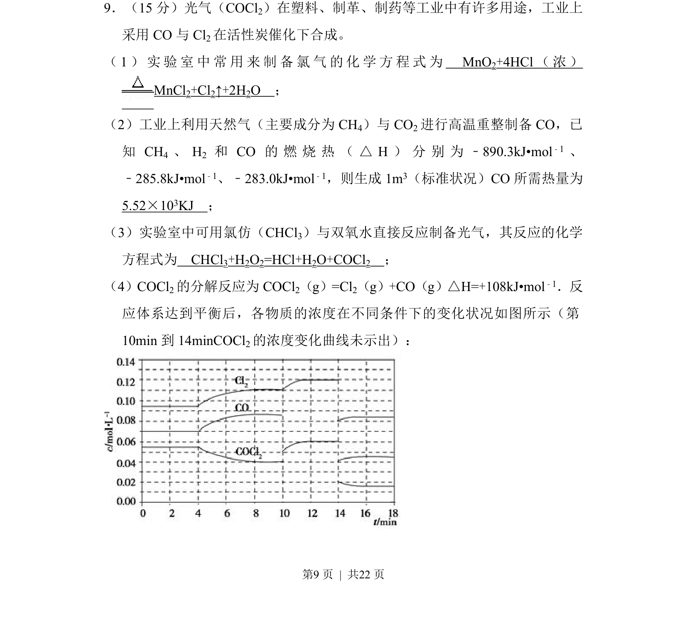
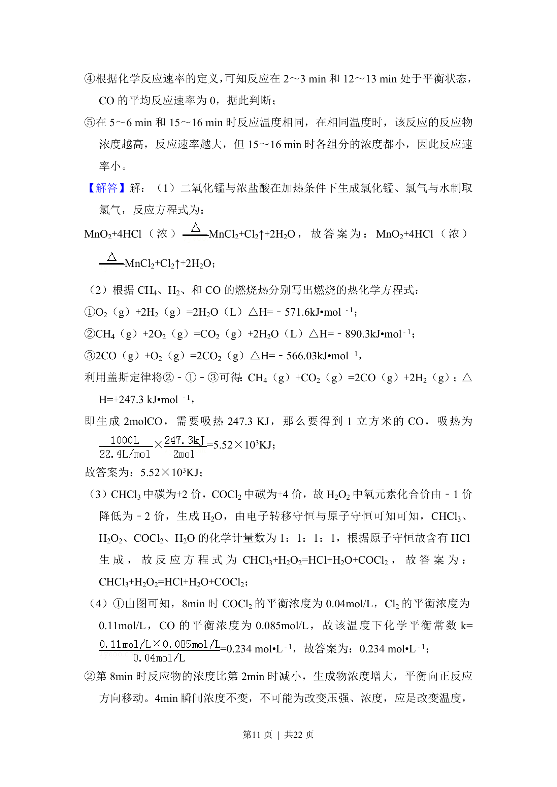

## 题面

## 摘要

考查氯气制备、热化学计算、光气合成及平衡图像分析等综合实验与原理内容。

## 关联考点

- [[621-化学方程式书写|化学方程式书写]]
- [[768-热化学方程式与反应热计算|热化学方程式与反应热计算]]
- [[化学平衡与浓度变化分析]]

## 答案与解析

> 📄 原 PDF 第 9 页：`素材/真题/湖南/2008-2024·（湖南）化学高考真题/2012年高考化学试卷（新课标）（解析卷）.pdf`
