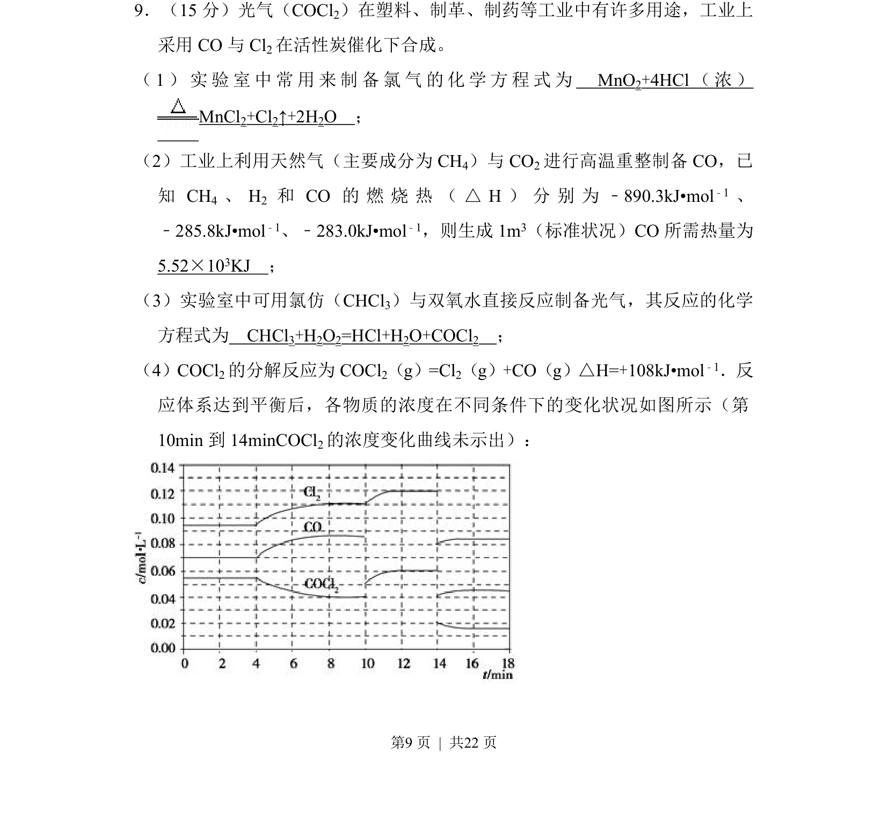
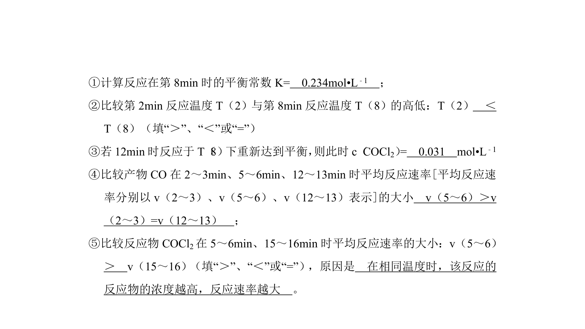
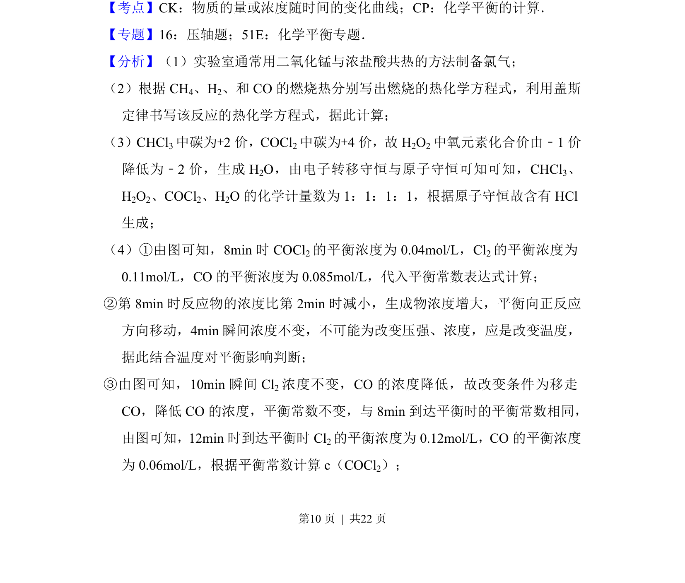
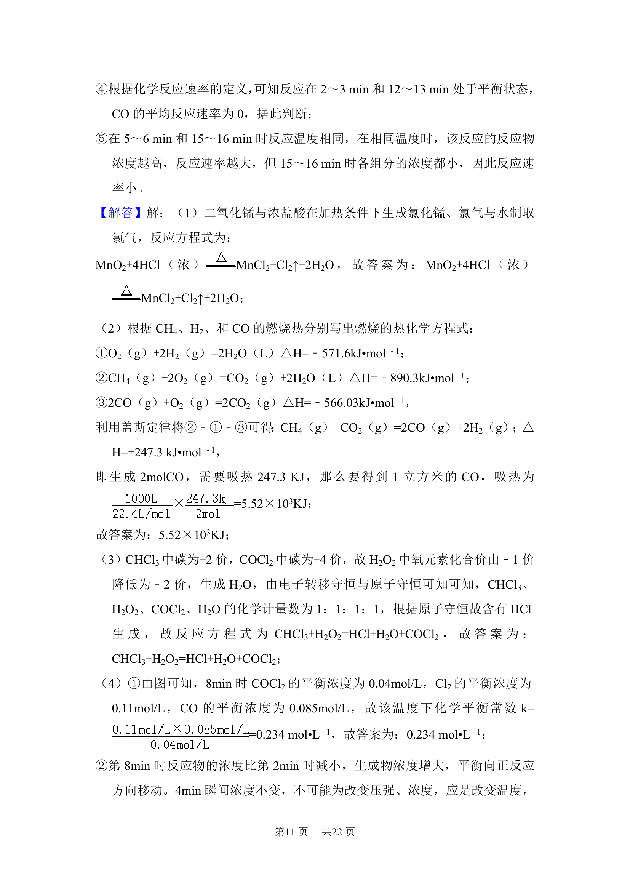
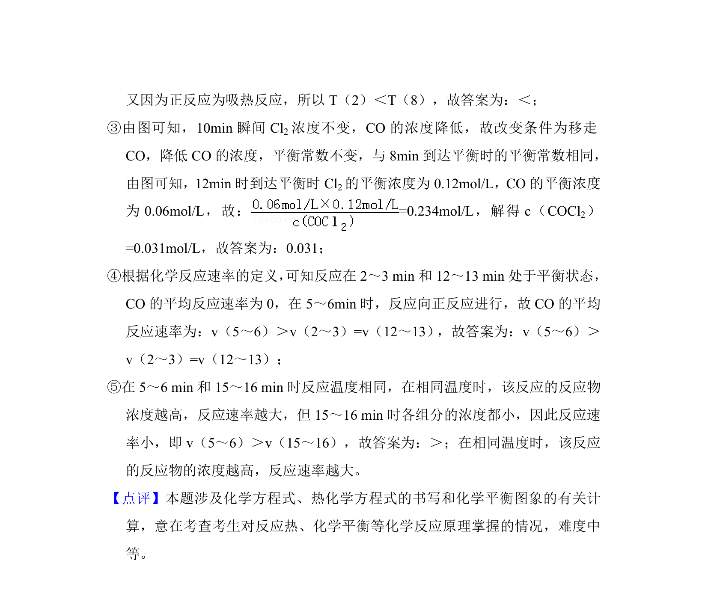

## 题面

## 摘要

考查氯气制备、热化学计算、光气合成及平衡图像分析等综合实验与原理内容。

## 关联考点

- [[976-化学方程式的书写|化学方程式书写]]
- [[768-热化学方程式与反应热计算|热化学方程式与反应热计算]]
- [[化学平衡与浓度变化分析]]

## 答案与解析

> 📄 原 PDF 第 9 页：`素材/真题/湖南/2008-2024·（湖南）化学高考真题/2012年高考化学试卷（新课标）（解析卷）.pdf`

<!-- 题干文本-start -->
## 题干文本
9．（15分）光气（COCl 2）在塑料、制革、制药等工业中有许多用途，工业上
采用CO与Cl 2在活性炭催化下合成。
（1）实验室中常用来制备氯气的化学方程式为　MnO 2+4HCl（浓）
MnCl2+Cl2↑+2H2O　；
（2）工业上利用天然气（主要成分为CH 4）与CO 2进行高温重整制备CO，已
知CH 4 、H 2 和CO的 燃 烧 热 （ △H） 分 别 为﹣890.3kJ•mol ﹣1 、
﹣285.8kJ•mol﹣1、﹣283.0kJ•mol﹣1，则生成1m 3（标准状况）CO所需热量为　
5.52×103KJ　；
（3）实验室中可用氯仿（CHCl 3）与双氧水直接反应制备光气，其反应的化学
方程式为　CHCl3+H2O2=HCl+H2O+COCl2　；
（4）COCl2的分解反应为COCl 2（g）=Cl2（g）+CO（g）△H=+108kJ•mol﹣1．反
应体系达到平衡后，各物质的浓度在不同条件下的变化状况如图所示（第
10min到14minCOCl 2的浓度变化曲线未示出）：
<!-- 题干文本-end -->

<!-- 解析文本-start -->
## 解析文本

<!-- 解析文本-end -->
