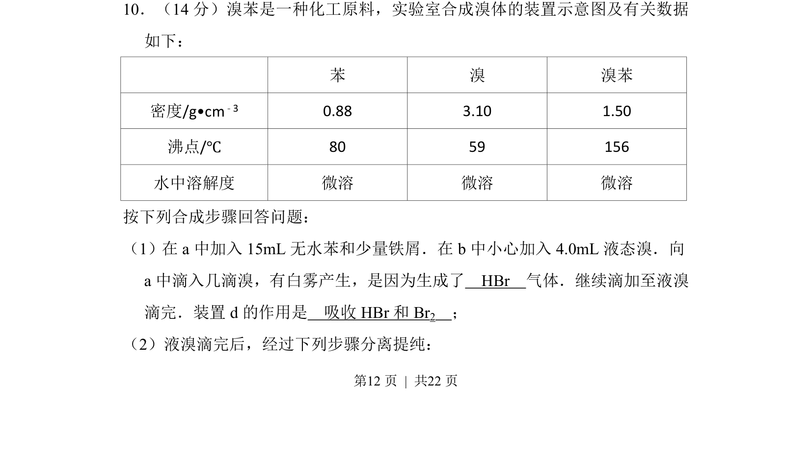

## 题面

## 摘要

实验室合成溴苯的装置、原理及尾气吸收等操作分析。

## 关联考点

- [[246-甲烷取代反应|卤代反应]]
- [[996-实验装置|实验装置]]
- [[677-尾气处理|尾气处理]]
- [[分离提纯]]

## 答案与解析

> 📄 原 PDF 第 12 页：`素材/真题/湖南/2008-2024·（湖南）化学高考真题/2012年高考化学试卷（新课标）（解析卷）.pdf`
