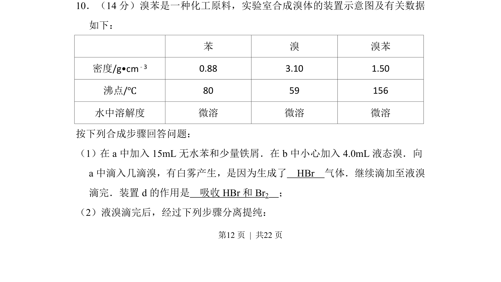
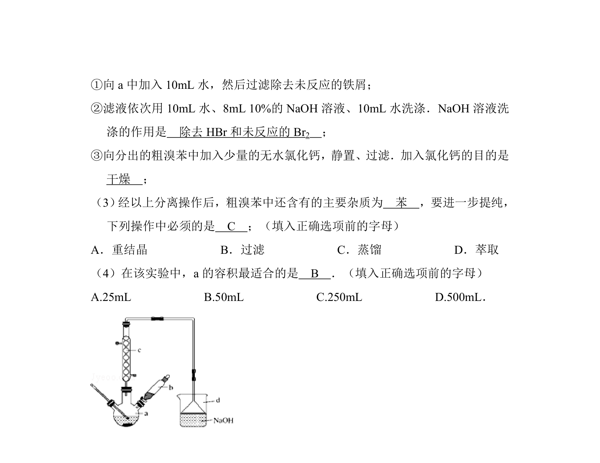
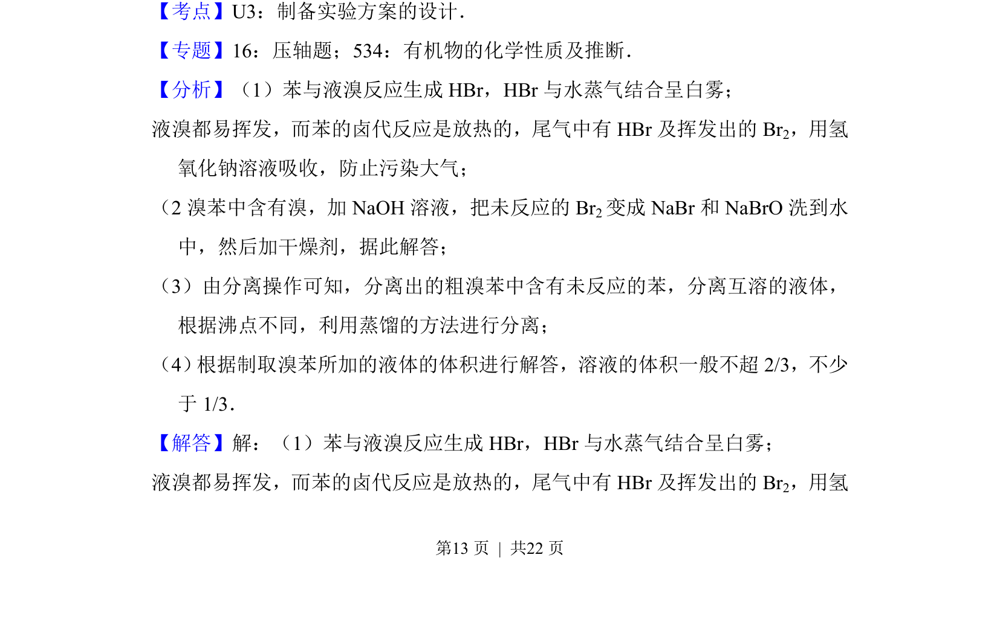
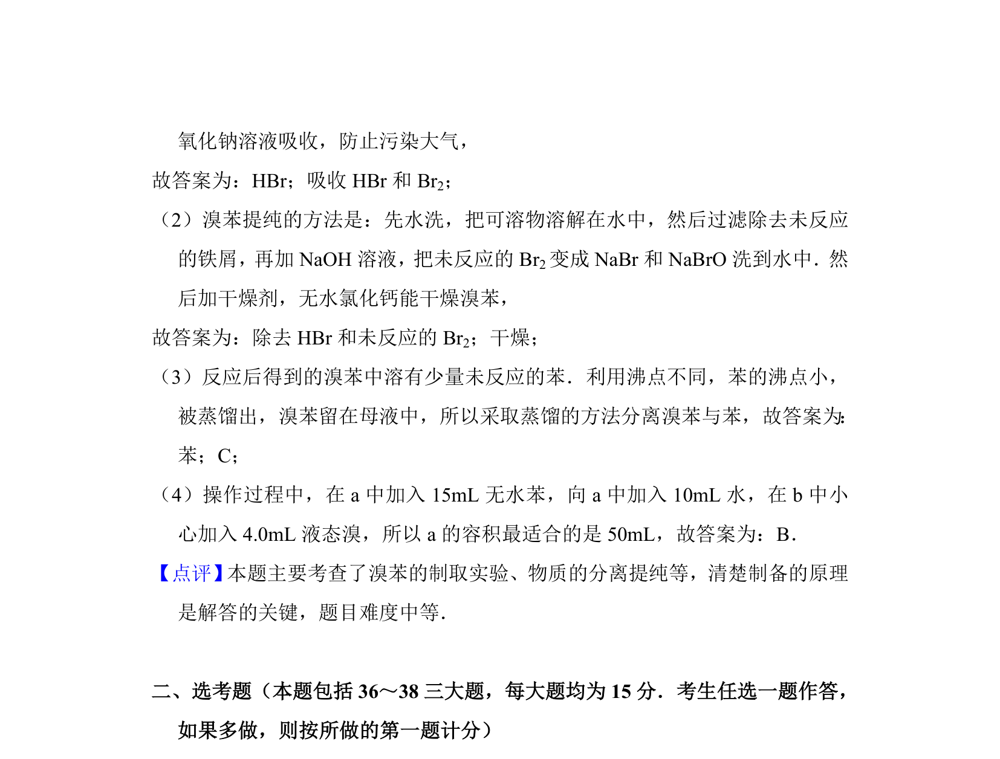

## 题面

## 摘要

实验室合成溴苯的装置、原理及尾气吸收等操作分析。

## 关联考点

- [[246-甲烷取代反应|卤代反应]]
- [[996-实验装置|实验装置]]
- [[677-尾气处理|尾气处理]]
- [[分离提纯]]

## 答案与解析

> 📄 原 PDF 第 12 页：`素材/真题/湖南/2008-2024·（湖南）化学高考真题/2012年高考化学试卷（新课标）（解析卷）.pdf`

<!-- 题干文本-start -->
## 题干文本
10．（14分）溴苯是一种化工原料，实验室合成溴体的装置示意图及有关数据
如下：
苯 溴 溴苯
密度/g•cm﹣3 0.88 3.10 1.50
沸点/℃ 80 59 156
水中溶解度 微溶 微溶 微溶
按下列合成步骤回答问题：
（1）在a中加入15mL无水苯和少量铁屑．在b中小心加入4.0mL液态溴．向
a中滴入几滴溴，有白雾产生，是因为生成了　HBr　气体．继续滴加至液溴
滴完．装置d的作用是　吸收HBr和Br 2　；
（2）液溴滴完后，经过下列步骤分离提纯：
<!-- 题干文本-end -->

<!-- 解析文本-start -->
## 解析文本

<!-- 解析文本-end -->
