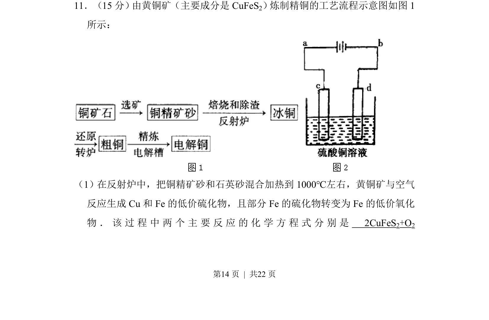
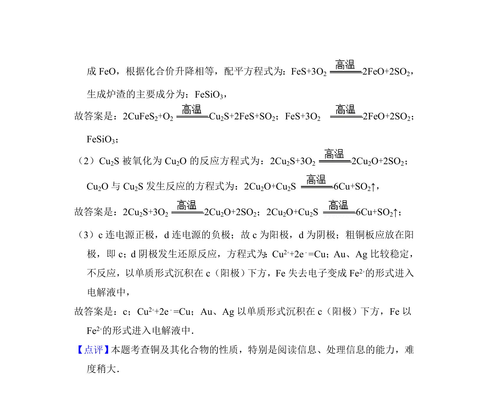

## 题面

## 摘要

从黄铜矿炼制精铜的工艺流程，写出反射炉中的化学方程式。

## 关联考点

- [[无机化工流程]]
- [[621-化学方程式书写|化学方程式书写]]
- [[162-氧化还原反应|氧化还原反应]]

## 答案与解析

> 📄 原 PDF 第 14 页：`素材/真题/湖南/2008-2024·（湖南）化学高考真题/2012年高考化学试卷（新课标）（解析卷）.pdf`
