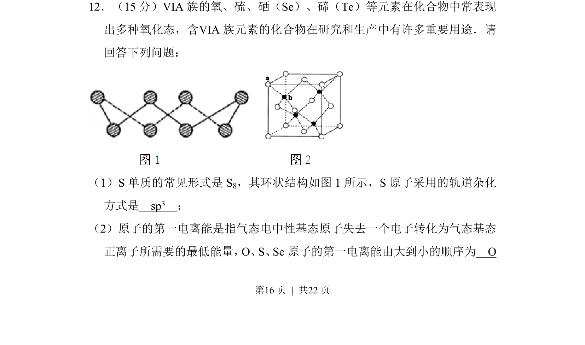
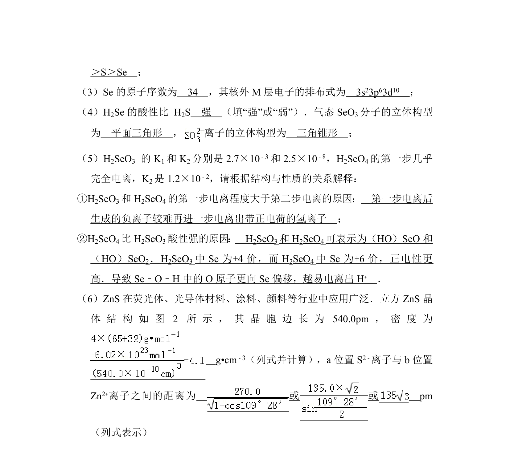
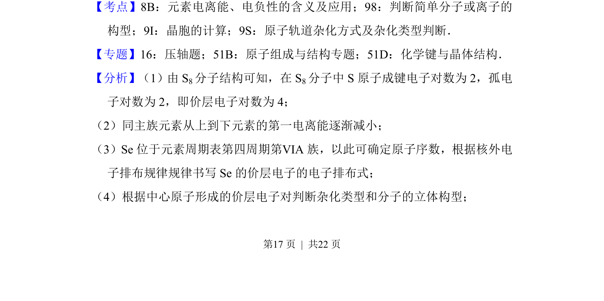
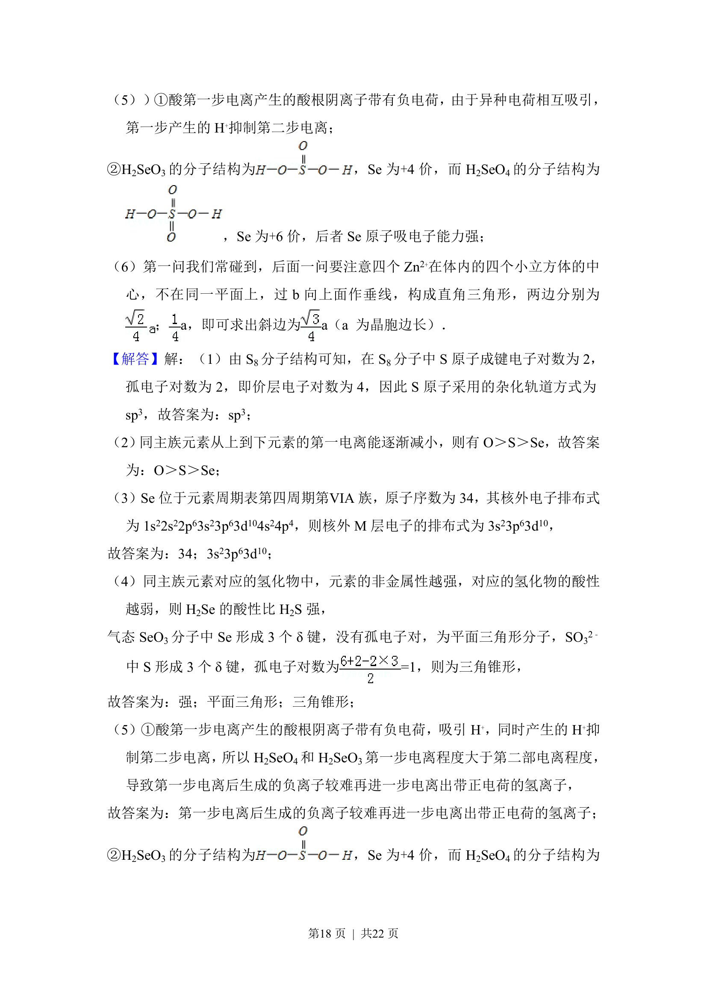
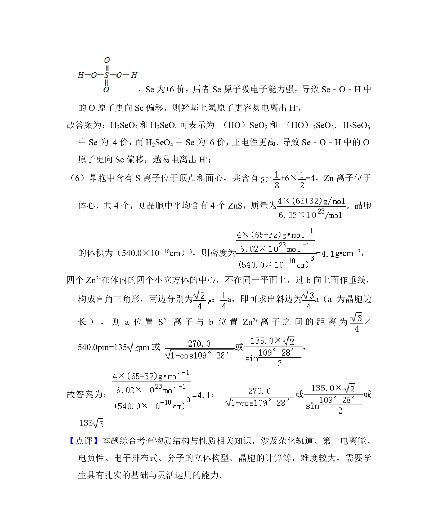

## 题面

## 摘要

本题以VIA族元素为载体，考查S₈的杂化方式与O、S、Se第一电离能比较。

## 关联考点

- [[720-杂化轨道|杂化轨道]]
- [[393-第一电离能|第一电离能]]
- [[252-元素周期律|元素周期律]]

## 答案与解析

> 📄 原 PDF 第 16 页：`素材/真题/湖南/2008-2024·（湖南）化学高考真题/2012年高考化学试卷（新课标）（解析卷）.pdf`

<!-- 题干文本-start -->
## 题干文本
12．（15分）ⅥA族的氧、硫、硒（Se）、碲（Te）等元素在化合物中常表现
出多种氧化态，含ⅥA族元素的化合物在研究和生产中有许多重要用途．请
回答下列问题：
（1）S单质的常见形式是S 8，其环状结构如图1所示，S原子采用的轨道杂化
方式是　sp3　；
（2）原子的第一电离能是指气态电中性基态原子失去一个电子转化为气态基态
正离子所需要的最低能量，O、S、Se原子的第一电离能由大到小的顺序为　O
<!-- 题干文本-end -->

<!-- 解析文本-start -->
## 解析文本

<!-- 解析文本-end -->
