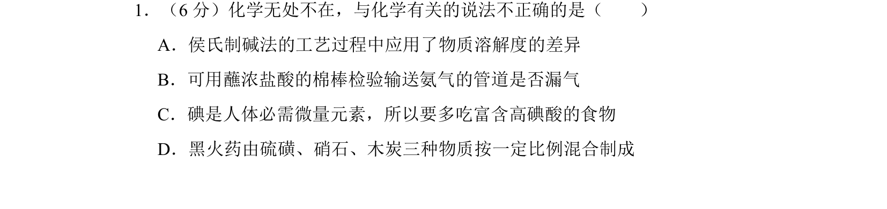
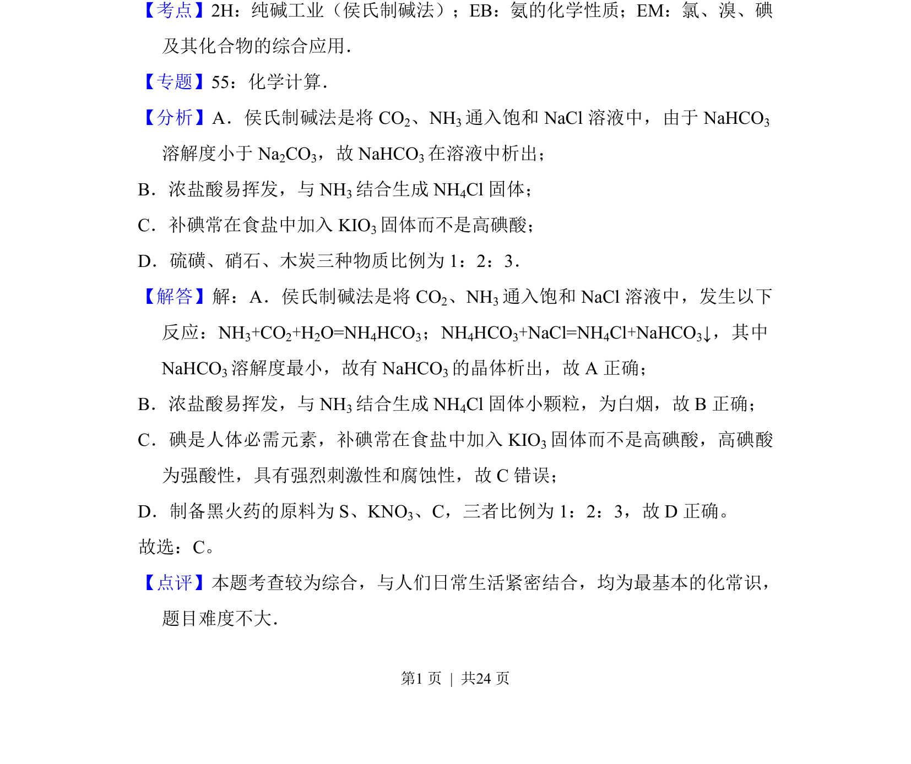

## 题面

## 摘要

考查侯氏制碱法、氨气检验、碘元素存在形式、黑火药组成等化学常识。

## 关联考点

- [[侯氏制碱法]]
- [[氨的化学性质]]
- [[碘的化合物]]
- [[黑火药]]

## 答案与解析

> 📄 原 PDF 第 1 页：`素材/真题/湖南/2008-2024·（湖南）化学高考真题/2013年高考化学试卷（新课标Ⅰ）（解析卷）.pdf`

<!-- 题干文本-start -->
## 题干文本
1．（6分）化学无处不在，与化学有关的说法不正确的是（　　）
A．侯氏制碱法的工艺过程中应用了物质溶解度的差异
B．可用蘸浓盐酸的棉棒检验输送氨气的管道是否漏气
C．碘是人体必需微量元素，所以要多吃富含高碘酸的食物
D．黑火药由硫磺、硝石、木炭三种物质按一定比例混合制成
<!-- 题干文本-end -->

<!-- 解析文本-start -->
## 解析文本
【考点】2H：纯碱工业（侯氏制碱法）；EB：氨的化学性质；EM：氯、溴、碘
及其化合物的综合应用．菁优网版权所有
【专题】55：化学计算．
【分析】A．侯氏制碱法是将CO 2、NH3通入饱和NaCl溶液中，由于NaHCO 3
溶解度小于Na 2CO3，故NaHCO 3在溶液中析出；
B．浓盐酸易挥发，与NH 3结合生成NH 4Cl固体；
C．补碘常在食盐中加入KIO 3固体而不是高碘酸；
D．硫磺、硝石、木炭三种物质比例为1：2：3．
【解答】解：A．侯氏制碱法是将CO 2、NH3通入饱和NaCl溶液中，发生以下
反应：NH 3+CO2+H2O=NH4HCO3；NH4HCO3+NaCl=NH4Cl+NaHCO3↓，其中
NaHCO3溶解度最小，故有NaHCO 3的晶体析出，故A正确；
B．浓盐酸易挥发，与NH 3结合生成NH 4Cl固体小颗粒，为白烟，故B正确；
C．碘是人体必需元素，补碘常在食盐中加入KIO 3固体而不是高碘酸，高碘酸
为强酸性，具有强烈刺激性和腐蚀性，故C错误；
D．制备黑火药的原料为S、KNO 3、C，三者比例为1：2：3，故D正确。
故选：C。
【点评】本题考查较为综合，与人们日常生活紧密结合，均为最基本的化常识，
题目难度不大．
<!-- 解析文本-end -->
