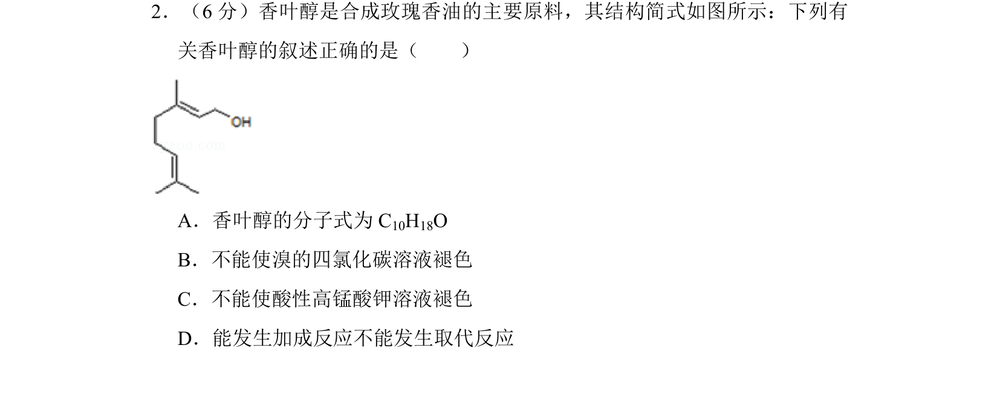
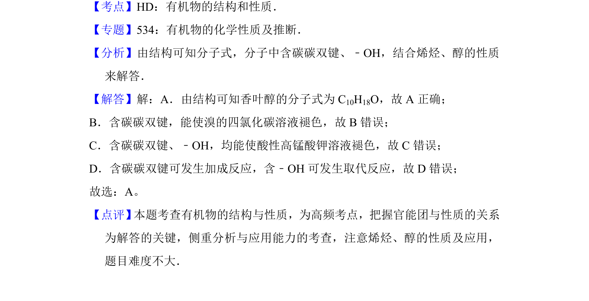

## 题面

## 摘要

该题考查香叶醇的结构与性质，通过官能团判断其分子式、反应类型及性质表述正误。

## 关联考点

- [[有机物的结构]]
- [[663-官能团性质|官能团性质]]
- [[烯烃性质]]
- [[醇的性质]]

## 答案与解析

> 📄 原 PDF 第 2 页：`素材/真题/湖南/2008-2024·（湖南）化学高考真题/2013年高考化学试卷（新课标Ⅰ）（解析卷）.pdf`
