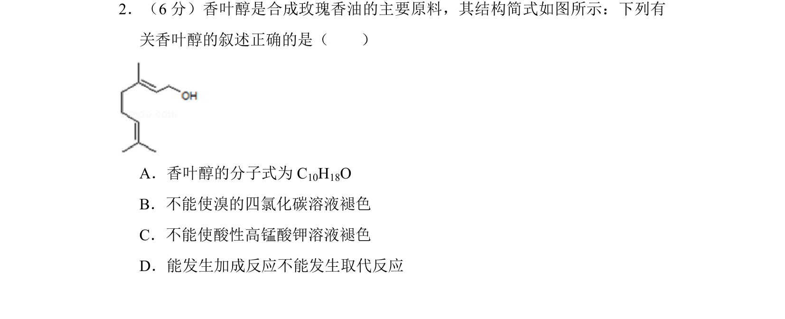
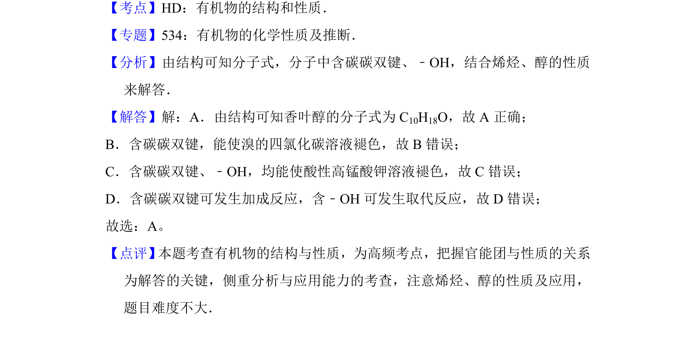

## 题面

## 摘要

该题考查香叶醇的结构与性质，通过官能团判断其分子式、反应类型及性质表述正误。

## 关联考点

- [[有机物的结构]]
- [[663-官能团性质|官能团性质]]
- [[999-烯烃性质|烯烃性质]]
- [[醇的性质]]

## 答案与解析

> 📄 原 PDF 第 2 页：`素材/真题/湖南/2008-2024·（湖南）化学高考真题/2013年高考化学试卷（新课标Ⅰ）（解析卷）.pdf`

<!-- 题干文本-start -->
## 题干文本
2．（6分）香叶醇是合成玫瑰香油的主要原料，其结构简式如图所示：下列有
关香叶醇的叙述正确的是（　　）
A．香叶醇的分子式为C 10H18O
B．不能使溴的四氯化碳溶液褪色
C．不能使酸性高锰酸钾溶液褪色
D．能发生加成反应不能发生取代反应
<!-- 题干文本-end -->

<!-- 解析文本-start -->
## 解析文本
【考点】HD：有机物的结构和性质．菁优网版权所有
【专题】534：有机物的化学性质及推断．
【分析】由结构可知分子式，分子中含碳碳双键、﹣OH，结合烯烃、醇的性质
来解答．
【解答】解：A．由结构可知香叶醇的分子式为C 10H18O，故A正确；
B．含碳碳双键，能使溴的四氯化碳溶液褪色，故B错误；
C．含碳碳双键、﹣OH，均能使酸性高锰酸钾溶液褪色，故C错误；
D．含碳碳双键可发生加成反应，含﹣OH可发生取代反应，故D错误；
故选：A。
【点评】 本题考查有机物的结构与性质，为高频考点，把握官能团与性质的关系
为解答的关键，侧重分析与应用能力的考查，注意烯烃、醇的性质及应用，
题目难度不大．
<!-- 解析文本-end -->
