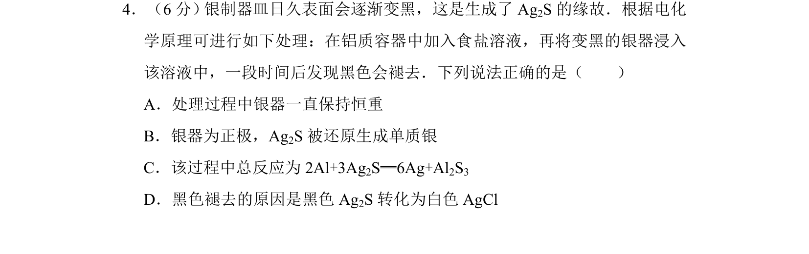
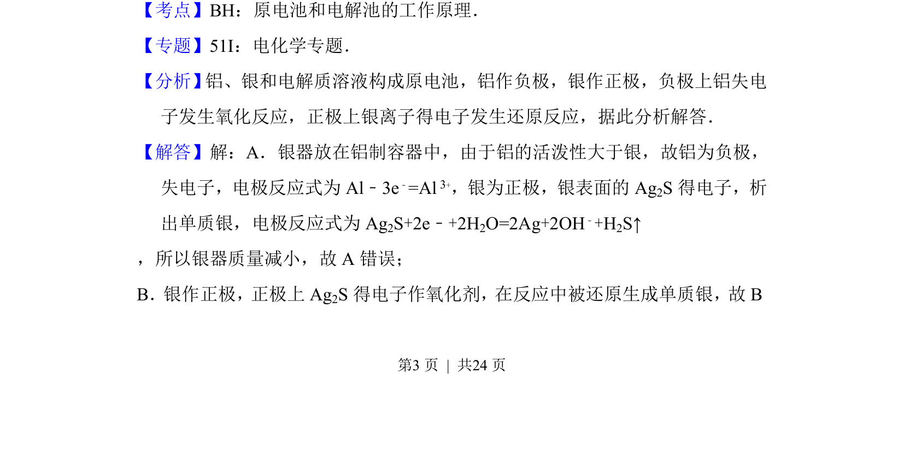
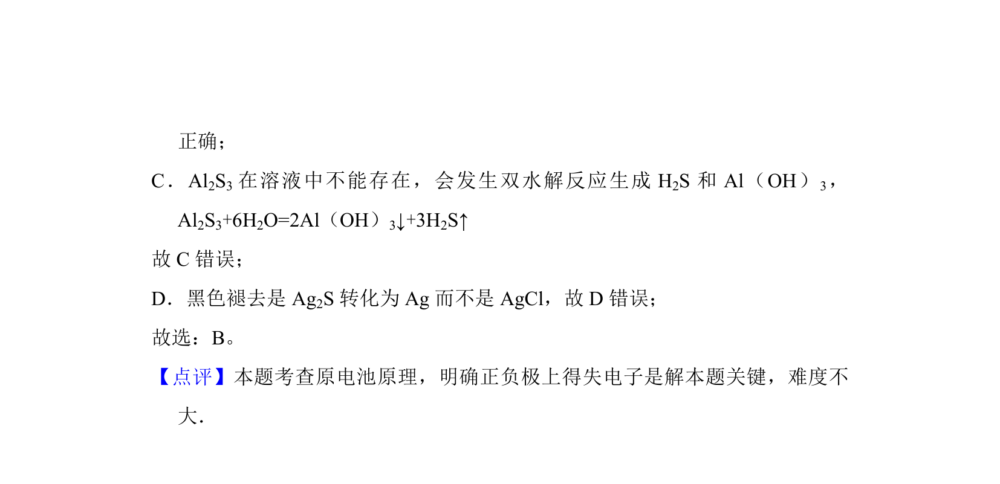

## 题面

## 摘要

银器在铝质容器食盐溶液中原电池法除Ag2S的原理分析，涉及电极判断、电极反应式书写及物质变化。

## 关联考点

- [[642-原电池工作原理|原电池工作原理]]
- [[794-电极反应式|电极反应式]]
- [[金属腐蚀与防护]]

## 答案与解析

> 📄 原 PDF 第 3 页：`素材/真题/湖南/2008-2024·（湖南）化学高考真题/2013年高考化学试卷（新课标Ⅰ）（解析卷）.pdf`

<!-- 题干文本-start -->
## 题干文本
4．（6分） 银制器皿日久表面会逐渐变黑，这是生成了Ag2S的缘故．根据电化
学原理可进行如下处理：在铝质容器中加入食盐溶液，再将变黑的银器浸入
该溶液中，一段时间后发现黑色会褪去．下列说法正确的是（　　）
A．处理过程中银器一直保持恒重
B．银器为正极，Ag2S被还原生成单质银
C．该过程中总反应为2Al+3Ag 2S═6Ag+Al2S3
D．黑色褪去的原因是黑色Ag 2S转化为白色AgCl
<!-- 题干文本-end -->

<!-- 解析文本-start -->
## 解析文本
【考点】BH：原电池和电解池的工作原理．菁优网版权所有
【专题】51I：电化学专题．
【分析】 铝、银和电解质溶液构成原电池，铝作负极，银作正极，负极上铝失电
子发生氧化反应，正极上银离子得电子发生还原反应，据此分析解答．
【解答】解：A．银器放在铝制容器中，由于铝的活泼性大于银，故铝为负极，
失电子，电极反应式为Al﹣3e ﹣=Al 3+，银为正极，银表面的Ag 2S得电子，析
出单质银，电极反应式为Ag 2S+2e﹣+2H2O=2Ag+2OH﹣+H2S↑
，所以银器质量减小，故A错误； 
B．银作正极，正极上Ag2S得电子作氧化剂，在反应中被还原生成单质银，故B
<!-- 解析文本-end -->
