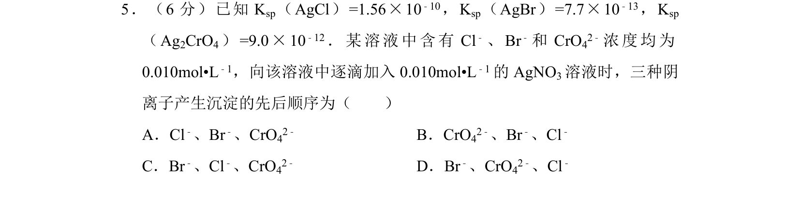
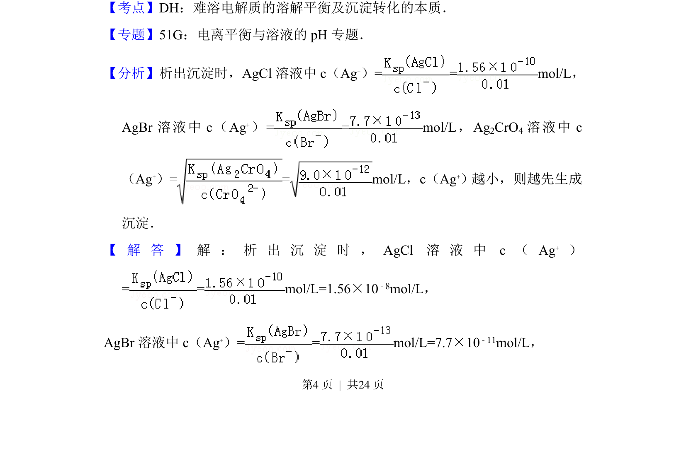
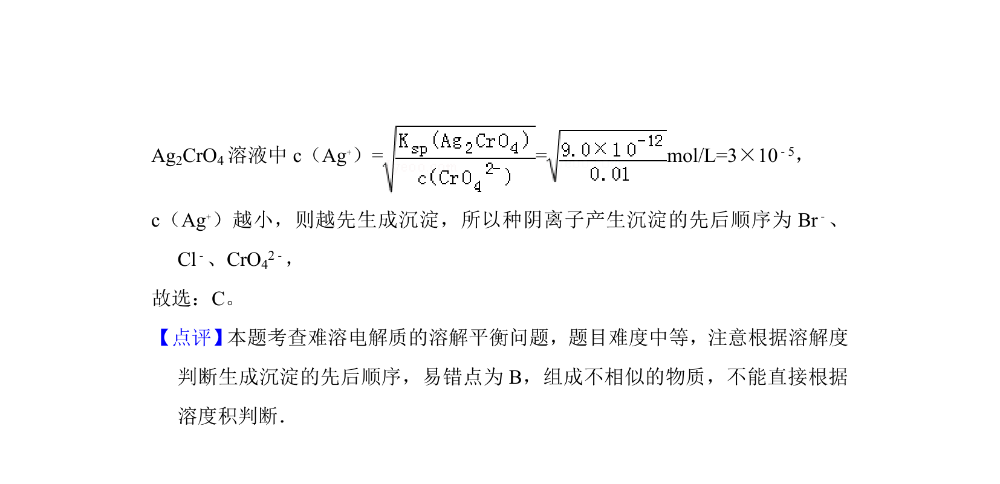

## 题面

## 摘要

根据溶度积常数计算所需Ag+浓度，判断沉淀生成的先后顺序。

## 关联考点

- [[难溶电解质的溶解平衡]]
- [[762-溶度积|溶度积常数]]
- [[沉淀顺序]]

## 答案与解析

> 📄 原 PDF 第 4 页：`素材/真题/湖南/2008-2024·（湖南）化学高考真题/2013年高考化学试卷（新课标Ⅰ）（解析卷）.pdf`

<!-- 题干文本-start -->
## 题干文本
5．（6分）已知K sp（AgCl）=1.56×10 ﹣10，K sp（AgBr）=7.7×10 ﹣13，K sp
（Ag 2CrO4）=9.0×10 ﹣12．某溶液中含有Cl ﹣、Br ﹣和CrO 42﹣浓度均为
0.010mol•L﹣1，向该溶液中逐滴加入0.010mol•L ﹣1的AgNO 3溶液时，三种阴
离子产生沉淀的先后顺序为（　　）
A．Cl﹣、Br﹣、CrO42﹣ B．CrO42﹣、Br﹣、Cl﹣
C．Br﹣、Cl﹣、CrO42﹣ D．Br﹣、CrO42﹣、Cl﹣
<!-- 题干文本-end -->

<!-- 解析文本-start -->
## 解析文本
【考点】DH：难溶电解质的溶解平衡及沉淀转化的本质．菁优网版权所有
【专题】51G：电离平衡与溶液的pH专题．
【分析】析出沉淀时，AgCl溶液中c（Ag +）= = mol/L，
AgBr溶液中c（Ag +）= = mol/L，Ag 2CrO4 溶液中c
（Ag+）= = mol/L，c（Ag +）越小，则越先生成
沉淀．
【 解 答 】 解 ： 析 出 沉 淀 时 ，AgCl溶 液 中c（Ag + ）
= = mol/L=1.56×10 ﹣8mol/L，
AgBr溶液中c（Ag +）= = mol/L=7.7×10 ﹣11mol/L，
<!-- 解析文本-end -->
