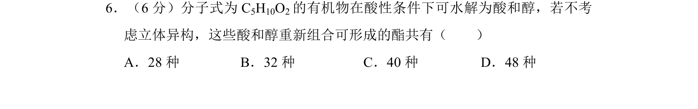
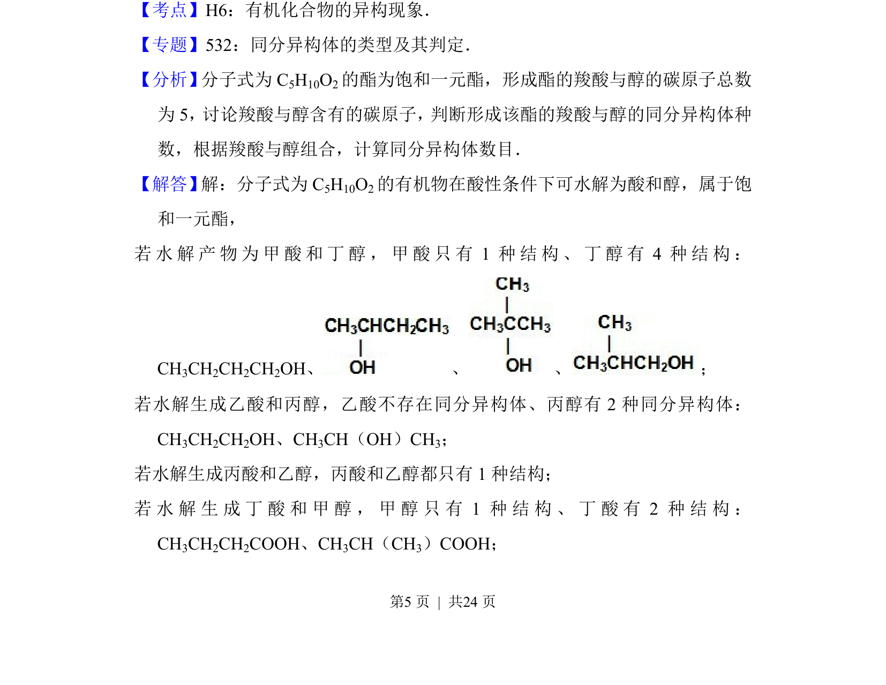
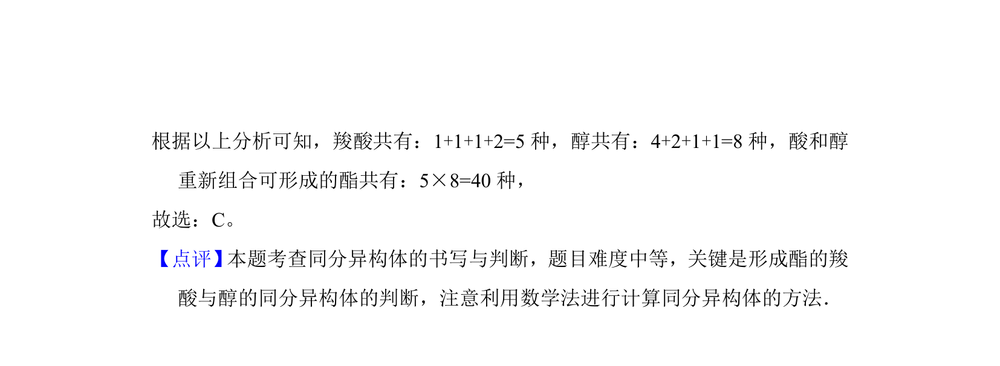

## 题面

## 摘要

酯的水解产物酸和醇重新酯化形成的同分异构体数目计算。

## 关联考点

- [[705-有机化合物的异构现象|有机化合物的异构现象]]
- [[同分异构体数目计算]]
- [[851-酯的水解反应|酯的水解反应]]
- [[250-酯化反应|酯化反应]]

## 答案与解析

> 📄 原 PDF 第 5 页：`素材/真题/湖南/2008-2024·（湖南）化学高考真题/2013年高考化学试卷（新课标Ⅰ）（解析卷）.pdf`
