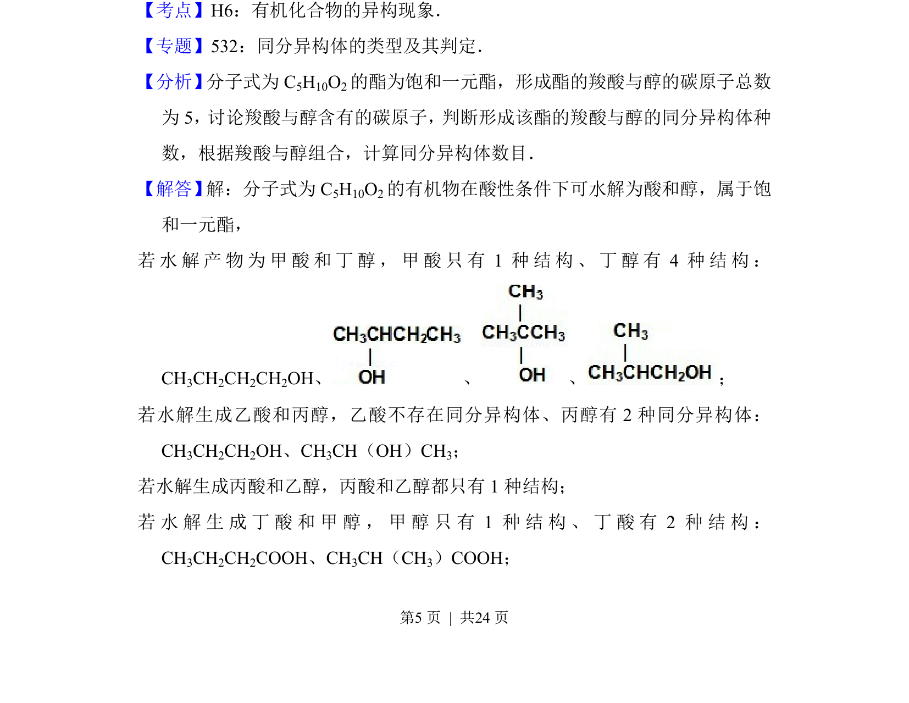
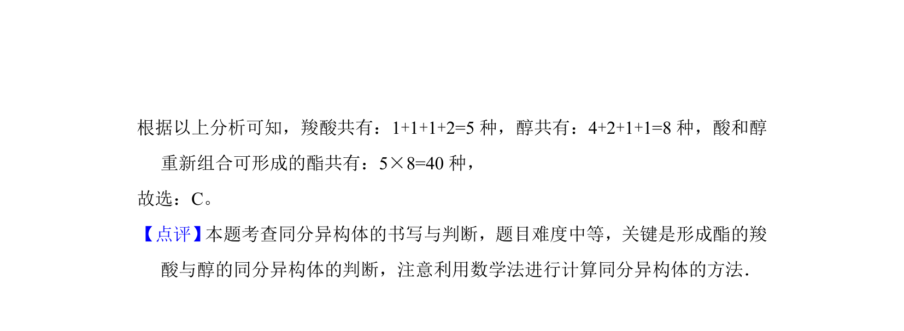

## 题面

## 摘要

酯的水解产物酸和醇重新酯化形成的同分异构体数目计算。

## 关联考点

- [[705-有机化合物的异构现象|有机化合物的异构现象]]
- [[同分异构体数目计算]]
- [[851-酯的水解反应|酯的水解反应]]
- [[250-酯化反应|酯化反应]]

## 答案与解析

> 📄 原 PDF 第 5 页：`素材/真题/湖南/2008-2024·（湖南）化学高考真题/2013年高考化学试卷（新课标Ⅰ）（解析卷）.pdf`

<!-- 题干文本-start -->
## 题干文本
6．（6分）分子式为C 5H10O2的有机物在酸性条件下可水解为酸和醇，若不考
虑立体异构，这些酸和醇重新组合可形成的酯共有（　　）
A．28种B．32种C．40种D．48种
<!-- 题干文本-end -->

<!-- 解析文本-start -->
## 解析文本
【考点】H6：有机化合物的异构现象．菁优网版权所有
【专题】532：同分异构体的类型及其判定．
【分析】 分子式为C5H10O2的酯为饱和一元酯，形成酯的羧酸与醇的碳原子总数
为5，讨论羧酸与醇含有的碳原子，判断形成该酯的羧酸与醇的同分异构体种
数，根据羧酸与醇组合，计算同分异构体数目．
【解答】 解：分子式为C5H10O2的有机物在酸性条件下可水解为酸和醇，属于饱
和一元酯，
若水解产物为甲酸和丁醇，甲酸只有1种结构、丁醇有4种结构：
CH3CH2CH2CH2OH、 、 、 ；
若水解生成乙酸和丙醇，乙酸不存在同分异构体、丙醇有2种同分异构体：
CH3CH2CH2OH、CH3CH（OH）CH3；
若水解生成丙酸和乙醇，丙酸和乙醇都只有1种结构；
若 水 解 生 成 丁 酸 和 甲 醇 ， 甲 醇 只 有1种 结 构 、 丁 酸 有2种 结 构 ：
CH3CH2CH2COOH、CH3CH（CH3）COOH；
<!-- 解析文本-end -->
