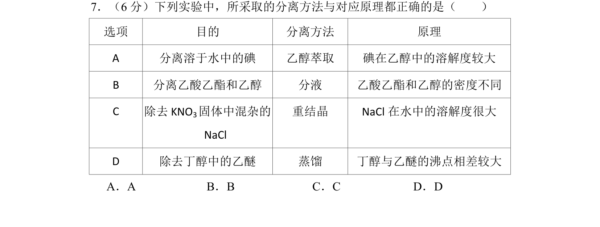
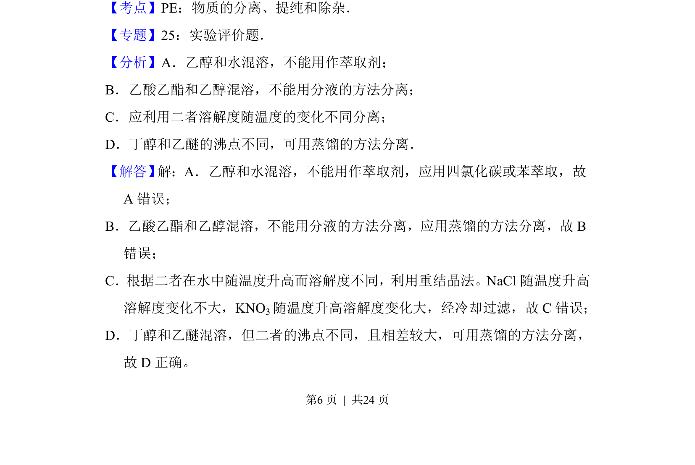
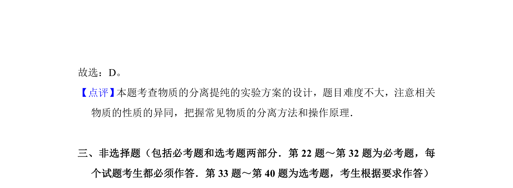

## 题面

## 摘要

考查分离提纯方法选择与原理的正误判断

## 关联考点

- [[832-萃取|萃取]]
- [[606-分液|分液]]
- [[961-重结晶|重结晶]]
- [[079-蒸馏|蒸馏]]

## 答案与解析

> 📄 原 PDF 第 6 页：`素材/真题/湖南/2008-2024·（湖南）化学高考真题/2013年高考化学试卷（新课标Ⅰ）（解析卷）.pdf`

<!-- 题干文本-start -->
## 题干文本
7．（6分）下列实验中，所采取的分离方法与对应原理都正确的是（　　）
选项 目的 分离方法 原理
A 分离溶于水中的碘 乙醇萃取 碘在乙醇中的溶解度较大
B 分离乙酸乙酯和乙醇 分液 乙酸乙酯和乙醇的密度不同
C 除去KNO 3固体中混杂的
NaCl
重结晶 NaCl在水中的溶解度很大
D 除去丁醇中的乙醚 蒸馏 丁醇与乙醚的沸点相差较大
A．A B．B C．C D．D
<!-- 题干文本-end -->

<!-- 解析文本-start -->
## 解析文本
【考点】PE：物质的分离、提纯和除杂．菁优网版权所有
【专题】25：实验评价题．
【分析】A．乙醇和水混溶，不能用作萃取剂；
B．乙酸乙酯和乙醇混溶，不能用分液的方法分离；
C．应利用二者溶解度随温度的变化不同分离；
D．丁醇和乙醚的沸点不同，可用蒸馏的方法分离．
【解答】 解：A．乙醇和水混溶，不能用作萃取剂，应用四氯化碳或苯萃取，故
A错误；
B．乙酸乙酯和乙醇混溶，不能用分液的方法分离，应用蒸馏的方法分离，故B
错误；
C．根据二者在水中随温度升高而溶解度不同，利用重结晶法。NaCl随温度升高
溶解度变化不大，KNO3随温度升高溶解度变化大，经冷却过滤，故C错误；
D．丁醇和乙醚混溶，但二者的沸点不同，且相差较大，可用蒸馏的方法分离，
故D正确。
<!-- 解析文本-end -->
