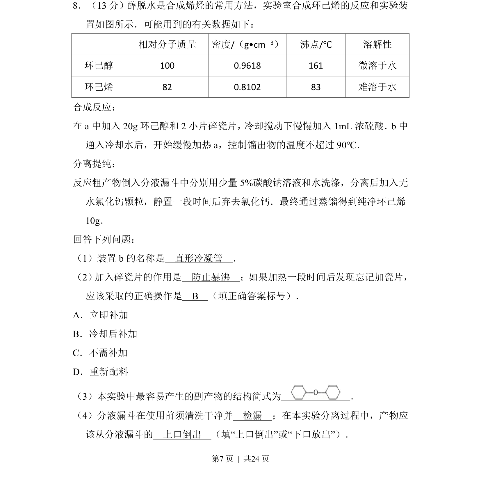
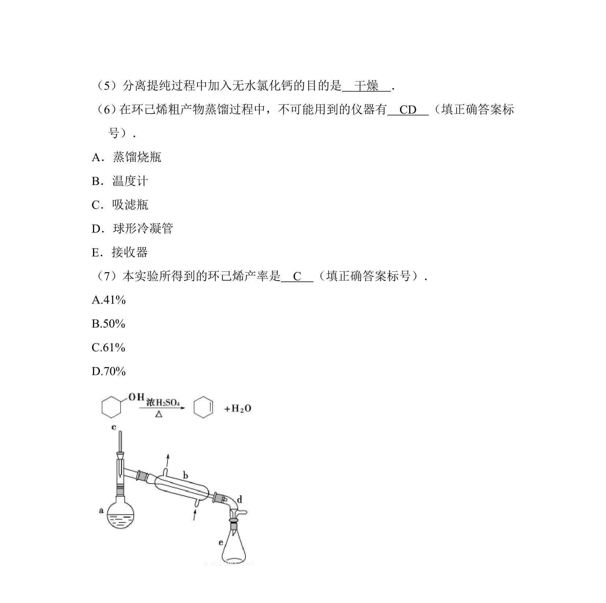
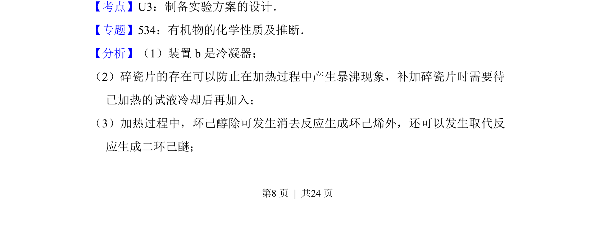
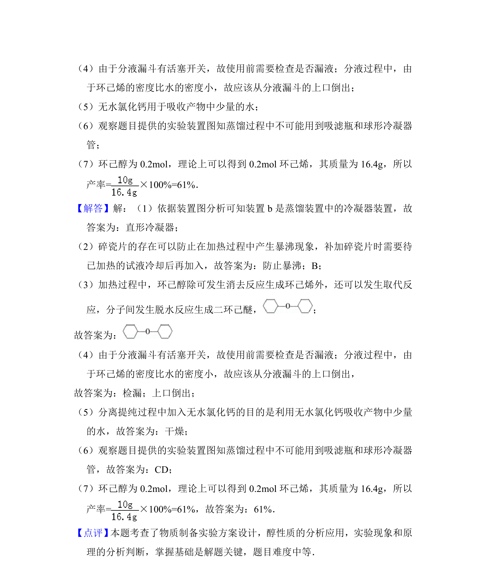

## 题面

## 摘要

实验室合成环己烯，考查醇消去反应、实验操作、副产物判断及分液漏斗的使用。

## 关联考点

- [[醇的消去反应]]
- [[防暴沸操作]]
- [[副产物判断]]
- [[分液漏斗检漏与分液]]

## 答案与解析

> 📄 原 PDF 第 7 页：`素材/真题/湖南/2008-2024·（湖南）化学高考真题/2013年高考化学试卷（新课标Ⅰ）（解析卷）.pdf`

<!-- 题干文本-start -->
## 题干文本
8．（13分）醇脱水是合成烯烃的常用方法，实验室合成环己烯的反应和实验装
置如图所示．可能用到的有关数据如下：
相对分子质量 密度/（g•cm﹣3） 沸点/℃ 溶解性
环己醇 100 0.9618 161 微溶于水
环己烯 82 0.8102 83 难溶于水
合成反应：
在a中加入20g环己醇和2小片碎瓷片，冷却搅动下慢慢加入1mL浓硫酸．b中
通入冷却水后，开始缓慢加热a，控制馏出物的温度不超过90℃．
分离提纯：
反应粗产物倒入分液漏斗中分别用少量5%碳酸钠溶液和水洗涤，分离后加入无
水氯化钙颗粒，静置一段时间后弃去氯化钙．最终通过蒸馏得到纯净环己烯
10g．
回答下列问题：
（1）装置b的名称是　直形冷凝管　．
（2） 加入碎瓷片的作用是　防止暴沸　；如果加热一段时间后发现忘记加瓷片，
应该采取的正确操作是　B　（填正确答案标号）．
A．立即补加
B．冷却后补加
C．不需补加
D．重新配料
（3）本实验中最容易产生的副产物的结构简式为　 　．
（4）分液漏斗在使用前须清洗干净并　检漏　；在本实验分离过程中，产物应
该从分液漏斗的　上口倒出　（填“上口倒出”或“下口放出”）．
<!-- 题干文本-end -->

<!-- 解析文本-start -->
## 解析文本

<!-- 解析文本-end -->
