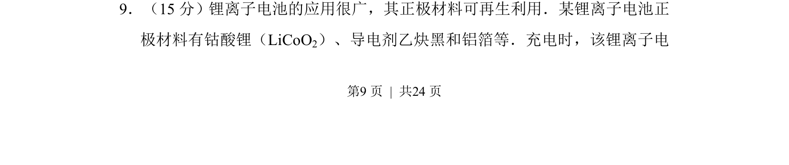
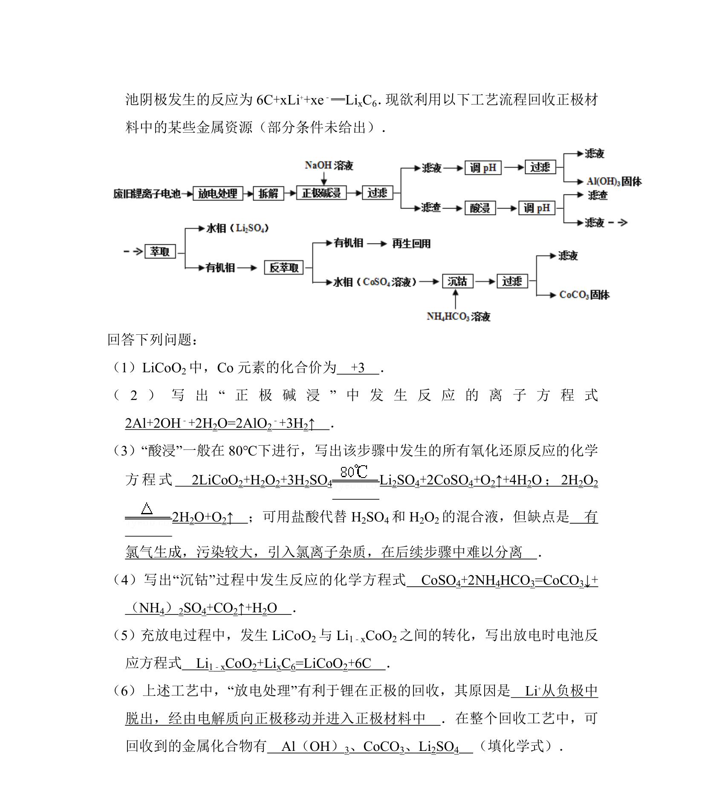
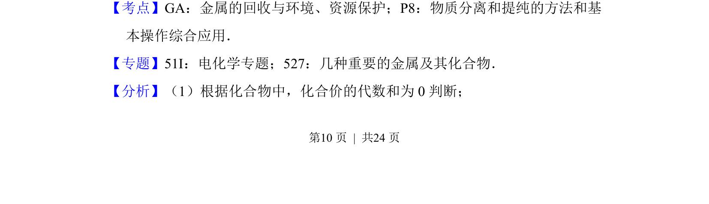
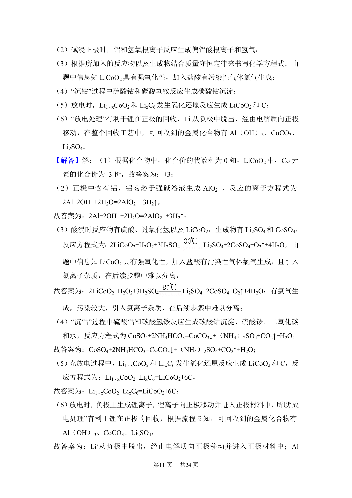
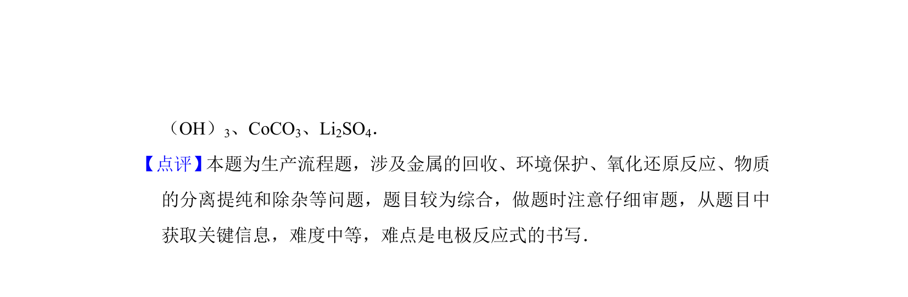

## 题面

## 摘要

锂离子电池正极材料可再生利用，考查钴酸锂电池的组成与充放电原理。

## 关联考点

- [[电化学原理]]
- [[电极材料]]
- [[资源回收]]

## 答案与解析

> 📄 原 PDF 第 9 页：`素材/真题/湖南/2008-2024·（湖南）化学高考真题/2013年高考化学试卷（新课标Ⅰ）（解析卷）.pdf`

<!-- 题干文本-start -->
## 题干文本
9．（15分）锂离子电池的应用很广，其正极材料可再生利用．某锂离子电池正
极材料有钴酸锂（LiCoO2）、导电剂乙炔黑和铝箔等．充电时，该锂离子电
<!-- 题干文本-end -->

<!-- 解析文本-start -->
## 解析文本

<!-- 解析文本-end -->
