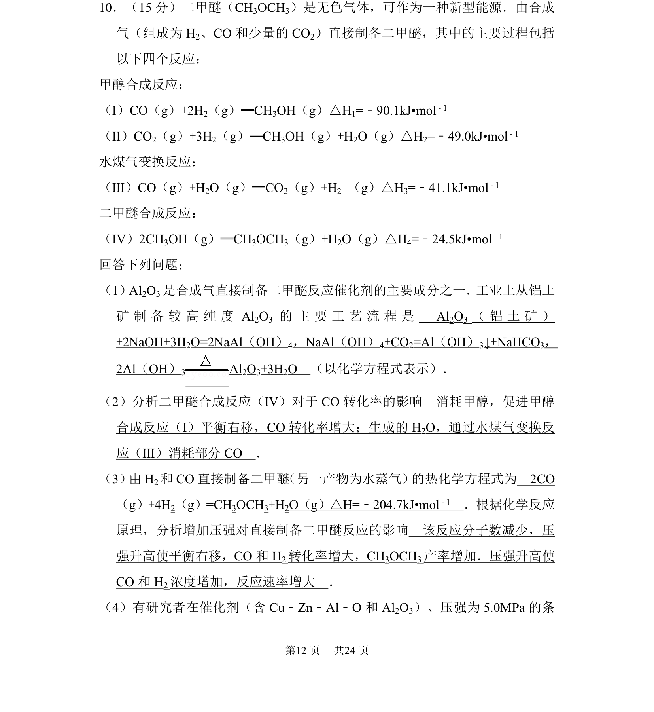
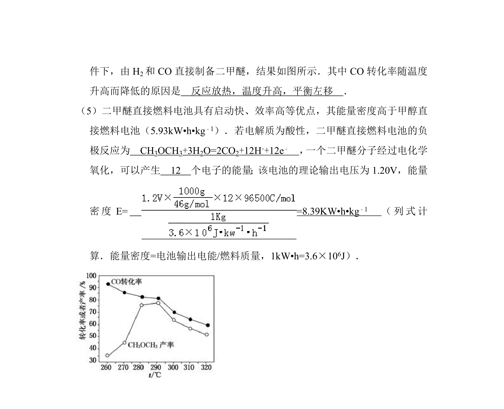
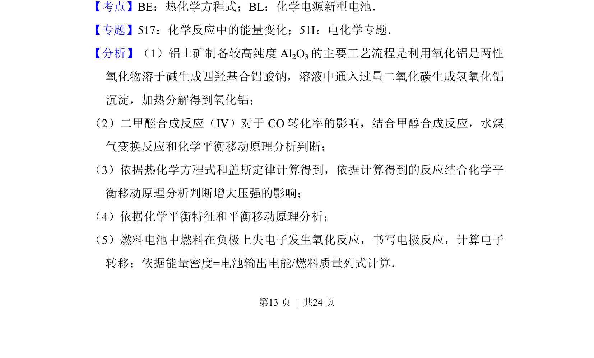
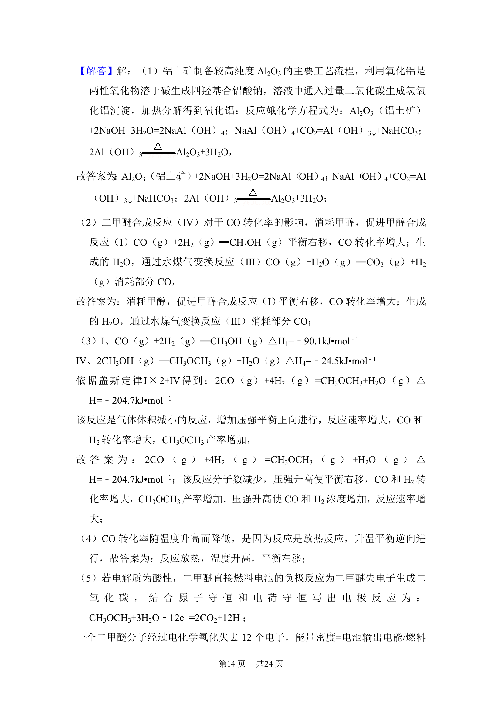
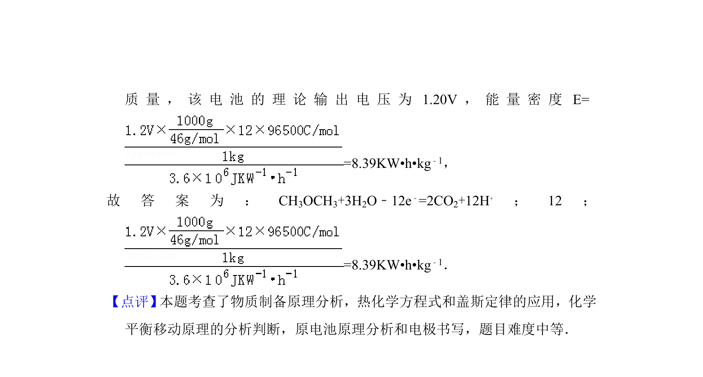

## 题面

## 摘要

该题考查利用合成气制备二甲醚的反应原理、工艺流程及平衡与速率分析，涉及铝土矿提纯、热化学方程式书写和压强影响等。

## 关联考点

- [[铝土矿提纯]]
- [[620-化学平衡移动|化学平衡移动]]
- [[311-盖斯定律|盖斯定律]]
- [[压强对反应速率和平衡的影响]]

## 答案与解析

> 📄 原 PDF 第 12 页：`素材/真题/湖南/2008-2024·（湖南）化学高考真题/2013年高考化学试卷（新课标Ⅰ）（解析卷）.pdf`
