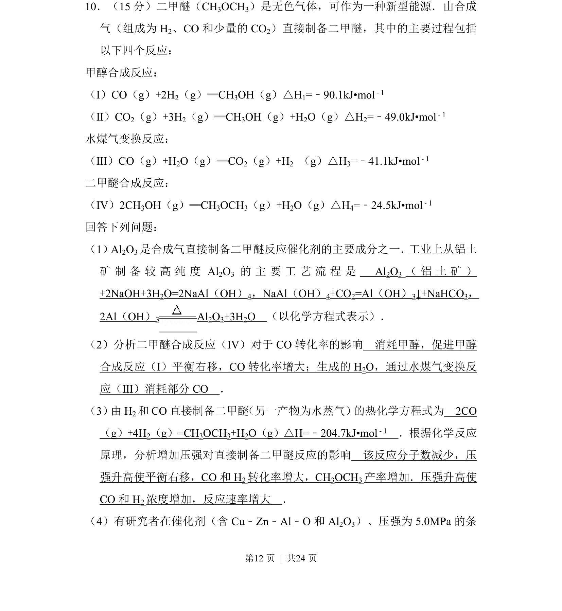
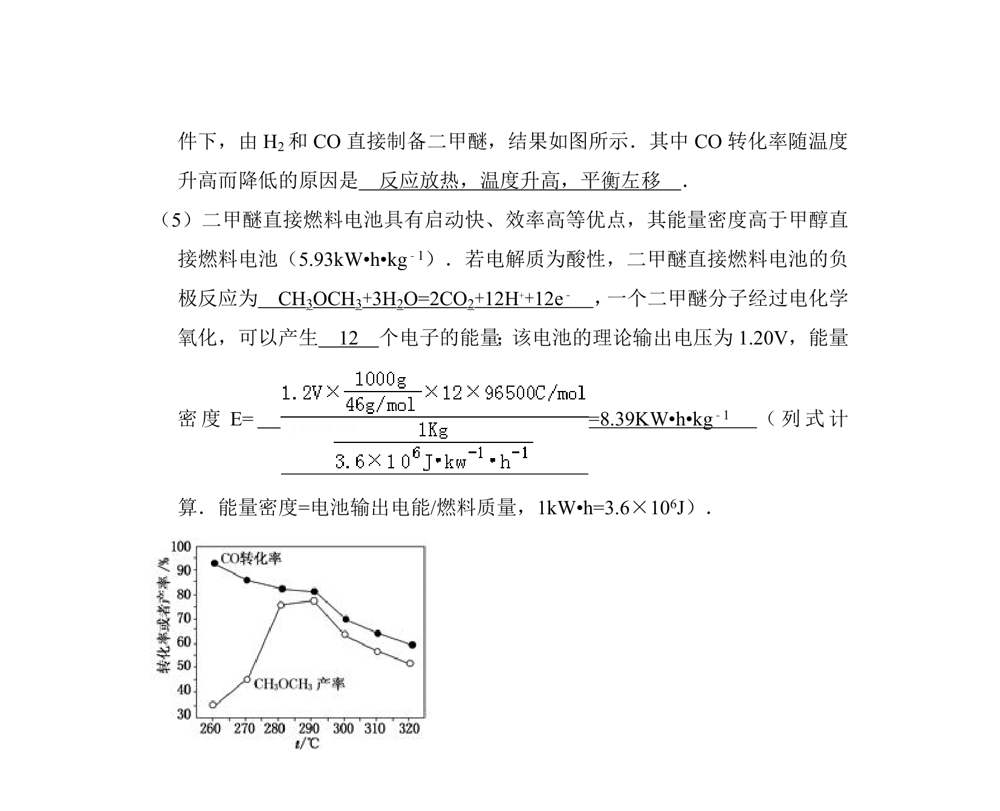
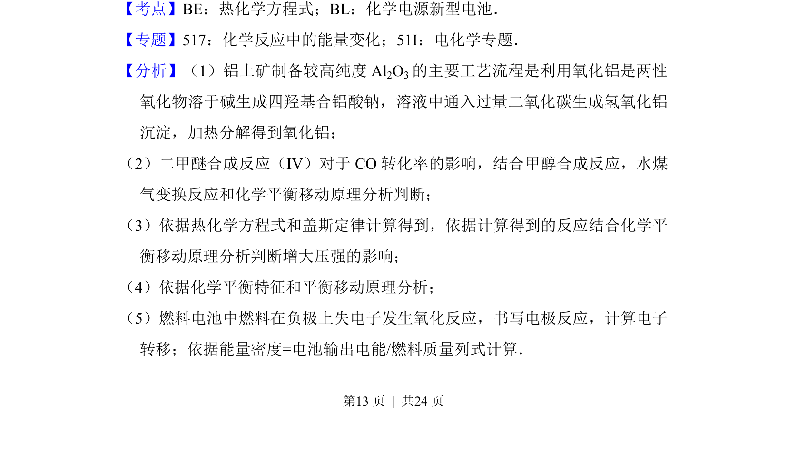
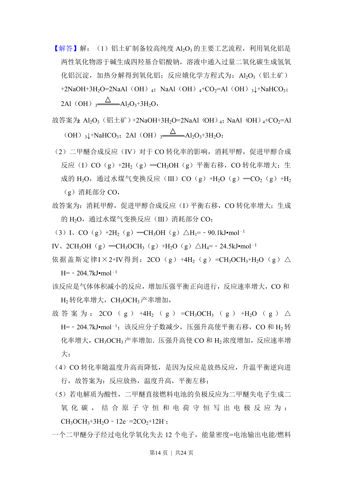
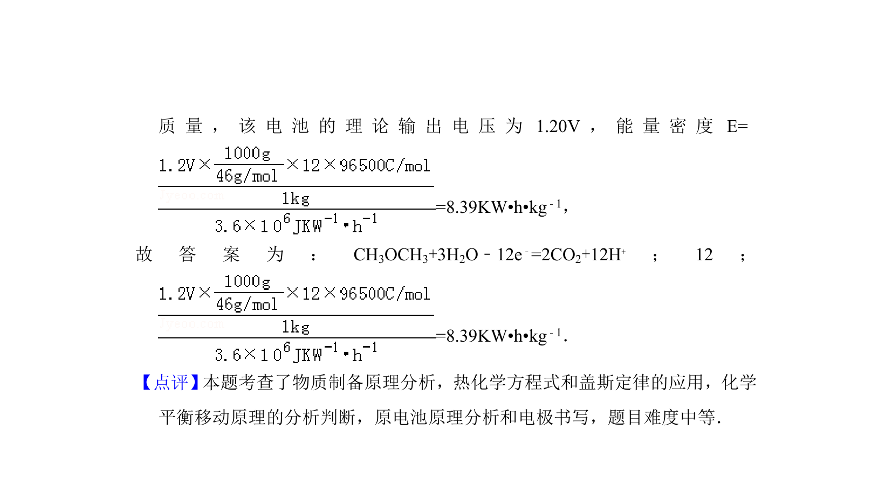

## 题面

## 摘要

该题考查利用合成气制备二甲醚的反应原理、工艺流程及平衡与速率分析，涉及铝土矿提纯、热化学方程式书写和压强影响等。

## 关联考点

- [[铝土矿提纯]]
- [[620-化学平衡移动|化学平衡移动]]
- [[311-盖斯定律|盖斯定律]]
- [[压强对反应速率和平衡的影响]]

## 答案与解析

> 📄 原 PDF 第 12 页：`素材/真题/湖南/2008-2024·（湖南）化学高考真题/2013年高考化学试卷（新课标Ⅰ）（解析卷）.pdf`

<!-- 题干文本-start -->
## 题干文本
10．（15分）二甲醚（CH 3OCH3）是无色气体，可作为一种新型能源．由合成
气（组成为H 2、CO和少量的CO 2）直接制备二甲醚，其中的主要过程包括
以下四个反应：
甲醇合成反应：
（Ⅰ）CO（g）+2H2（g）═CH3OH（g）△H1=﹣90.1kJ•mol﹣1
（Ⅱ）CO2（g）+3H2（g）═CH3OH（g）+H2O（g）△H2=﹣49.0kJ•mol﹣1
水煤气变换反应：
（Ⅲ）CO（g）+H2O（g）═CO2（g）+H2 （g）△H 3=﹣41.1kJ•mol﹣1
二甲醚合成反应：
（Ⅳ）2CH3OH（g）═CH3OCH3（g）+H2O（g）△H4=﹣24.5kJ•mol﹣1
回答下列问题：
（1）Al2O3是合成气直接制备二甲醚反应催化剂的主要成分之一．工业上从铝土
矿 制 备 较 高 纯 度Al2O3 的 主 要 工 艺 流 程 是 　Al2O3 （ 铝 土 矿 ）
+2NaOH+3H2O=2NaAl（OH）4，NaAl（OH）4+CO2=Al（OH）3↓+NaHCO3，
2Al（OH）3 Al2O3+3H2O　（以化学方程式表示）．
（2）分析二甲醚合成反应（Ⅳ）对于CO转化率的影响　消耗甲醇，促进甲醇
合成反应（Ⅰ）平衡右移，CO转化率增大；生成的H 2O，通过水煤气变换反
应（Ⅲ）消耗部分CO　．
（3） 由H2和CO直接制备二甲醚 （另一产物为水蒸气） 的热化学方程式为　2CO
（g）+4H2（g）=CH3OCH3+H2O（g）△H=﹣204.7kJ•mol﹣1　．根据化学反应
原理，分析增加压强对直接制备二甲醚反应的影响　该反应分子数减少，压
强升高使平衡右移，CO和H 2转化率增大，CH3OCH3产率增加．压强升高使
CO和H 2浓度增加，反应速率增大　．
（4）有研究者在催化剂（含Cu﹣Zn﹣Al﹣O和Al 2O3）、压强为5.0MPa的条
<!-- 题干文本-end -->

<!-- 解析文本-start -->
## 解析文本

<!-- 解析文本-end -->
