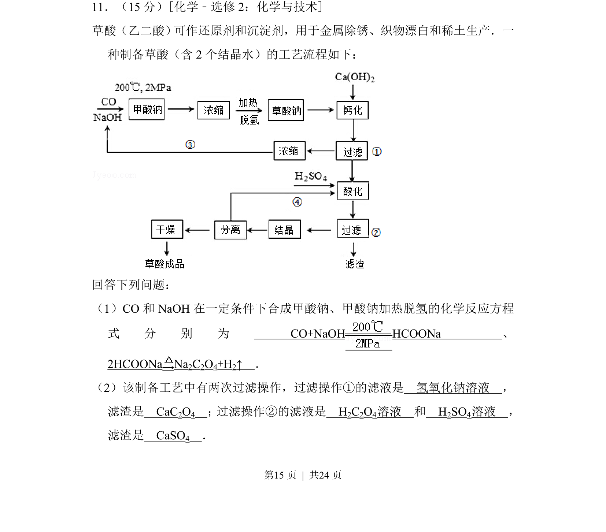
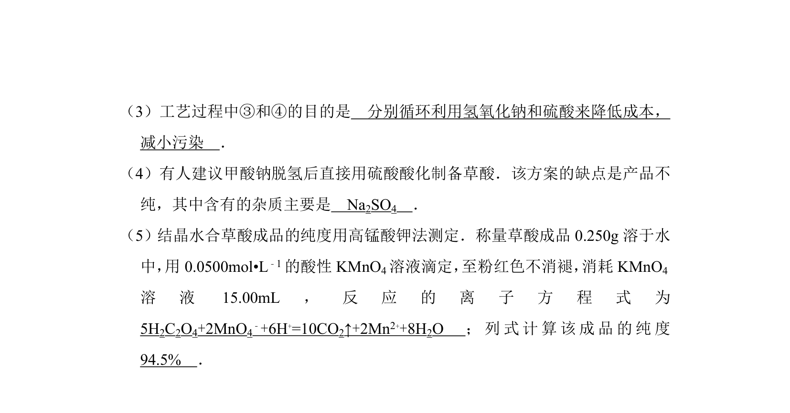
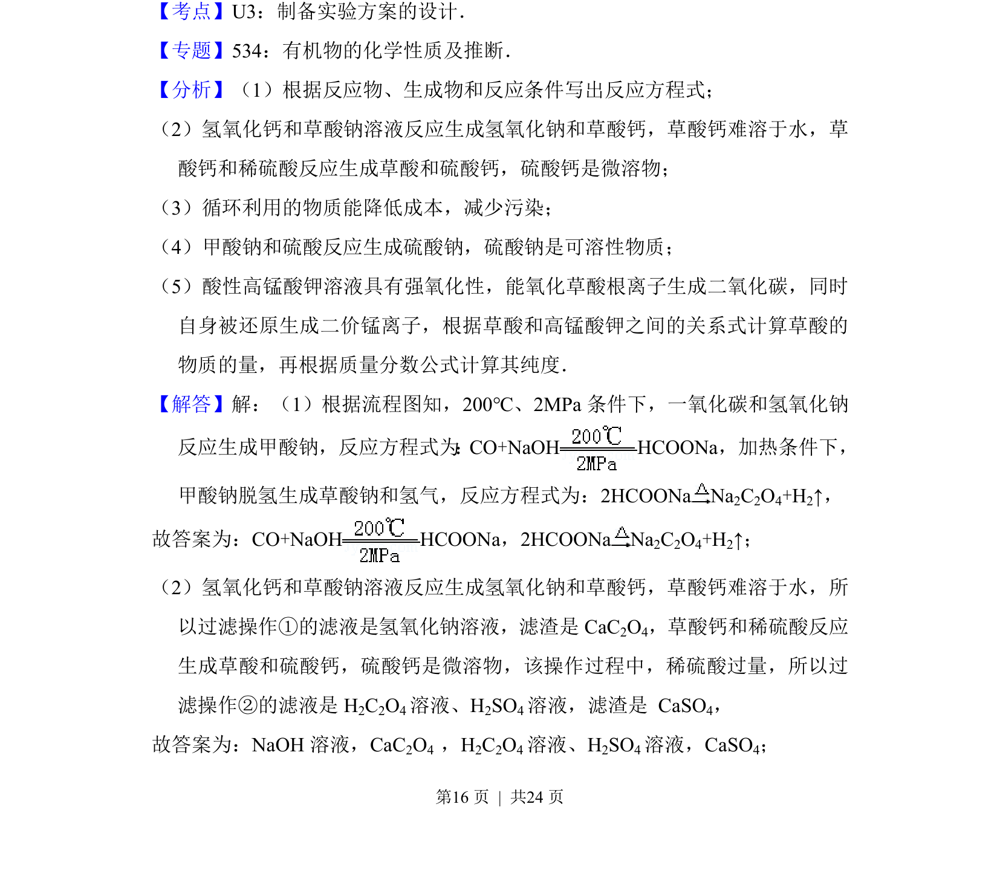
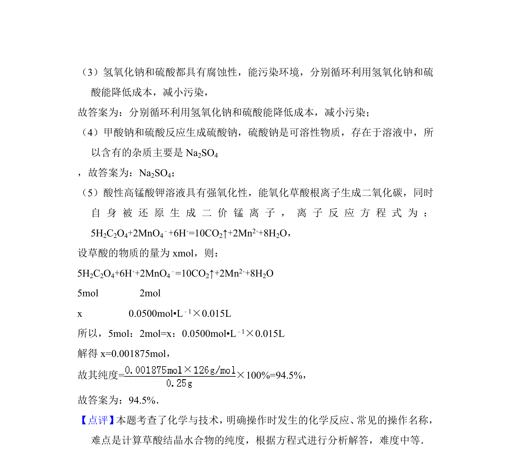

## 题面

## 摘要

制备草酸的工艺流程，涉及化学方程式书写及过滤分离操作判断。

## 关联考点

- [[621-化学方程式书写|化学方程式书写]]
- [[680-工艺流程分析|工艺流程分析]]
- [[过滤与分离操作]]
- [[草酸盐性质]]

## 答案与解析

> 📄 原 PDF 第 15 页：`素材/真题/湖南/2008-2024·（湖南）化学高考真题/2013年高考化学试卷（新课标Ⅰ）（解析卷）.pdf`
