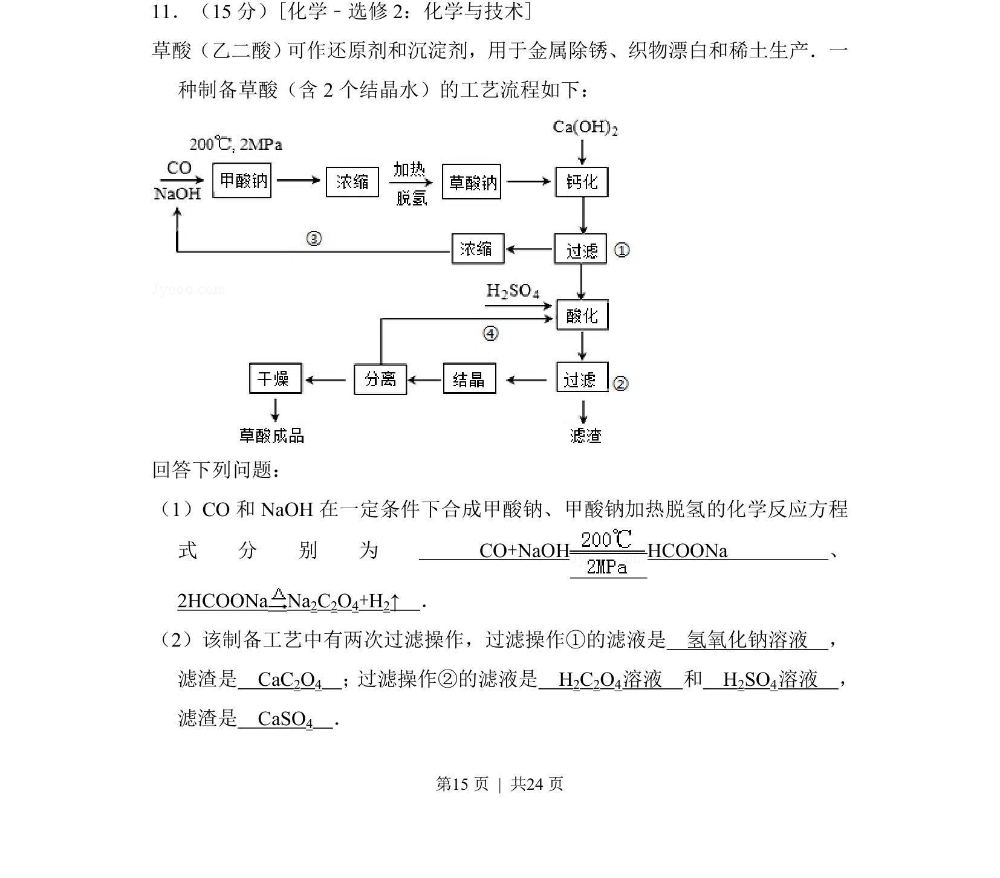
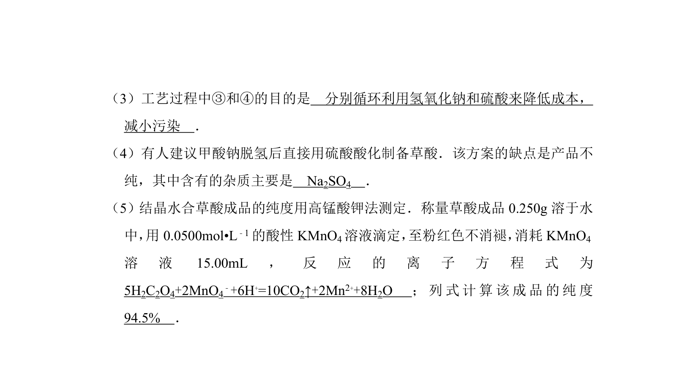
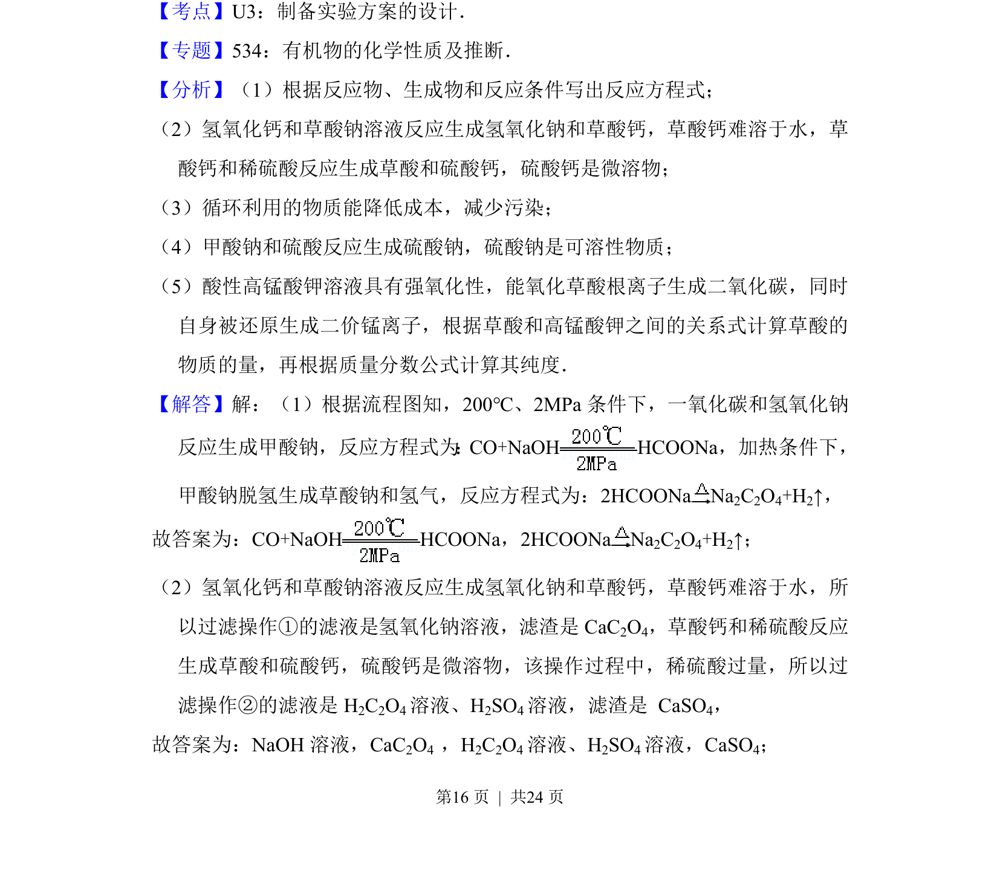
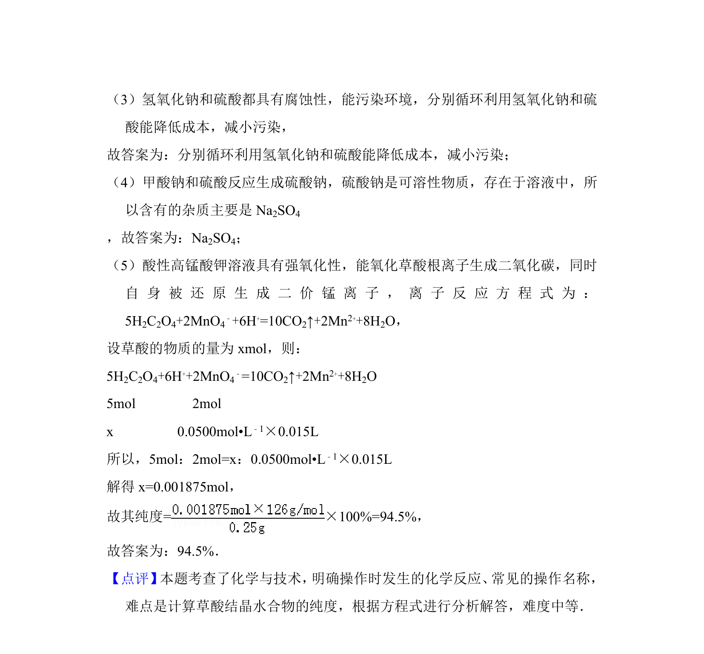

## 题面

## 摘要

制备草酸的工艺流程，涉及化学方程式书写及过滤分离操作判断。

## 关联考点

- [[976-化学方程式的书写|化学方程式书写]]
- [[680-工艺流程分析|工艺流程分析]]
- [[过滤与分离操作]]
- [[草酸盐性质]]

## 答案与解析

> 📄 原 PDF 第 15 页：`素材/真题/湖南/2008-2024·（湖南）化学高考真题/2013年高考化学试卷（新课标Ⅰ）（解析卷）.pdf`

<!-- 题干文本-start -->
## 题干文本
11．（15分）[化学﹣选修2：化学与技术]
草酸（乙二酸） 可作还原剂和沉淀剂，用于金属除锈、织物漂白和稀土生产．一
种制备草酸（含2个结晶水）的工艺流程如下：
回答下列问题：
（1）CO和NaOH在一定条件下合成甲酸钠、甲酸钠加热脱氢的化学反应方程
式 分 别 为 　CO+NaOH HCOONa　 、　
2HCOONa Na2C2O4+H2↑　．
（2）该制备工艺中有两次过滤操作，过滤操作①的滤液是　氢氧化钠溶液　，
滤渣是　CaC2O4　； 过滤操作②的滤液是　H2C2O4溶液　和　H2SO4溶液　，
滤渣是　CaSO4　．
<!-- 题干文本-end -->

<!-- 解析文本-start -->
## 解析文本

<!-- 解析文本-end -->
